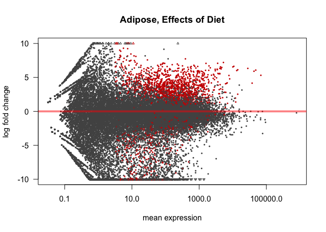

# DESeq Analysis
Dave Bridges  
August 2, 2015  


This script performs the DESeq analyses on the Juvenile HFD studies.  This script was most recently run on Fri Aug  7 14:58:54 2015


The counts data, derived from HTSeq are located in ../server-scripts/htseq-output.  The sample mapping file is located in ../sample-mapping.csv.  The annotations are from the file ENSEMBL Annotation.csv.


# Overall Analysis

The first model was a completely interacting model in which tissue, feeding state and diet were all able to interact.

 

 

 

# Adipose Tissue

The adipose tissue samples are all eWAT samples

## Effects of Feeding State

This model used only the adipose tissue data, and tested for changes related to the feeding state.


Table: Top Hits for Effects of Feeding

        ensembl_gene_id       baseMean   log2FoldChange   lfcSE    stat   pvalue    padj       X  gene_biotype     external_gene_name 
------  -------------------  ---------  ---------------  ------  ------  -------  ------  ------  ---------------  -------------------
10425   ENSMUSG00000036644        1352            0.467   0.076    6.11        0   0.000   26684  protein_coding   Tbc1d9b            
6864    ENSMUSG00000028715         804           -7.543   1.363   -5.54        0   0.000   26511  protein_coding   Cyp4a14            
2484    ENSMUSG00000020385         288           -0.656   0.124   -5.30        0   0.000   31424  protein_coding   Clk4               
5236    ENSMUSG00000025878         255           -0.629   0.128   -4.91        0   0.002   14925  protein_coding   Uimc1              
10453   ENSMUSG00000036752        1888            0.772   0.157    4.92        0   0.002    3500  protein_coding   Tubb4b             

 

We identified 42 differentially expressed genes, out of a total of 45232 genes tested.  Of these significantly differentially expressed genes, 13 were upregulated and 29 were downregulated.

## Effects of Diet 


Table: Top Hits for Effects of Diet

        ensembl_gene_id       baseMean   log2FoldChange   lfcSE   stat   pvalue    padj       X  gene_biotype     external_gene_name 
------  -------------------  ---------  ---------------  ------  -----  -------  ------  ------  ---------------  -------------------
12479   ENSMUSG00000042129       192.9            1.945   0.352   32.9        0   0.001   12610  protein_coding   Rassf4             
834     ENSMUSG00000005360       739.2            6.638   1.240   24.0        0   0.004   27013  protein_coding   Slc1a3             
964     ENSMUSG00000006235        37.4            6.110   1.169   24.6        0   0.004   25827  protein_coding   Epor               
1150    ENSMUSG00000008036       522.3           -0.814   0.334   23.1        0   0.004   25195  protein_coding   Ap2s1              
1410    ENSMUSG00000012705      4124.9            6.331   1.217   22.8        0   0.004   13700  protein_coding   Retn               
1680    ENSMUSG00000015950       149.6            2.033   0.454   24.0        0   0.004   37961  protein_coding   Ncf1               
2317    ENSMUSG00000020101       851.0            5.361   1.053   23.2        0   0.004   15099  protein_coding   4632428N05Rik      
2401    ENSMUSG00000020241       943.1            3.530   0.680   25.3        0   0.004   16248  protein_coding   Col6a2             
2665    ENSMUSG00000020676        72.2            6.843   1.270   25.5        0   0.004   41451  protein_coding   Ccl11              
2854    ENSMUSG00000020963       480.5            6.194   1.165   23.8        0   0.004   21836  protein_coding   Tshr               

 

We identified 1281 differentially expressed genes, out of a total of 45232 genes tested.  Of these significantly differentially expressed genes, 958 were upregulated and 323 were downregulated.

# Session Information


```
## R version 3.2.0 (2015-04-16)
## Platform: x86_64-apple-darwin13.4.0 (64-bit)
## Running under: OS X 10.10.4 (Yosemite)
## 
## locale:
## [1] en_US.UTF-8/en_US.UTF-8/en_US.UTF-8/C/en_US.UTF-8/en_US.UTF-8
## 
## attached base packages:
## [1] parallel  stats4    stats     graphics  grDevices utils     datasets 
## [8] methods   base     
## 
## other attached packages:
##  [1] gplots_2.17.0             BiocParallel_1.2.18      
##  [3] DESeq2_1.8.1              RcppArmadillo_0.5.200.1.0
##  [5] Rcpp_0.12.0               GenomicRanges_1.20.5     
##  [7] GenomeInfoDb_1.4.1        IRanges_2.2.5            
##  [9] S4Vectors_0.6.3           BiocGenerics_0.14.0      
## [11] knitr_1.10.5             
## 
## loaded via a namespace (and not attached):
##  [1] genefilter_1.50.0    gtools_3.5.0         locfit_1.5-9.1      
##  [4] reshape2_1.4.1       splines_3.2.0        lattice_0.20-33     
##  [7] colorspace_1.2-6     htmltools_0.2.6      yaml_2.1.13         
## [10] survival_2.38-3      XML_3.98-1.3         foreign_0.8-65      
## [13] DBI_0.3.1            RColorBrewer_1.1-2   lambda.r_1.1.7      
## [16] plyr_1.8.3           stringr_1.0.0        munsell_0.4.2       
## [19] gtable_0.1.2         futile.logger_1.4.1  caTools_1.17.1      
## [22] evaluate_0.7         labeling_0.3         latticeExtra_0.6-26 
## [25] Biobase_2.28.0       geneplotter_1.46.0   AnnotationDbi_1.30.1
## [28] highr_0.5            proto_0.3-10         KernSmooth_2.23-15  
## [31] acepack_1.3-3.3      xtable_1.7-4         scales_0.2.5        
## [34] formatR_1.2          gdata_2.17.0         Hmisc_3.16-0        
## [37] annotate_1.46.1      XVector_0.8.0        gridExtra_2.0.0     
## [40] ggplot2_1.0.1        digest_0.6.8         stringi_0.5-5       
## [43] grid_3.2.0           bitops_1.0-6         tools_3.2.0         
## [46] magrittr_1.5         RSQLite_1.0.0        Formula_1.2-1       
## [49] cluster_2.0.3        futile.options_1.0.0 MASS_7.3-43         
## [52] rmarkdown_0.7        rpart_4.1-10         nnet_7.3-10
```
