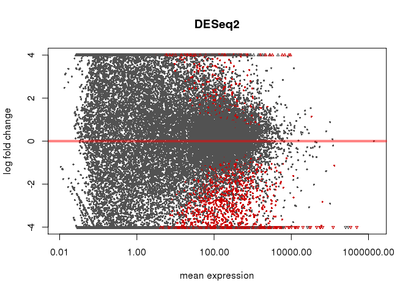
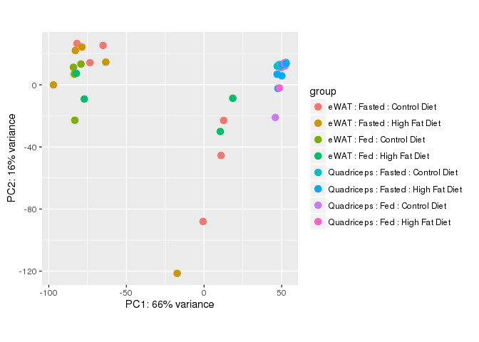
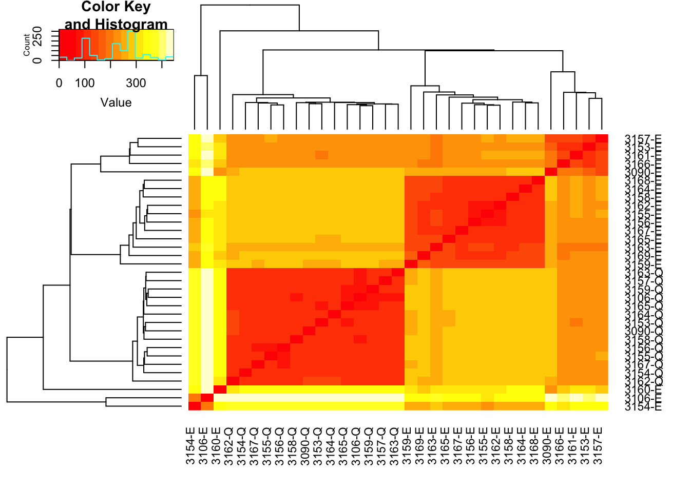
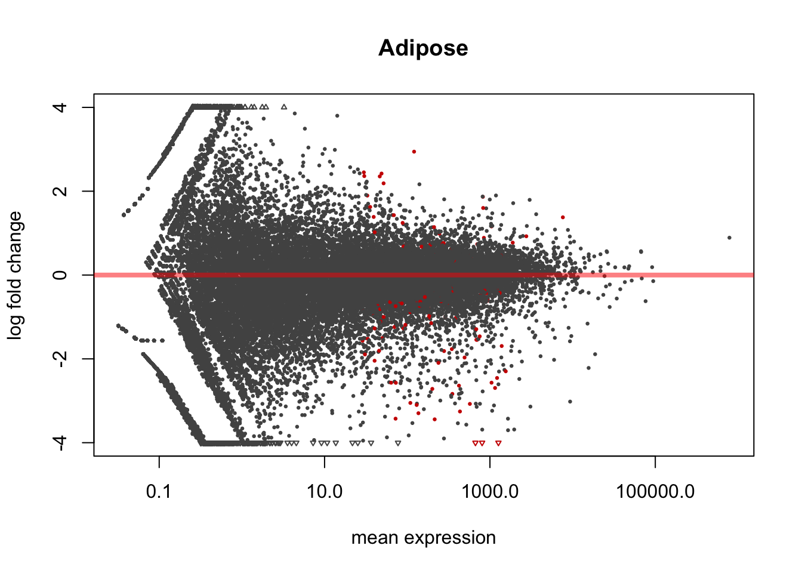

# DESeq Analysis
Dave Bridges  
August 2, 2015  


This script performs the DESeq analyses on the Juvenile HFD studies.  This script was most recently run on Sun Aug  2 10:20:18 2015


The counts data, derived from HTSeq are located in ../server-scripts/htseq-output.  The sample mapping file is located in ../sample-mapping.csv.


# Overall Analysis

The first model was a completely interacting model in which tissue, feeding state and diet were all able to interact.

 

 

 

# Adipose Tissue

The adipose tissue samples are all eWAT samples

## Effects of Feeding State

This model used only the adipose tissue data, and tested for changes related to the feeding state.


```
## 
## out of 30959 with nonzero total read count
## adjusted p-value < 0.1
## LFC > 0 (up)     : 43, 0.14% 
## LFC < 0 (down)   : 90, 0.29% 
## outliers [1]     : 0, 0% 
## low counts [2]   : 18164, 59% 
## (mean count < 28.7)
## [1] see 'cooksCutoff' argument of ?results
## [2] see 'independentFiltering' argument of ?results
```

 

# Session Information


```
## R version 3.2.0 (2015-04-16)
## Platform: x86_64-apple-darwin13.4.0 (64-bit)
## Running under: OS X 10.10.4 (Yosemite)
## 
## locale:
## [1] en_US.UTF-8/en_US.UTF-8/en_US.UTF-8/C/en_US.UTF-8/en_US.UTF-8
## 
## attached base packages:
## [1] parallel  stats4    stats     graphics  grDevices utils     datasets 
## [8] methods   base     
## 
## other attached packages:
##  [1] gplots_2.17.0             BiocParallel_1.2.18      
##  [3] DESeq2_1.8.1              RcppArmadillo_0.5.200.1.0
##  [5] Rcpp_0.12.0               GenomicRanges_1.20.5     
##  [7] GenomeInfoDb_1.4.1        IRanges_2.2.5            
##  [9] S4Vectors_0.6.3           BiocGenerics_0.14.0      
## [11] knitr_1.10.5             
## 
## loaded via a namespace (and not attached):
##  [1] genefilter_1.50.0    gtools_3.5.0         locfit_1.5-9.1      
##  [4] reshape2_1.4.1       splines_3.2.0        lattice_0.20-33     
##  [7] colorspace_1.2-6     htmltools_0.2.6      yaml_2.1.13         
## [10] survival_2.38-3      XML_3.98-1.3         foreign_0.8-65      
## [13] DBI_0.3.1            RColorBrewer_1.1-2   lambda.r_1.1.7      
## [16] plyr_1.8.3           stringr_1.0.0        munsell_0.4.2       
## [19] gtable_0.1.2         futile.logger_1.4.1  caTools_1.17.1      
## [22] evaluate_0.7         labeling_0.3         latticeExtra_0.6-26 
## [25] Biobase_2.28.0       geneplotter_1.46.0   AnnotationDbi_1.30.1
## [28] proto_0.3-10         KernSmooth_2.23-15   acepack_1.3-3.3     
## [31] xtable_1.7-4         scales_0.2.5         formatR_1.2         
## [34] gdata_2.17.0         Hmisc_3.16-0         annotate_1.46.1     
## [37] XVector_0.8.0        gridExtra_2.0.0      ggplot2_1.0.1       
## [40] digest_0.6.8         stringi_0.5-5        grid_3.2.0          
## [43] bitops_1.0-6         tools_3.2.0          magrittr_1.5        
## [46] RSQLite_1.0.0        Formula_1.2-1        cluster_2.0.3       
## [49] futile.options_1.0.0 MASS_7.3-43          rmarkdown_0.7       
## [52] rpart_4.1-10         nnet_7.3-10
```
