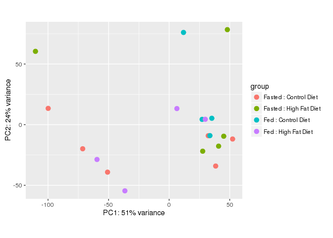
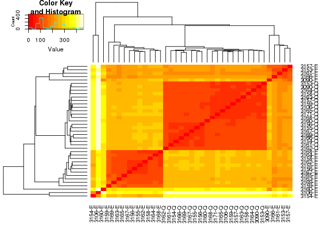
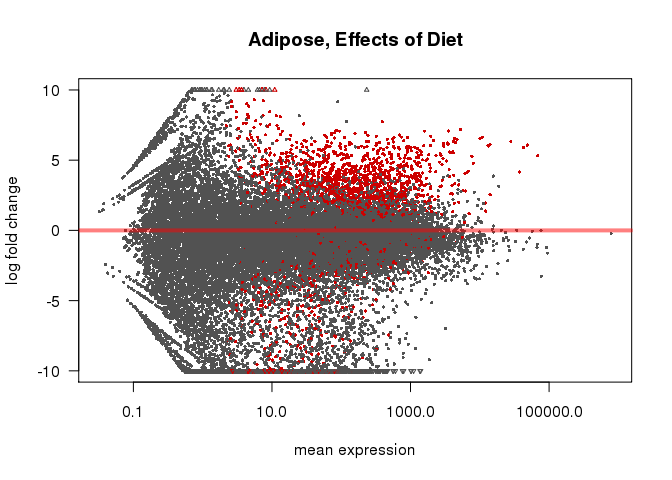
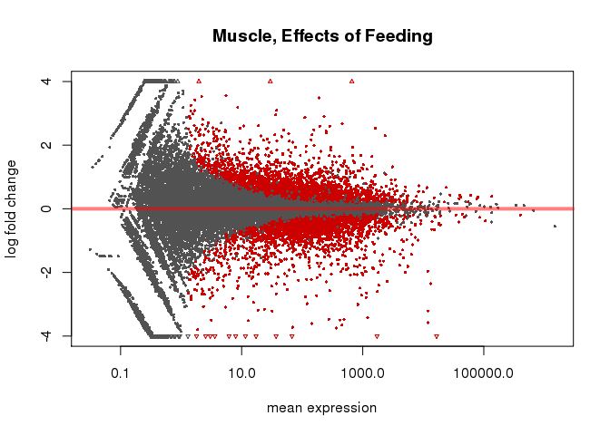

# DESeq Analysis
Dave Bridges  
August 2, 2015  


This script performs the DESeq analyses on the Juvenile HFD studies.  This script was most recently run on Mon Mar 14 14:14:25 2016


The counts data, derived from HTSeq are located in ../server-scripts/htseq-output.  The sample mapping file is located in ../sample-mapping.csv.  The annotations are from the file ENSEMBL Annotation.csv.


# Overall Analysis

The first model was a completely interacting model in which tissue, feeding state and diet were all able to interact.

<div class="figure">

<p class="caption">MA Plot for Overall Model</p>
</div>

<div class="figure">

<p class="caption">PCA Plot for Overall Model</p>
</div>

<div class="figure">

<p class="caption">Similarity Matrix for All Samples</p>
</div>

# Adipose Tissue

The adipose tissue samples are all eWAT samples

## Adipose Overall Model

This model used only the adipose tissue data, and tested for changes for the interaction between feeding state and diet, then for the main effects of each.


Using the combined model, we identified 2136 transcripts with a significant interaction between feeding and diet in WAT.  After removing those genes with an interaction, 205 genes had a main effect with respect to Diet and 110 transcripts had a main effect with respect to Feeding State.


Table: Top Hits for Effects of Diet

        ensembl_gene_id       baseMean   log2FoldChange   lfcSE    stat   pvalue   padj   log2FoldChange_Diet   lfcSE_Diet   pvalue_Diet   padj_Diet   log2FoldChange_Feeding   lfcSE_Feeding   pvalue_Feeding   padj_Feeding       X  gene_biotype     external_gene_name 
------  -------------------  ---------  ---------------  ------  ------  -------  -----  --------------------  -----------  ------------  ----------  -----------------------  --------------  ---------------  -------------  ------  ---------------  -------------------
20618   ENSMUSG00000073722        18.7            -27.5    4.32   -6.36        0      0                 21.72        3.018             0           0                    19.76           3.146                0              0   35576  protein_coding   4931408C20Rik      
31706   ENSMUSG00000091129        12.6            -26.6    4.24   -6.27        0      0                 21.09        2.972             0           0                    19.53           3.096                0              0   24044  protein_coding   Iqcf6              
13505   ENSMUSG00000045631        11.8            -26.4    4.68   -5.65        0      0                 20.98        3.238             0           0                    19.49           3.386                0              0   18923  protein_coding   Tmprss12           
10467   ENSMUSG00000036800        27.3            -30.0    4.19   -7.15        0      0                 15.76        2.691             0           0                    15.01           2.785                0              0    9757  protein_coding   Fam135b            
11808   ENSMUSG00000040152       571.8              6.3    1.26    5.01        0      0                 -4.45        0.816             0           0                    -5.09           0.872                0              0   15937  protein_coding   Thbs1              


Table: Top Hits for Effects of Feeding

        ensembl_gene_id       baseMean   log2FoldChange   lfcSE    stat   pvalue    padj   log2FoldChange_Diet   lfcSE_Diet   pvalue_Diet   padj_Diet   log2FoldChange_Feeding   lfcSE_Feeding   pvalue_Feeding   padj_Feeding       X  gene_biotype     external_gene_name 
------  -------------------  ---------  ---------------  ------  ------  -------  ------  --------------------  -----------  ------------  ----------  -----------------------  --------------  ---------------  -------------  ------  ---------------  -------------------
7035    ENSMUSG00000028996       214.6             5.93    1.33    4.44        0   0.001                 -3.27        0.854         0.000       0.012                    -6.07           0.937                0              0   28775  protein_coding   Rbp7               
20618   ENSMUSG00000073722        18.7           -27.48    4.32   -6.36        0   0.000                 21.72        3.018         0.000       0.000                    19.76           3.146                0              0   35576  protein_coding   4931408C20Rik      
31706   ENSMUSG00000091129        12.6           -26.61    4.24   -6.27        0   0.000                 21.09        2.972         0.000       0.000                    19.53           3.096                0              0   24044  protein_coding   Iqcf6              
10823   ENSMUSG00000037709      1219.6             5.21    1.15    4.54        0   0.001                 -2.70        0.744         0.000       0.017                    -4.89           0.795                0              0   35002  protein_coding   Fam13a             
2110    ENSMUSG00000019577       333.2             5.66    1.28    4.43        0   0.001                 -2.50        0.825         0.002       0.045                    -5.46           0.893                0              0   22720  protein_coding   Pdk4               


Table: Top Hits for Interaction between Diet and Feeding

        ensembl_gene_id       baseMean   log2FoldChange   lfcSE    stat   pvalue   padj   log2FoldChange_Diet   lfcSE_Diet   pvalue_Diet   padj_Diet   log2FoldChange_Feeding   lfcSE_Feeding   pvalue_Feeding   padj_Feeding       X  gene_biotype     external_gene_name 
------  -------------------  ---------  ---------------  ------  ------  -------  -----  --------------------  -----------  ------------  ----------  -----------------------  --------------  ---------------  -------------  ------  ---------------  -------------------
3678    ENSMUSG00000022432        46.6            -27.7    3.75   -7.39        0      0                  5.63         1.95         0.004       0.056                     3.90            2.08            0.061          0.309   13091  protein_coding   Smc1b              
31306   ENSMUSG00000090255        15.0            -26.2    3.61   -7.27        0      0                  5.50         1.87         0.003       0.051                     4.07            1.99            0.041          0.255   37120  antisense        4921534H16Rik      
10467   ENSMUSG00000036800        27.3            -30.0    4.19   -7.15        0      0                 15.76         2.69         0.000       0.000                    15.01            2.79            0.000          0.000    9757  protein_coding   Fam135b            
3093    ENSMUSG00000021415        11.3            -27.9    4.01   -6.96        0      0                  7.46         2.36         0.002       0.036                     6.29            2.48            0.011          0.138   29628  protein_coding   4933417A18Rik      
7308    ENSMUSG00000029437        11.3            -27.3    3.91   -6.97        0      0                  6.71         2.20         0.002       0.043                     5.58            2.32            0.016          0.165   30007  protein_coding   Il31               

## Effects of Feeding State

This model used only the adipose tissue data, and tested for changes related to the feeding state.


Table: Top Hits for Effects of Feeding

        ensembl_gene_id       baseMean   log2FoldChange   lfcSE    stat   pvalue    padj       X  gene_biotype     external_gene_name 
------  -------------------  ---------  ---------------  ------  ------  -------  ------  ------  ---------------  -------------------
10425   ENSMUSG00000036644      1351.9            0.467   0.076    6.11        0   0.000   26684  protein_coding   Tbc1d9b            
6864    ENSMUSG00000028715       803.9           -7.543   1.363   -5.54        0   0.000   26511  protein_coding   Cyp4a14            
2484    ENSMUSG00000020385       288.4           -0.656   0.124   -5.30        0   0.001   31424  protein_coding   Clk4               
817     ENSMUSG00000005220        14.2            3.801   0.766    4.96        0   0.002   16285  protein_coding   Corin              
5236    ENSMUSG00000025878       255.0           -0.629   0.128   -4.91        0   0.002   14925  protein_coding   Uimc1              

<div class="figure">

<p class="caption">MA Plot for Effects of Feeding Status on Adipose Tissue</p>
</div>

We identified 46 differentially expressed genes in adipose tissue, out of a total of 45232 genes tested.  Of these significantly differentially expressed genes, 16 were upregulated and 30 were downregulated.

## Effects of Diet Overall


Table: Top Hits for Effects of Diet, Ignoring Feeding

        ensembl_gene_id       baseMean   log2FoldChange   lfcSE     stat   pvalue    padj       X  gene_biotype     external_gene_name 
------  -------------------  ---------  ---------------  ------  -------  -------  ------  ------  ---------------  -------------------
22987   ENSMUSG00000079480       56.71            1.231   0.276   19.762    0.000   0.245   31944  protein_coding   Pin4               
2264    ENSMUSG00000020018      183.68            0.847   0.205   17.012    0.000   0.518   44451  protein_coding   Snrpf              
1       ENSMUSG00000000001      647.87            0.063   0.266    0.057    0.812   1.000   10968  protein_coding   Gnai3              
3       ENSMUSG00000000028       49.41            0.647   0.488    1.750    0.186   1.000   21198  protein_coding   Cdc45              
4       ENSMUSG00000000031        4.29            0.339   0.782    0.166    0.683   1.000   44859  lincRNA          H19                
7       ENSMUSG00000000056      259.33           -0.030   0.208    0.021    0.884   1.000   24598  protein_coding   Narf               
8       ENSMUSG00000000058      653.32           -0.030   0.641    0.001    0.971   1.000   26481  protein_coding   Cav2               
9       ENSMUSG00000000078      275.35           -0.288   0.467    0.298    0.585   1.000   11118  protein_coding   Klf6               
10      ENSMUSG00000000085      468.62            0.149   0.330    0.199    0.655   1.000   24470  protein_coding   Scmh1              
11      ENSMUSG00000000088      320.22            0.708   0.377    3.504    0.061   1.000    5606  protein_coding   Cox5a              

<div class="figure">

<p class="caption">MA Plot for Main Effects of Diet Status on Adipose Tissue</p>
</div>

We identified NA differentially expressed genes, out of a total of 45232 genes tested.  

## Effects of Diet with an Interaction


Table: Top Hits for Effects of Diet

        ensembl_gene_id       baseMean   log2FoldChange   lfcSE   stat   pvalue    padj   log2FC_HFDvsControl   lfcSE_HFDvsControl       X  gene_biotype           external_gene_name 
------  -------------------  ---------  ---------------  ------  -----  -------  ------  --------------------  -------------------  ------  ---------------------  -------------------
27712   ENSMUSG00000085684        2.97          -12.683   2.918   37.1        0   0.000                  5.81                1.599   25707  processed_transcript   4930469K13Rik      
12479   ENSMUSG00000042129      192.95            1.945   0.352   32.9        0   0.001                 -1.14                0.231   12610  protein_coding         Rassf4             
834     ENSMUSG00000005360      739.15            6.638   1.240   24.0        0   0.005                 -3.40                0.807   27013  protein_coding         Slc1a3             
964     ENSMUSG00000006235       37.36            6.110   1.169   24.6        0   0.005                 -3.10                0.754   25827  protein_coding         Epor               
1150    ENSMUSG00000008036      522.28           -0.814   0.334   23.1        0   0.005                  1.03                0.217   25195  protein_coding         Ap2s1              
1410    ENSMUSG00000012705     4124.93            6.331   1.217   22.8        0   0.005                 -3.13                0.792   13700  protein_coding         Retn               
1680    ENSMUSG00000015950      149.57            2.033   0.454   24.0        0   0.005                 -1.38                0.298   37961  protein_coding         Ncf1               
2317    ENSMUSG00000020101      850.98            5.361   1.053   23.2        0   0.005                 -2.83                0.685   15099  protein_coding         4632428N05Rik      
2401    ENSMUSG00000020241      943.11            3.530   0.680   25.3        0   0.005                 -1.66                0.443   16248  protein_coding         Col6a2             
2665    ENSMUSG00000020676       72.18            6.843   1.270   25.5        0   0.005                 -3.90                0.831   41451  protein_coding         Ccl11              

<div class="figure">

<p class="caption">MA Plot for Effects of Diet Status on Adipose Tissue</p>
</div>

We identified 1235 differentially expressed genes, out of a total of 45232 genes tested.  Of these significantly differentially expressed genes, 929 were upregulated and 306 were downregulated.

# Muscle Tissue

The muscle tissue samples are all quadriceps samples

## Quadriceps Overall Model

This model used only the quadricep tissue data, and tested for changes for the interaction between feeding state and diet, then for the main effects of each.


Using the combined model, we identified 2 transcripts with a significant interaction between feeding and diet in quad.  After removing those genes with an interaction, 3 genes had a main effect with respect to Diet and 2840 transcripts had a main effect with respect to Feeding State.


Table: Top Hits for Effects of Diet

        ensembl_gene_id       baseMean   log2FoldChange   lfcSE    stat   pvalue   padj   log2FoldChange_Diet   lfcSE_Diet   pvalue_Diet   padj_Diet   log2FoldChange_Feeding   lfcSE_Feeding   pvalue_Feeding   padj_Feeding       X  gene_biotype     external_gene_name 
------  -------------------  ---------  ---------------  ------  ------  -------  -----  --------------------  -----------  ------------  ----------  -----------------------  --------------  ---------------  -------------  ------  ---------------  -------------------
5067    ENSMUSG00000025477         911           -0.221   0.157   -1.41    0.160      1                 0.417        0.100             0       0.044                    0.425           0.112            0.000          0.002   40491  protein_coding   Inpp5a             
6935    ENSMUSG00000028841         956           -0.416   0.173   -2.41    0.016      1                 0.448        0.108             0       0.044                   -0.646           0.122            0.000          0.000   19911  protein_coding   Cnksr1             
11439   ENSMUSG00000039159         625           -0.168   0.150   -1.12    0.261      1                 0.388        0.096             0       0.044                    0.208           0.107            0.051          0.172   17205  protein_coding   Ube2h              
5906    ENSMUSG00000027022       12519           -0.172   0.166   -1.03    0.302      1                 0.399        0.105             0       0.073                    0.195           0.118            0.098          0.266   39489  protein_coding   Xirp2              
19154   ENSMUSG00000066839         705           -0.140   0.126   -1.11    0.267      1                 0.306        0.081             0       0.073                    0.266           0.090            0.003          0.021   44199  protein_coding   Ecsit              


Table: Top Hits for Effects of Feeding

        ensembl_gene_id       baseMean   log2FoldChange   lfcSE     stat   pvalue   padj   log2FoldChange_Diet   lfcSE_Diet   pvalue_Diet   padj_Diet   log2FoldChange_Feeding   lfcSE_Feeding   pvalue_Feeding   padj_Feeding       X  gene_biotype     external_gene_name 
------  -------------------  ---------  ---------------  ------  -------  -------  -----  --------------------  -----------  ------------  ----------  -----------------------  --------------  ---------------  -------------  ------  ---------------  -------------------
6930    ENSMUSG00000028834       11986            0.003   0.245    0.013    0.989      1                -0.029        0.154         0.851       0.970                    -3.58           0.173                0              0   36321  protein_coding   Trim63             
5917    ENSMUSG00000027075         828           -0.266   0.210   -1.269    0.204      1                -0.057        0.125         0.646       0.918                    -2.88           0.148                0              0   39992  protein_coding   Slc43a1            
4485    ENSMUSG00000024413        1821           -0.215   0.140   -1.539    0.124      1                 0.185        0.086         0.032       0.452                    -1.90           0.099                0              0   31803  protein_coding   Npc1               
14304   ENSMUSG00000048489        1721           -0.680   0.490   -1.387    0.165      1                 0.191        0.290         0.511       0.876                    -6.16           0.344                0              0     111  protein_coding   8430408G22Rik      
3631    ENSMUSG00000022358       11991           -0.126   0.276   -0.457    0.648      1                 0.069        0.174         0.694       0.933                    -3.15           0.195                0              0    3003  protein_coding   Fbxo32             


Table: Top Hits for Interaction between Diet and Feeding

        ensembl_gene_id       baseMean   log2FoldChange   lfcSE    stat   pvalue    padj   log2FoldChange_Diet   lfcSE_Diet   pvalue_Diet   padj_Diet   log2FoldChange_Feeding   lfcSE_Feeding   pvalue_Feeding   padj_Feeding       X  gene_biotype     external_gene_name 
------  -------------------  ---------  ---------------  ------  ------  -------  ------  --------------------  -----------  ------------  ----------  -----------------------  --------------  ---------------  -------------  ------  ---------------  -------------------
16878   ENSMUSG00000059481        12.6          -21.445   3.703   -5.79        0   0.000                18.231        2.750         0.000          NA                   21.150           2.919            0.000          0.000   30495  protein_coding   Plg                
17760   ENSMUSG00000063415        74.6           -3.853   0.742   -5.19        0   0.003                 0.286        0.456         0.531          NA                    0.886           0.507            0.081          0.234    8793  protein_coding   Cyp26b1            
10737   ENSMUSG00000037465       182.0           -1.095   0.261   -4.19        0   0.235                 0.264        0.157         0.092          NA                   -0.994           0.181            0.000          0.000   42445  protein_coding   Klf10              
5300    ENSMUSG00000025991         7.9          -22.203   5.588   -3.97        0   0.450                17.569        3.805         0.000          NA                   20.595           4.139            0.000          0.000   37633  protein_coding   Cps1               
2229    ENSMUSG00000019944       171.2           -0.715   0.189   -3.79        0   0.683                 0.408        0.122         0.001          NA                    0.495           0.134            0.000          0.003   35623  protein_coding   Rhobtb1            

## Effects of Feeding State

This model used only the quadriceps tissue data, and tested for changes related to the feeding state.


Table: Top Hits for Effects of Feeding

        ensembl_gene_id       baseMean   log2FoldChange   lfcSE    stat   pvalue   padj       X  gene_biotype     external_gene_name 
------  -------------------  ---------  ---------------  ------  ------  -------  -----  ------  ---------------  -------------------
6930    ENSMUSG00000028834       11986            -3.58   0.119   -30.1        0      0   36321  protein_coding   Trim63             
5917    ENSMUSG00000027075         828            -3.01   0.108   -27.8        0      0   39992  protein_coding   Slc43a1            
4485    ENSMUSG00000024413        1821            -2.01   0.074   -27.0        0      0   31803  protein_coding   Npc1               
14304   ENSMUSG00000048489        1721            -6.49   0.243   -26.7        0      0     111  protein_coding   8430408G22Rik      
3631    ENSMUSG00000022358       11991            -3.21   0.135   -23.9        0      0    3003  protein_coding   Fbxo32             

<div class="figure">

<p class="caption">MA Plot for Effects of Feeding Status on Muscle Tissue</p>
</div>

We identified 4764 differentially expressed genes in muscle tissue, out of a total of 45232 genes tested.  Of these significantly differentially expressed genes, 2353 were upregulated and 2411 were downregulated.

## Effects of Diet 


Table: Top Hits for Effects of Diet

        ensembl_gene_id       baseMean   log2FoldChange   lfcSE   stat   pvalue    padj   log2FC_HFDvsControl   lfcSE_HFDvsControl       X  gene_biotype           external_gene_name 
------  -------------------  ---------  ---------------  ------  -----  -------  ------  --------------------  -------------------  ------  ---------------------  -------------------
30697   ENSMUSG00000089417        19.6            1.026   0.772   42.1        0   0.000                -2.856                0.493   32167  scaRNA                 Gm22009            
42477   ENSMUSG00000103880        60.6           -0.918   0.388   35.3        0   0.000                -0.671                0.249   15263  processed_pseudogene   Gm37009            
17760   ENSMUSG00000063415        74.6           -3.853   0.742   32.6        0   0.000                 0.286                0.456    8793  protein_coding         Cyp26b1            
5922    ENSMUSG00000027080        33.6           -0.318   0.344   27.7        0   0.003                 1.031                0.237   40317  protein_coding         Med19              
691     ENSMUSG00000004285       361.5           -0.046   0.206   24.1        0   0.009                -0.479                0.132   21470  protein_coding         Atp6v1f            
2805    ENSMUSG00000020893       623.4           -0.723   0.314   24.2        0   0.009                -0.394                0.195   41303  protein_coding         Per1               
18016   ENSMUSG00000064368        44.3           -0.568   0.583   24.3        0   0.009                -1.172                0.368       5  protein_coding         mt-Nd6             
11439   ENSMUSG00000039159       624.7           -0.168   0.150   20.1        0   0.057                 0.388                0.096   17205  protein_coding         Ube2h              
5067    ENSMUSG00000025477       910.9           -0.221   0.157   19.8        0   0.060                 0.417                0.100   40491  protein_coding         Inpp5a             
502     ENSMUSG00000002910      1209.1           -0.479   0.343   18.8        0   0.080                -0.506                0.212    9876  protein_coding         Arrdc2             

<div class="figure">

<p class="caption">MA Plot for Effects of Diet Status on Adipose Tissue</p>
</div>

We identified 7 differentially expressed genes in quadriceps, out of a total of 45232 genes tested.  Of these significantly differentially expressed genes, 1 were upregulated and 6 were downregulated.


# Session Information


```
## R version 3.2.2 (2015-08-14)
## Platform: x86_64-redhat-linux-gnu (64-bit)
## Running under: Red Hat Enterprise Linux Server release 6.7 (Santiago)
## 
## locale:
##  [1] LC_CTYPE=en_US.UTF-8       LC_NUMERIC=C              
##  [3] LC_TIME=en_US.UTF-8        LC_COLLATE=en_US.UTF-8    
##  [5] LC_MONETARY=en_US.UTF-8    LC_MESSAGES=en_US.UTF-8   
##  [7] LC_PAPER=en_US.UTF-8       LC_NAME=C                 
##  [9] LC_ADDRESS=C               LC_TELEPHONE=C            
## [11] LC_MEASUREMENT=en_US.UTF-8 LC_IDENTIFICATION=C       
## 
## attached base packages:
## [1] parallel  stats4    stats     graphics  grDevices utils     datasets 
## [8] methods   base     
## 
## other attached packages:
##  [1] gplots_2.17.0              BiocParallel_1.4.3        
##  [3] DESeq2_1.10.1              RcppArmadillo_0.6.500.4.0 
##  [5] Rcpp_0.12.3                SummarizedExperiment_1.0.2
##  [7] Biobase_2.30.0             GenomicRanges_1.22.4      
##  [9] GenomeInfoDb_1.6.3         IRanges_2.4.8             
## [11] S4Vectors_0.8.11           BiocGenerics_0.16.1       
## [13] knitr_1.12.3              
## 
## loaded via a namespace (and not attached):
##  [1] genefilter_1.52.1    gtools_3.5.0         locfit_1.5-9.1      
##  [4] splines_3.2.2        lattice_0.20-33      colorspace_1.2-6    
##  [7] htmltools_0.3        yaml_2.1.13          survival_2.38-3     
## [10] XML_3.98-1.4         foreign_0.8-66       DBI_0.3.1           
## [13] RColorBrewer_1.1-2   lambda.r_1.1.7       plyr_1.8.3          
## [16] stringr_1.0.0        zlibbioc_1.16.0      munsell_0.4.3       
## [19] gtable_0.2.0         futile.logger_1.4.1  caTools_1.17.1      
## [22] evaluate_0.8.3       labeling_0.3         latticeExtra_0.6-28 
## [25] geneplotter_1.48.0   AnnotationDbi_1.32.3 highr_0.5.1         
## [28] KernSmooth_2.23-15   acepack_1.3-3.3      xtable_1.8-2        
## [31] scales_0.4.0         formatR_1.3          gdata_2.17.0        
## [34] Hmisc_3.17-2         annotate_1.48.0      XVector_0.10.0      
## [37] gridExtra_2.2.1      ggplot2_2.1.0        digest_0.6.9        
## [40] stringi_1.0-1        grid_3.2.2           bitops_1.0-6        
## [43] tools_3.2.2          magrittr_1.5         RSQLite_1.0.0       
## [46] Formula_1.2-1        cluster_2.0.3        futile.options_1.0.0
## [49] rmarkdown_0.9.5      rpart_4.1-10         nnet_7.3-12
```
