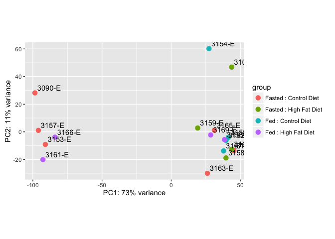
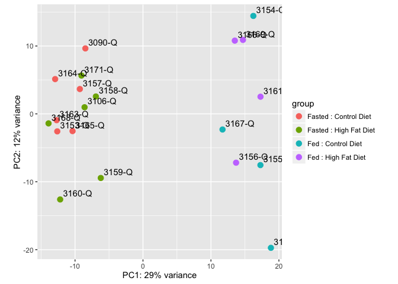

# DESeq Analysis
Quynh Tran  
August 2, 2015  


This script performs the DESeq analyses on the Juvenile HFD studies.  This script was most recently run on Thu Apr 14 10:40:14 2016.  This uses the input data from the kallisto runs.


The counts data, derived from kallisto and get_highest_kallisto_count_transcript.Rmd are located in Unique_Estimated_Counts_WAT.csv and Unique_Estimated_Counts_Quad.csv.  The sample mapping file is located in ../sample-mapping.csv.  The annotations are from the file ENSEMBL Annotation - Transcripts.csv.


Table: Total counts for each eWAT samples

                     Total_counts
------------------  -------------
IonXpress_RNA_026        23340422
IonXpress_RNA_027        18471646
IonXpress_RNA_028        17049308
IonXpress_RNA_029        21161430
IonXpress_RNA_030        20944002
IonXpress_RNA_031        19131039
IonXpress_RNA_032        18414141
IonXpress_RNA_033        17915008
IonXpress_RNA_034        19363799
IonXpress_RNA_035        18712520
IonXpress_RNA_036        16537715
IonXpress_RNA_037        17952538
IonXpress_RNA_038        15857919
IonXpress_RNA_039        16754140
IonXpress_RNA_040        17884106
IonXpress_RNA_041        17132159
IonXpress_RNA_042        19257253
IonXpress_RNA_043        17405180
IonXpress_RNA_044        17660396


```
## 
## WAT Descriptive statistics
## =======================================================
## Statistic           N     Mean   St. Dev. Min    Max   
## -------------------------------------------------------
## IonXpress_RNA_026 20,546 1,136.0 10,271.0  0   759,414 
## IonXpress_RNA_027 20,546  899.0  7,661.0   0   481,821 
## IonXpress_RNA_028 20,546  830.0  5,172.0   0   433,831 
## IonXpress_RNA_029 20,546 1,030.0 6,593.0   0   414,986 
## IonXpress_RNA_030 20,546 1,019.0 8,952.0   0   579,504 
## IonXpress_RNA_031 20,546  931.0  5,996.0   0   388,145 
## IonXpress_RNA_032 20,546  896.0  5,487.0   0   356,727 
## IonXpress_RNA_033 20,546  872.0  5,876.0   0   438,052 
## IonXpress_RNA_034 20,546  942.0  7,084.0   0   510,524 
## IonXpress_RNA_035 20,546  911.0  6,085.0   0   412,945 
## IonXpress_RNA_036 20,546  805.0  3,573.0   0   251,213 
## IonXpress_RNA_037 20,546  874.0  5,610.0   0   321,656 
## IonXpress_RNA_038 20,546  772.0  5,969.0   0   533,584 
## IonXpress_RNA_039 20,546  815.0  5,629.0   0   389,594 
## IonXpress_RNA_040 20,546  870.0  12,815.0  0  1,453,430
## IonXpress_RNA_041 20,546  834.0  7,162.0   0   541,135 
## IonXpress_RNA_042 20,546  937.0  7,696.0   0   476,103 
## IonXpress_RNA_043 20,546  847.0  5,822.0   0   384,315 
## IonXpress_RNA_044 20,546  860.0  5,520.0   0   374,466 
## -------------------------------------------------------
```

```
## 
## QUAD Descriptive statistics
## =======================================================
## Statistic           N     Mean   St. Dev. Min    Max   
## -------------------------------------------------------
## IonXpress_RNA_045 18,464 1,014.0 18,472.0  0  1,666,940
## IonXpress_RNA_046 18,464  992.0  15,705.0  0  1,109,870
## IonXpress_RNA_059 18,464  891.0  15,592.0  0  1,066,150
## IonXpress_RNA_060 18,464 1,010.0 19,224.0  0  1,709,080
## IonXpress_RNA_061 18,464 1,011.0 16,986.0  0  1,270,810
## IonXpress_RNA_062 18,464  959.0  14,759.0  0   788,137 
## IonXpress_RNA_063 18,464 1,052.0 17,112.0  0  1,198,510
## IonXpress_RNA_064 18,464 1,173.0 18,611.0  0  1,358,210
## IonXpress_RNA_47  18,464  952.0  16,491.0  0  1,208,780
## IonXpress_RNA_48  18,464 1,000.0 16,573.0  0  1,237,440
## IonXpress_RNA_49  18,464  938.0  15,359.0  0  1,114,310
## IonXpress_RNA_50  18,464 1,096.0 16,997.0  0  1,129,160
## IonXpress_RNA_51  18,464  938.0  15,762.0  0  1,179,960
## IonXpress_RNA_52  18,464  849.0  13,353.0  0  1,028,780
## IonXpress_RNA_53  18,464  990.0  15,388.0  0  1,022,380
## IonXpress_RNA_54  18,464  883.0  14,787.0  0  1,049,510
## IonXpress_RNA_55  18,464 1,350.0 23,230.0  0  1,725,240
## IonXpress_RNA_56  18,464 1,033.0 17,245.0  0  1,281,270
## IonXpress_RNA_57  18,464 1,003.0 19,042.0  0  1,583,020
## IonXpress_RNA_58  18,464  993.0  16,394.0  0  1,198,470
## -------------------------------------------------------
```


Table: Sum counts of WAT

 IonXpress_RNA_026   IonXpress_RNA_027   IonXpress_RNA_028   IonXpress_RNA_029   IonXpress_RNA_030   IonXpress_RNA_031   IonXpress_RNA_032   IonXpress_RNA_033   IonXpress_RNA_034   IonXpress_RNA_035   IonXpress_RNA_036   IonXpress_RNA_037   IonXpress_RNA_038   IonXpress_RNA_039   IonXpress_RNA_040   IonXpress_RNA_041   IonXpress_RNA_042   IonXpress_RNA_043   IonXpress_RNA_044
------------------  ------------------  ------------------  ------------------  ------------------  ------------------  ------------------  ------------------  ------------------  ------------------  ------------------  ------------------  ------------------  ------------------  ------------------  ------------------  ------------------  ------------------  ------------------
          23340422            18471646            17049308            21161430            20944002            19131039            18414141            17915008            19363799            18712520            16537715            17952538            15857919            16754140            17884106            17132159            19257253            17405180            17660396


Table: Sum counts of QUAD

 IonXpress_RNA_045   IonXpress_RNA_046   IonXpress_RNA_059   IonXpress_RNA_060   IonXpress_RNA_061   IonXpress_RNA_062   IonXpress_RNA_063   IonXpress_RNA_064   IonXpress_RNA_47   IonXpress_RNA_48   IonXpress_RNA_49   IonXpress_RNA_50   IonXpress_RNA_51   IonXpress_RNA_52   IonXpress_RNA_53   IonXpress_RNA_54   IonXpress_RNA_55   IonXpress_RNA_56   IonXpress_RNA_57   IonXpress_RNA_58
------------------  ------------------  ------------------  ------------------  ------------------  ------------------  ------------------  ------------------  -----------------  -----------------  -----------------  -----------------  -----------------  -----------------  -----------------  -----------------  -----------------  -----------------  -----------------  -----------------
          18715553            18318996            16448226            18655011            18665685            17705407            19423465            21659001           17586655           18473806           17322340           20240449           17309832           15667925           18272653           16305065           24925414           19074794           18520194           18330614
##Adipose Tissue

The adipose tissue samples are all eWAT samples

## Adipose Overall Model

This model used only the adipose tissue data, and tested for changes for the interaction between feeding state and diet, then for the main effects of each.


Using the combined model, we identified 2320 transcripts with a significant interaction between feeding and diet in WAT. Of which, 2026 genes are up-regulated while 294 genes are downregulated . 

There are 21 genes had a main effect with respect to Diet and 389 genes had a main effect with respect to Feeding State.


Table: Top Hits for Effects of Diet

        ensembl_transcript_id    baseMean   log2FoldChange   lfcSE   stat   pvalue   padj   log2FoldChange_Diet   lfcSE_Diet   pvalue_Diet   padj_Diet   log2FoldChange_Feeding   lfcSE_Feeding   pvalue_Feeding   padj_Feeding       X  gene_biotype     external_gene_name   ensembl_gene_id    
------  ----------------------  ---------  ---------------  ------  -----  -------  -----  --------------------  -----------  ------------  ----------  -----------------------  --------------  ---------------  -------------  ------  ---------------  -------------------  -------------------
4447    ENSMUST00000031729          230.4             25.7    4.13   6.21        0      0                 -24.4         3.46             0           0                    -4.17            2.06            0.043          0.189   79968  protein_coding   Tfr2                 ENSMUSG00000029716 
3615    ENSMUST00000028681         1138.1             26.3    4.78   5.51        0      0                 -26.6         3.86             0           0                    -2.99            2.58            0.246          0.472   93614  protein_coding   F2                   ENSMUSG00000027249 
1171    ENSMUST00000017590          272.5             27.2    4.29   6.34        0      0                 -24.1         3.56             0           0                    -3.44            2.19            0.116          0.318   58911  protein_coding   C1qtnf1              ENSMUSG00000017446 
10588   ENSMUST00000073772           51.4             20.7    3.94   5.24        0      0                 -22.5         3.34             0           0                    -2.74            1.88            0.146          0.360    8467  protein_coding   Ugt1a9               ENSMUSG00000090175 
18667   ENSMUST00000170392           71.8             22.9    4.02   5.70        0      0                 -22.8         3.40             0           0                    -3.05            1.96            0.121          0.325   68291  protein_coding   Pglyrp2              ENSMUSG00000079563 


Table: Top Hits for Effects of Feeding

        ensembl_transcript_id    baseMean   log2FoldChange   lfcSE   stat   pvalue    padj   log2FoldChange_Diet   lfcSE_Diet   pvalue_Diet   padj_Diet   log2FoldChange_Feeding   lfcSE_Feeding   pvalue_Feeding   padj_Feeding        X  gene_biotype     external_gene_name   ensembl_gene_id    
------  ----------------------  ---------  ---------------  ------  -----  -------  ------  --------------------  -----------  ------------  ----------  -----------------------  --------------  ---------------  -------------  -------  ---------------  -------------------  -------------------
14369   ENSMUST00000106526            198            23.68    4.62   5.12    0.000   0.000                 -3.98        2.842         0.161       0.477                   -24.91           3.452                0              0    19656  protein_coding   Acsm3                ENSMUSG00000030935 
17521   ENSMUST00000159440            102            25.75    4.65   5.54    0.000   0.000                 -5.27        2.871         0.066       0.323                   -23.92           3.462                0              0   107068  protein_coding   Gls2                 ENSMUSG00000044005 
4214    ENSMUST00000030848            568             6.03    1.42   4.24    0.000   0.002                 -3.14        0.999         0.002       0.069                    -6.32           0.925                0              0    60166  protein_coding   Rbp7                 ENSMUSG00000028996 
5610    ENSMUST00000036765            507             3.40    1.11   3.07    0.002   0.024                 -2.91        0.781         0.000       0.027                    -4.52           0.716                0              0    23817  protein_coding   Eif4ebp3             ENSMUSG00000090264 
12106   ENSMUST00000089860           3624             5.31    1.19   4.45    0.000   0.002                 -2.92        0.844         0.001       0.048                    -4.83           0.771                0              0    77490  protein_coding   Fam13a               ENSMUSG00000037709 


Table: Top Hits for Interaction between Diet and Feeding

        ensembl_transcript_id    baseMean   log2FoldChange   lfcSE    stat   pvalue   padj   log2FoldChange_Diet   lfcSE_Diet   pvalue_Diet   padj_Diet   log2FoldChange_Feeding   lfcSE_Feeding   pvalue_Feeding   padj_Feeding        X  gene_biotype     external_gene_name   ensembl_gene_id    
------  ----------------------  ---------  ---------------  ------  ------  -------  -----  --------------------  -----------  ------------  ----------  -----------------------  --------------  ---------------  -------------  -------  ---------------  -------------------  -------------------
1171    ENSMUST00000017590          272.5            27.18   4.289    6.34        0      0                -24.15        3.558         0.000       0.000                   -3.440           2.186            0.116          0.318    58911  protein_coding   C1qtnf1              ENSMUSG00000017446 
4447    ENSMUST00000031729          230.4            25.66   4.134    6.21        0      0                -24.42        3.465         0.000       0.000                   -4.165           2.059            0.043          0.189    79968  protein_coding   Tfr2                 ENSMUSG00000029716 
15701   ENSMUST00000113779           32.9            30.00   4.872    6.16        0      0                -15.14        3.568         0.000       0.006                  -15.748           3.167            0.000          0.000    68936  protein_coding   Eda                  ENSMUSG00000059327 
18667   ENSMUST00000170392           71.8            22.90   4.021    5.70        0      0                -22.80        3.396         0.000       0.000                   -3.046           1.963            0.121          0.325    68291  protein_coding   Pglyrp2              ENSMUSG00000079563 
19712   ENSMUST00000181860           21.8            30.00   5.356    5.60        0      0                -15.31        3.899         0.000       0.015                  -15.922           3.477            0.000          0.001    27704  protein_coding   Car1                 ENSMUSG00000027556 
15905   ENSMUST00000114890           28.4            -3.96   0.711   -5.57        0      0                  1.70        0.476         0.000       0.038                    0.969           0.441            0.028          0.152    96012  protein_coding   Gm17604              ENSMUSG00000079600 
17521   ENSMUST00000159440          101.7            25.75   4.648    5.54        0      0                 -5.27        2.871         0.066       0.323                  -23.919           3.462            0.000          0.000   107068  protein_coding   Gls2                 ENSMUSG00000044005 
3615    ENSMUST00000028681         1138.1            26.34   4.783    5.51        0      0                -26.61        3.861         0.000       0.000                   -2.987           2.577            0.246          0.472    93614  protein_coding   F2                   ENSMUSG00000027249 
8712    ENSMUST00000057685           33.0            21.59   3.980    5.42        0      0                -21.77        3.367         0.000       0.000                   -2.985           1.927            0.121          0.326    97725  protein_coding   Gltpd2               ENSMUSG00000046811 
4722    ENSMUST00000032958          396.8             6.89   1.311    5.25        0      0                 -3.06        0.924         0.001       0.057                   -4.615           0.849            0.000          0.000    73745  protein_coding   Ucp3                 ENSMUSG00000032942 
10588   ENSMUST00000073772           51.4            20.65   3.939    5.24        0      0                -22.45        3.341         0.000       0.000                   -2.738           1.884            0.146          0.360     8467  protein_coding   Ugt1a9               ENSMUSG00000090175 
7933    ENSMUST00000051846           71.2            22.53   4.355    5.17        0      0                -22.15        3.598         0.000       0.000                   -0.850           2.240            0.704          0.820    55717  protein_coding   Cyp2c70              ENSMUSG00000060613 
6623    ENSMUST00000043077         6862.8             6.37   1.246    5.11        0      0                 -2.79        0.881         0.002       0.068                   -1.629           0.804            0.043          0.188      905  protein_coding   Thrsp                ENSMUSG00000035686 
12825   ENSMUST00000096269           19.8            21.18   4.136    5.12        0      0                -20.38        3.464         0.000       0.000                   -1.045           2.063            0.612          0.759    83849  protein_coding   Slc22a30             ENSMUSG00000052562 
14369   ENSMUST00000106526          198.2            23.68   4.623    5.12        0      0                 -3.98        2.842         0.161       0.477                  -24.905           3.452            0.000          0.000    19656  protein_coding   Acsm3                ENSMUSG00000030935 
14453   ENSMUST00000107016           57.5           -30.00   5.868   -5.11        0      0                 13.31        4.047         0.001       0.059                   17.392           3.766            0.000          0.001    70874  protein_coding   Hsd3b1               ENSMUSG00000027871 
17626   ENSMUST00000160929          835.5             6.30   1.237    5.09        0      0                 -3.72        0.876         0.000       0.006                   -3.038           0.798            0.000          0.009    54030  protein_coding   Hsd11b1              ENSMUSG00000016194 
11449   ENSMUST00000081619        10999.7             6.95   1.373    5.06        0      0                 -3.51        0.971         0.000       0.034                   -3.710           0.886            0.000          0.004   102065  protein_coding   Sh3pxd2a             ENSMUSG00000053617 
17204   ENSMUST00000146411          158.6            23.76   4.712    5.04        0      0                -23.97        3.815         0.000       0.000                   -3.447           2.522            0.172          0.392    94079  protein_coding   Asgr1                ENSMUSG00000020884 
18355   ENSMUST00000167643           34.3            24.68   4.908    5.03        0      0                 -3.97        3.084         0.198       0.517                  -22.191           3.606            0.000          0.000    15941  protein_coding   Sco2                 ENSMUSG00000091780 

<div class="figure">

<p class="caption">MA Plot for Interaction results in WAT</p>
</div>




# Muscle Tissue

The muscle tissue samples are all quadriceps samples

## Muscle Overall Model

This model used only the quadricep tissue data, and tested for changes for the interaction between feeding state and diet, then for the main effects of each.


  Using the combined model, we identified NA transcripts with a significant interaction between feeding and diet in quadriceps.  There are 3130 genes that had a main effect with respect to Feeding State.


Table: Top Hits for Effects of Diet

       ensembl_transcript_id    baseMean   log2FoldChange   lfcSE    stat   pvalue   padj   log2FoldChange_Diet   lfcSE_Diet   pvalue_Diet   padj_Diet   log2FoldChange_Feeding   lfcSE_Feeding   pvalue_Feeding   padj_Feeding       X  gene_biotype     external_gene_name   ensembl_gene_id    
-----  ----------------------  ---------  ---------------  ------  ------  -------  -----  --------------------  -----------  ------------  ----------  -----------------------  --------------  ---------------  -------------  ------  ---------------  -------------------  -------------------
3867   ENSMUST00000030508           54.1           -0.634   0.297   -2.14    0.033      1                 0.888        0.191             0       0.052                    0.462           0.217            0.034          0.117   54259  protein_coding   Pax7                 ENSMUSG00000028736 
549    ENSMUST00000005705         1026.2           -0.225   0.096   -2.34    0.019      1                 0.252        0.060             0       0.087                   -0.075           0.068            0.275          0.498   33773  protein_coding   Trim28               ENSMUSG00000005566 
3899   ENSMUST00000030645         2126.9           -0.360   0.163   -2.20    0.028      1                 0.422        0.103             0       0.087                   -0.681           0.116            0.000          0.000   37174  protein_coding   Cnksr1               ENSMUSG00000028841 
7335   ENSMUST00000050916           76.1            0.659   0.228    2.89    0.004      1                -0.583        0.144             0       0.087                   -0.386           0.159            0.015          0.065   58016  protein_coding   Snx33                ENSMUSG00000032733 
7686   ENSMUST00000053871          143.6           -0.734   0.311   -2.36    0.018      1                 0.816        0.200             0       0.087                    0.934           0.222            0.000          0.000   22575  protein_coding   Ckap4                ENSMUSG00000046841 


Table: Top Hits for Effects of Feeding

        ensembl_transcript_id    baseMean   log2FoldChange   lfcSE     stat   pvalue   padj   log2FoldChange_Diet   lfcSE_Diet   pvalue_Diet   padj_Diet   log2FoldChange_Feeding   lfcSE_Feeding   pvalue_Feeding   padj_Feeding        X  gene_biotype     external_gene_name   ensembl_gene_id    
------  ----------------------  ---------  ---------------  ------  -------  -------  -----  --------------------  -----------  ------------  ----------  -----------------------  --------------  ---------------  -------------  -------  ---------------  -------------------  -------------------
9125    ENSMUST00000067354         2869.6            0.551   0.408    1.351    0.177      1                 0.152        0.239         0.526       0.999                    -7.00           0.293                0              0      142  protein_coding   8430408G22Rik        ENSMUSG00000048489 
12855   ENSMUST00000105875        27856.0           -0.046   0.246   -0.187    0.852      1                -0.008        0.155         0.960       1.000                    -3.52           0.174                0              0    81577  protein_coding   Trim63               ENSMUSG00000028834 
2583    ENSMUST00000025279         3794.0           -0.218   0.133   -1.637    0.102      1                 0.178        0.083         0.032       0.800                    -1.88           0.094                0              0    68773  protein_coding   Npc1                 ENSMUSG00000024413 
14768   ENSMUST00000118936         2808.3           -0.111   0.152   -0.728    0.467      1                 0.010        0.095         0.920       0.999                    -1.80           0.108                0              0   107766  protein_coding   Gucd1                ENSMUSG00000033416 
2112    ENSMUST00000022986        32168.7           -0.108   0.282   -0.384    0.701      1                 0.075        0.178         0.674       0.999                    -3.15           0.200                0              0     4159  protein_coding   Fbxo32               ENSMUSG00000022358 
12468   ENSMUST00000102745          933.7           -0.198   0.265   -0.749    0.454      1                 0.202        0.171         0.239       0.999                     2.96           0.187                0              0    49555  protein_coding   Tnfaip2              ENSMUSG00000021281 
4116    ENSMUST00000031490         4571.6           -0.119   0.147   -0.810    0.418      1                 0.206        0.092         0.025       0.758                    -1.55           0.104                0              0    62696  protein_coding   Ulk1                 ENSMUSG00000029512 
4635    ENSMUST00000033880         2152.7           -0.059   0.185   -0.319    0.750      1                -0.061        0.115         0.595       0.999                    -1.94           0.131                0              0    14161  protein_coding   Eif4ebp1             ENSMUSG00000031490 
14759   ENSMUST00000118762         1708.3            0.077   0.177    0.434    0.664      1                 0.045        0.110         0.680       0.999                    -1.86           0.125                0              0    89926  protein_coding   Kctd20               ENSMUSG00000005936 
4701    ENSMUST00000034091         1933.6            0.143   0.165    0.864    0.388      1                -0.016        0.103         0.874       0.999                    -1.70           0.117                0              0    95482  protein_coding   Rbl2                 ENSMUSG00000031666 
6141    ENSMUST00000042581          608.7           -0.060   0.253   -0.237    0.813      1                 0.049        0.165         0.766       0.999                     2.59           0.179                0              0    35440  protein_coding   6430571L13Rik        ENSMUSG00000037977 
6975    ENSMUST00000048319         1617.9           -0.032   0.174   -0.182    0.856      1                -0.064        0.108         0.551       0.999                    -1.76           0.123                0              0    31167  protein_coding   Zfyve1               ENSMUSG00000042628 
2017    ENSMUST00000022623         2550.3           -0.074   0.138   -0.539    0.590      1                 0.144        0.088         0.102       0.958                     1.34           0.098                0              0    74675  protein_coding   Trim35               ENSMUSG00000022043 
9834    ENSMUST00000074949         1849.4           -0.287   0.245   -1.173    0.241      1                 0.374        0.153         0.014       0.693                    -2.37           0.173                0              0    43544  protein_coding   Tmem140              ENSMUSG00000057137 
10603   ENSMUST00000084513        24248.0            0.207   0.267    0.773    0.439      1                 0.002        0.169         0.989       1.000                    -2.57           0.189                0              0    27745  protein_coding   Tacc2                ENSMUSG00000030852 
4279    ENSMUST00000032264         2362.6           -0.244   0.247   -0.989    0.323      1                 0.134        0.154         0.387       0.999                    -2.37           0.175                0              0    21256  protein_coding   Gabarapl1            ENSMUSG00000030161 
14904   ENSMUST00000120664         1244.4            0.215   0.133    1.619    0.105      1                -0.038        0.082         0.647       0.999                    -1.27           0.094                0              0    18438  protein_coding   Pde4d                ENSMUSG00000021699 
11425   ENSMUST00000093962           98.2           -0.140   0.290   -0.483    0.629      1                 0.055        0.212         0.796       0.999                     2.75           0.206                0              0    27759  protein_coding   Ccnd1                ENSMUSG00000070348 
5129    ENSMUST00000035842          267.6            0.737   0.347    2.125    0.034      1                -0.405        0.204         0.047       0.862                    -3.28           0.248                0              0    21794  protein_coding   Rassf4               ENSMUSG00000042129 
1386    ENSMUST00000020223         1323.3           -0.181   0.203   -0.889    0.374      1                 0.208        0.126         0.099       0.958                    -1.85           0.144                0              0   100212  protein_coding   Tcp11l2              ENSMUSG00000020034 



# Session Information


```
## R version 3.2.2 (2015-08-14)
## Platform: x86_64-apple-darwin13.4.0 (64-bit)
## Running under: OS X 10.10.5 (Yosemite)
## 
## locale:
## [1] en_US.UTF-8/en_US.UTF-8/en_US.UTF-8/C/en_US.UTF-8/en_US.UTF-8
## 
## attached base packages:
##  [1] grid      parallel  stats4    stats     graphics  grDevices utils    
##  [8] datasets  methods   base     
## 
## other attached packages:
##  [1] circlize_0.3.5             ComplexHeatmap_1.6.0      
##  [3] pheatmap_1.0.8             ggplot2_2.1.0             
##  [5] DESeq2_1.10.1              RcppArmadillo_0.6.700.3.0 
##  [7] Rcpp_0.12.4                SummarizedExperiment_1.0.2
##  [9] Biobase_2.30.0             GenomicRanges_1.22.4      
## [11] GenomeInfoDb_1.6.3         IRanges_2.4.8             
## [13] S4Vectors_0.8.11           BiocGenerics_0.16.1       
## [15] stargazer_5.2              reshape2_1.4.1            
## [17] knitr_1.12.3              
## 
## loaded via a namespace (and not attached):
##  [1] locfit_1.5-9.1       lattice_0.20-33      digest_0.6.9        
##  [4] plyr_1.8.3           futile.options_1.0.0 acepack_1.3-3.3     
##  [7] RSQLite_1.0.0        evaluate_0.8.3       highr_0.5.1         
## [10] GlobalOptions_0.0.9  zlibbioc_1.16.0      annotate_1.48.0     
## [13] whisker_0.3-2        GetoptLong_0.1.2     rpart_4.1-10        
## [16] rmarkdown_0.9.5      labeling_0.3         splines_3.2.2       
## [19] BiocParallel_1.4.3   geneplotter_1.48.0   stringr_1.0.0       
## [22] foreign_0.8-66       munsell_0.4.3        shape_1.4.2         
## [25] htmltools_0.3.5      nnet_7.3-12          gridExtra_2.2.1     
## [28] Hmisc_3.17-3         dendextend_1.1.8     XML_3.98-1.4        
## [31] xtable_1.8-2         gtable_0.2.0         DBI_0.3.1           
## [34] magrittr_1.5         formatR_1.3          scales_0.4.0        
## [37] stringi_1.0-1        XVector_0.10.0       genefilter_1.52.1   
## [40] latticeExtra_0.6-28  futile.logger_1.4.1  Formula_1.2-1       
## [43] rjson_0.2.15         lambda.r_1.1.7       RColorBrewer_1.1-2  
## [46] tools_3.2.2          survival_2.38-3      yaml_2.1.13         
## [49] AnnotationDbi_1.32.3 colorspace_1.2-6     cluster_2.0.3
```
