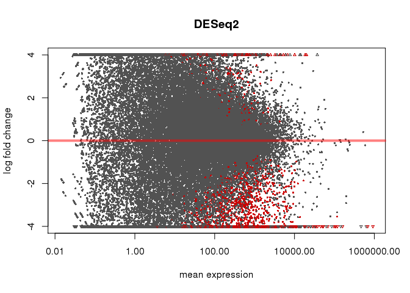
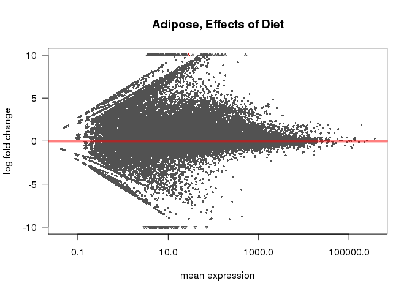

# DESeq Analysis
Dave Bridges  
August 2, 2015  


This script performs the DESeq analyses on the Juvenile HFD studies.  This script was most recently run on Thu Sep  3 13:17:32 2015.  This uses the input data from the kallisto runs.


The counts data, derived from HTSeq are located in ../kallisto/kallisto_output.  The sample mapping file is located in ../sample-mapping.csv.  The annotations are from the file ENSEMBL Annotation - Transcripts.csv.  The files are written out as TPM Table.csv and Estimated Counts.csv.


# Overall Analysis

The first model was a completely interacting model in which tissue, feeding state and diet were all able to interact.

 

 

 

# Adipose Tissue

The adipose tissue samples are all eWAT samples

## Adipose Overall Model

This model used only the adipose tissue data, and tested for changes for the interaction between feeding state and diet, then for the main effects of each.


```
## -- standard model matrices are used for factors with two levels and an interaction,
##    where the main effects are for the reference level of other factors.
##    see the 'Interactions' section of the vignette for more details: vignette('DESeq2') 
## -- standard model matrices are used for factors with two levels and an interaction,
##    where the main effects are for the reference level of other factors.
##    see the 'Interactions' section of the vignette for more details: vignette('DESeq2') 
## -- standard model matrices are used for factors with two levels and an interaction,
##    where the main effects are for the reference level of other factors.
##    see the 'Interactions' section of the vignette for more details: vignette('DESeq2') 
## -- standard model matrices are used for factors with two levels and an interaction,
##    where the main effects are for the reference level of other factors.
##    see the 'Interactions' section of the vignette for more details: vignette('DESeq2') 
## -- standard model matrices are used for factors with two levels and an interaction,
##    where the main effects are for the reference level of other factors.
##    see the 'Interactions' section of the vignette for more details: vignette('DESeq2') 
## -- standard model matrices are used for factors with two levels and an interaction,
##    where the main effects are for the reference level of other factors.
##    see the 'Interactions' section of the vignette for more details: vignette('DESeq2') 
## -- standard model matrices are used for factors with two levels and an interaction,
##    where the main effects are for the reference level of other factors.
##    see the 'Interactions' section of the vignette for more details: vignette('DESeq2') 
## -- standard model matrices are used for factors with two levels and an interaction,
##    where the main effects are for the reference level of other factors.
##    see the 'Interactions' section of the vignette for more details: vignette('DESeq2')
```

Using the combined model, we identified 1806 transcripts with a significant interaction between feeding and diet in WAT.  After removing those genes with an interaction, 148 genes had a main effect with respect to Diet and 173 transcripts had a main effect with respect to Feeding State.


Table: Top Hits for Effects of Diet

        ensembl_transcript_id    baseMean   log2FoldChange   lfcSE     stat   pvalue    padj   lfcSE_Diet   pvalue_Diet   padj_Diet   lfcSE_Feeding   pvalue_Feeding   padj_Feeding        X  gene_biotype     external_gene_name   ensembl_gene_id    
------  ----------------------  ---------  ---------------  ------  -------  -------  ------  -----------  ------------  ----------  --------------  ---------------  -------------  -------  ---------------  -------------------  -------------------
15682   ENSMUST00000077472           64.0            7.968   1.422    5.602    0.000   0.000        1.289             0           0           1.097            0.144          0.611   108372  protein_coding   Chst15               ENSMUSG00000030930 
1070    ENSMUST00000009102          787.2           -0.421   0.112   -3.763    0.000   0.008        0.073             0           0           0.077            0.160          0.632    80648  protein_coding   Vps72                ENSMUSG00000008958 
11110   ENSMUST00000054083          425.2            8.232   1.509    5.456    0.000   0.000        1.401             0           0           1.382            0.540          0.858    65681  protein_coding   Ermp1                ENSMUSG00000046324 
29414   ENSMUST00000119685           28.2           -0.438   1.535   -0.285    0.775   0.921        1.898             0           0           1.885            0.792          0.944   103448  protein_coding   Uspl1                ENSMUSG00000041264 
24886   ENSMUST00000110030           36.1           -5.766   1.510   -3.818    0.000   0.007        1.487             0           0           1.510            0.000          0.007    78552  protein_coding   Snx5                 ENSMUSG00000027423 


Table: Top Hits for Effects of Feeding

        ensembl_transcript_id    baseMean   log2FoldChange   lfcSE   stat   pvalue    padj   lfcSE_Diet   pvalue_Diet   padj_Diet   lfcSE_Feeding   pvalue_Feeding   padj_Feeding       X  gene_biotype     external_gene_name   ensembl_gene_id    
------  ----------------------  ---------  ---------------  ------  -----  -------  ------  -----------  ------------  ----------  --------------  ---------------  -------------  ------  ---------------  -------------------  -------------------
5594    ENSMUST00000030848            493             5.09   1.137   4.48        0   0.001        0.819         0.001       0.049           0.873                0              0   60166  protein_coding   Rbp7                 ENSMUSG00000028996 
2545    ENSMUST00000021784            143             5.62   1.219   4.62        0   0.001        0.891         0.003       0.100           0.964                0              0   85133  protein_coding   Irf4                 ENSMUSG00000021356 
17770   ENSMUST00000089860           3209             4.53   1.001   4.52        0   0.001        0.702         0.000       0.041           0.744                0              0   77490  protein_coding   Fam13a               ENSMUSG00000037709 
10543   ENSMUST00000051209           3366             4.13   0.997   4.14        0   0.003        0.699         0.000       0.038           0.740                0              0   20652  protein_coding   Peg3                 ENSMUSG00000002265 
8070    ENSMUST00000039559           1533             5.33   1.046   5.09        0   0.000        0.740         0.000       0.000           0.783                0              0   28760  protein_coding   Thbs1                ENSMUSG00000040152 


Table: Top Hits for Interaction between Diet and Feeding

        ensembl_transcript_id    baseMean   log2FoldChange   lfcSE    stat   pvalue   padj   lfcSE_Diet   pvalue_Diet   padj_Diet   lfcSE_Feeding   pvalue_Feeding   padj_Feeding        X  gene_biotype     external_gene_name   ensembl_gene_id    
------  ----------------------  ---------  ---------------  ------  ------  -------  -----  -----------  ------------  ----------  --------------  ---------------  -------------  -------  ---------------  -------------------  -------------------
58      ENSMUST00000000342          221.9             5.67    1.02    5.55        0      0        0.722         0.000       0.007           0.762            0.000          0.007    97241  protein_coding   Ccl11                ENSMUSG00000020676 
6301    ENSMUST00000032958          347.7             5.83    1.05    5.57        0      0        0.739         0.001       0.049           0.786            0.000          0.000    73745  protein_coding   Ucp3                 ENSMUSG00000032942 
15682   ENSMUST00000077472           64.0             7.97    1.42    5.60        0      0        1.289         0.000       0.000           1.097            0.144          0.611   108372  protein_coding   Chst15               ENSMUSG00000030930 
24650   ENSMUST00000109646           22.1            -6.95    1.24   -5.58        0      0        0.924         0.000       0.013           0.970            0.003          0.095    61660  protein_coding   Fam227a              ENSMUSG00000042564 
26203   ENSMUST00000112266          144.0            -8.17    1.41   -5.81        0      0        1.044         0.689       0.943           1.097            0.937          0.985   103482  protein_coding   Phospho2             ENSMUSG00000027088 

## Effects of Feeding State

This model used only the adipose tissue data, and tested for changes related to the feeding state.


Table: Top Hits for Effects of Feeding

        ensembl_transcript_id    baseMean   log2FoldChange   lfcSE    stat   pvalue    padj        X  gene_biotype     external_gene_name   ensembl_gene_id    
------  ----------------------  ---------  ---------------  ------  ------  -------  ------  -------  ---------------  -------------------  -------------------
32552   ENSMUST00000130301           10.4             9.35   1.478    6.33        0   0.000   108077  protein_coding   Gnptab               ENSMUSG00000035311 
7465    ENSMUST00000036765          687.1            -4.16   0.698   -5.96        0   0.000    23817  protein_coding   Eif4ebp3             ENSMUSG00000090264 
52445   ENSMUST00000191916           50.1           -11.29   2.091   -5.40        0   0.001     9337  protein_coding   Pex2                 ENSMUSG00000040374 
21517   ENSMUST00000103420           11.6             5.21   0.982    5.30        0   0.001    98619  IG_C_gene        Ighg1                ENSMUSG00000076614 
42067   ENSMUST00000162112           27.4            10.75   2.023    5.31        0   0.001    61669  protein_coding   Greb1                ENSMUSG00000036523 

 

We identified 88 differentially expressed transcripts in adipose tissue, out of a total of 55241 transcripts tested.  Of these significantly differentially expressed transcripts, 50 were upregulated and 38 were downregulated.

## Effects of Diet Overall


Table: Top Hits for Effects of Diet, Ignoring Feeding

        ensembl_transcript_id    baseMean   log2FoldChange   lfcSE   stat   pvalue    padj        X  gene_biotype     external_gene_name   ensembl_gene_id    
------  ----------------------  ---------  ---------------  ------  -----  -------  ------  -------  ---------------  -------------------  -------------------
29414   ENSMUST00000119685          28.24           10.771   1.780   37.1        0   0.000   103448  protein_coding   Uspl1                ENSMUSG00000041264 
13711   ENSMUST00000067664        4900.36            0.241   0.045   28.5        0   0.002     4107  protein_coding   Ywhae                ENSMUSG00000020849 
43506   ENSMUST00000165456           6.92           -8.338   1.920   18.5        0   0.241    34124  protein_coding   Slc6a12              ENSMUSG00000030109 
14928   ENSMUST00000073833           2.18           -6.641   1.782   16.6        0   0.452    43154  protein_coding   Zfp111               ENSMUSG00000087598 
38664   ENSMUST00000150685           1.95           -6.433   1.759   16.4        0   0.452   107855  protein_coding   Appl2                ENSMUSG00000020263 
18307   ENSMUST00000092802          56.15           11.738   2.374   15.4        0   0.540    82209  protein_coding   Mtmr4                ENSMUSG00000018401 
41890   ENSMUST00000161738           1.14           -5.735   1.685   15.3        0   0.540    25820  protein_coding   Igf2r                ENSMUSG00000023830 
53035   ENSMUST00000194663          13.81            9.776   2.193   15.2        0   0.540     8359  protein_coding   Ptch1                ENSMUSG00000021466 
13840   ENSMUST00000068333         569.51            0.514   0.137   14.0        0   0.569    47026  protein_coding   Farsb                ENSMUSG00000026245 
19386   ENSMUST00000097921         438.07            2.395   0.616   14.0        0   0.569    33569  protein_coding   Cdkn2c               ENSMUSG00000028551 

 

We identified 2 differentially expressed transcripts, out of a total of 55241 transcripts tested.  

## Effects of Diet with an Interaction


Table: Top Hits for Effects of Diet

        ensembl_transcript_id    baseMean   log2FoldChange   lfcSE   stat   pvalue    padj   log2FC_HFDvsControl   lfcSE_HFDvsControl        X  gene_biotype     external_gene_name   ensembl_gene_id    
------  ----------------------  ---------  ---------------  ------  -----  -------  ------  --------------------  -------------------  -------  ---------------  -------------------  -------------------
29414   ENSMUST00000119685           28.2           -1.040   3.646   36.1        0   0.000                11.192                2.329   103448  protein_coding   Uspl1                ENSMUSG00000041264 
20497   ENSMUST00000100832           16.1           -9.218   2.334   34.2        0   0.001                 9.649                2.073   104597  protein_coding   Recql                ENSMUSG00000030243 
1070    ENSMUST00000009102          787.2           -0.422   0.112   32.9        0   0.001                 0.418                0.073    80648  protein_coding   Vps72                ENSMUSG00000008958 
15682   ENSMUST00000077472           64.0           13.401   2.688   31.1        0   0.002               -11.730                2.333   108372  protein_coding   Chst15               ENSMUSG00000030930 
11110   ENSMUST00000054083          425.2           18.461   3.105   27.7        0   0.005               -13.448                2.545    65681  protein_coding   Ermp1                ENSMUSG00000046324 
13711   ENSMUST00000067664         4900.4           -0.039   0.094   26.9        0   0.005                 0.257                0.061     4107  protein_coding   Ywhae                ENSMUSG00000020849 
17131   ENSMUST00000086112         1197.9           -0.771   0.279   26.9        0   0.005                 0.931                0.182    50609  protein_coding   Ap2s1                ENSMUSG00000008036 
24650   ENSMUST00000109646           22.1           -8.793   1.602   27.6        0   0.005                 4.643                1.018    61660  protein_coding   Fam227a              ENSMUSG00000042564 
26203   ENSMUST00000112266          144.0          -13.996   2.878   27.3        0   0.005                 1.535                1.142   103482  protein_coding   Phospho2             ENSMUSG00000027088 
58      ENSMUST00000000342          221.9            6.484   1.168   26.6        0   0.006                -3.563                0.761    97241  protein_coding   Ccl11                ENSMUSG00000020676 

 

We identified 941 differentially expressed transcripts, out of a total of 55241 transcripts tested.  Of these significantly differentially expressed transcripts, 739 were upregulated and 202 were downregulated.

# Muscle Tissue

The muscle tissue samples are all quadriceps samples

## Effects of Feeding State

This model used only the quadriceps tissue data, and tested for changes related to the feeding state.


Table: Top Hits for Effects of Feeding

        ensembl_transcript_id    baseMean   log2FoldChange   lfcSE    stat   pvalue   padj        X  gene_biotype     external_gene_name   ensembl_gene_id    
------  ----------------------  ---------  ---------------  ------  ------  -------  -----  -------  ---------------  -------------------  -------------------
13650   ENSMUST00000067354           2846            -6.67   0.223   -29.9        0      0      142  protein_coding   8430408G22Rik        ENSMUSG00000048489 
22257   ENSMUST00000105875          27633            -3.54   0.119   -29.6        0      0    81577  protein_coding   Trim63               ENSMUSG00000028834 
3616    ENSMUST00000025279           3766            -1.98   0.071   -27.9        0      0    68773  protein_coding   Npc1                 ENSMUSG00000024413 
29184   ENSMUST00000118936           2787            -1.84   0.072   -25.7        0      0   107766  protein_coding   Gucd1                ENSMUSG00000033416 
2984    ENSMUST00000022986          31906            -3.19   0.138   -23.2        0      0     4159  protein_coding   Fbxo32               ENSMUSG00000022358 

 

We identified 5703 differentially expressed transcripts in muscle tissue, out of a total of 55241 transcripts tested.  Of these significantly differentially expressed transcripts, 2633 were upregulated and 3070 were downregulated.

## Effects of Diet 


Table: Top Hits for Effects of Diet

        ensembl_transcript_id    baseMean   log2FoldChange   lfcSE   stat   pvalue    padj   log2FC_HFDvsControl   lfcSE_HFDvsControl        X  gene_biotype     external_gene_name   ensembl_gene_id    
------  ----------------------  ---------  ---------------  ------  -----  -------  ------  --------------------  -------------------  -------  ---------------  -------------------  -------------------
28428   ENSMUST00000115785           96.7          -11.779   2.417   68.1        0   0.000                 0.738                0.507    83449  protein_coding   Synj2                ENSMUSG00000023805 
44074   ENSMUST00000166930           46.2           -6.297   1.308   55.3        0   0.000                -0.857                0.521    64038  protein_coding   Morf4l2              ENSMUSG00000031422 
23731   ENSMUST00000108182           28.2          -10.229   2.547   37.3        0   0.000                -0.373                0.725     8103  protein_coding   Dcun1d1              ENSMUSG00000027708 
52528   ENSMUST00000192305           56.9           -0.672   0.904   32.3        0   0.001                -2.318                0.548    82362  protein_coding   Uqcrc1               ENSMUSG00000025651 
44421   ENSMUST00000167764          495.8           -0.563   0.209   28.3        0   0.003                -0.254                0.130    86186  protein_coding   Fgfr1                ENSMUSG00000031565 
14366   ENSMUST00000071152           35.4           11.503   2.693   25.8        0   0.007                -1.569                0.909   102808  protein_coding   Rffl                 ENSMUSG00000020696 
19831   ENSMUST00000099131          801.9           -0.009   0.106   26.1        0   0.007                 0.266                0.066    33088  protein_coding   Smarcc2              ENSMUSG00000025369 
29868   ENSMUST00000121114          529.7            0.036   0.163   25.8        0   0.007                -0.411                0.099    92692  protein_coding   Slc43a1              ENSMUSG00000027075 
5468    ENSMUST00000030508           53.8           -0.627   0.286   25.0        0   0.008                 0.890                0.184    54259  protein_coding   Pax7                 ENSMUSG00000028736 
34602   ENSMUST00000136757           16.4            6.548   2.797   24.6        0   0.008                 2.896                1.045    27522  protein_coding   Aamdc                ENSMUSG00000035642 

 

We identified 59 differentially expressed transcripts in quadriceps, out of a total of 55241 transcripts tested.  Of these significantly differentially expressed transcripts, 19 were upregulated and 40 were downregulated.

## Effects of Diet with an Interaction


Table: Top Hits for Effects of Diet with An Interaction

        ensembl_transcript_id    baseMean   log2FoldChange   lfcSE   stat   pvalue    padj   log2FC_HFDvsControl   lfcSE_HFDvsControl        X  gene_biotype     external_gene_name   ensembl_gene_id    
------  ----------------------  ---------  ---------------  ------  -----  -------  ------  --------------------  -------------------  -------  ---------------  -------------------  -------------------
28428   ENSMUST00000115785           96.7          -11.779   2.417   68.1        0   0.000                 0.738                0.507    83449  protein_coding   Synj2                ENSMUSG00000023805 
44074   ENSMUST00000166930           46.2           -6.297   1.308   55.3        0   0.000                -0.857                0.521    64038  protein_coding   Morf4l2              ENSMUSG00000031422 
23731   ENSMUST00000108182           28.2          -10.229   2.547   37.3        0   0.000                -0.373                0.725     8103  protein_coding   Dcun1d1              ENSMUSG00000027708 
52528   ENSMUST00000192305           56.9           -0.672   0.904   32.3        0   0.001                -2.318                0.548    82362  protein_coding   Uqcrc1               ENSMUSG00000025651 
44421   ENSMUST00000167764          495.8           -0.563   0.209   28.3        0   0.003                -0.254                0.130    86186  protein_coding   Fgfr1                ENSMUSG00000031565 
14366   ENSMUST00000071152           35.4           11.503   2.693   25.8        0   0.007                -1.569                0.909   102808  protein_coding   Rffl                 ENSMUSG00000020696 
19831   ENSMUST00000099131          801.9           -0.009   0.106   26.1        0   0.007                 0.266                0.066    33088  protein_coding   Smarcc2              ENSMUSG00000025369 
29868   ENSMUST00000121114          529.7            0.036   0.163   25.8        0   0.007                -0.411                0.099    92692  protein_coding   Slc43a1              ENSMUSG00000027075 
5468    ENSMUST00000030508           53.8           -0.627   0.286   25.0        0   0.008                 0.890                0.184    54259  protein_coding   Pax7                 ENSMUSG00000028736 
34602   ENSMUST00000136757           16.4            6.548   2.797   24.6        0   0.008                 2.896                1.045    27522  protein_coding   Aamdc                ENSMUSG00000035642 

 

We identified 59 differentially expressed transcripts, out of a total of 55241 transcripts tested.  Of these significantly differentially expressed transcripts, 19 were upregulated and 40 were downregulated.

# Session Information


```
## R version 3.2.2 (2015-08-14)
## Platform: x86_64-apple-darwin13.4.0 (64-bit)
## Running under: OS X 10.10.4 (Yosemite)
## 
## locale:
## [1] en_US.UTF-8/en_US.UTF-8/en_US.UTF-8/C/en_US.UTF-8/en_US.UTF-8
## 
## attached base packages:
## [1] parallel  stats4    stats     graphics  grDevices utils     datasets 
## [8] methods   base     
## 
## other attached packages:
##  [1] gplots_2.17.0           BiocParallel_1.2.20    
##  [3] DESeq2_1.8.1            RcppArmadillo_0.5.300.4
##  [5] Rcpp_0.12.0             GenomicRanges_1.20.5   
##  [7] GenomeInfoDb_1.4.2      IRanges_2.2.7          
##  [9] S4Vectors_0.6.3         BiocGenerics_0.14.0    
## [11] knitr_1.11             
## 
## loaded via a namespace (and not attached):
##  [1] genefilter_1.50.0    gtools_3.5.0         locfit_1.5-9.1      
##  [4] reshape2_1.4.1       splines_3.2.2        lattice_0.20-33     
##  [7] colorspace_1.2-6     htmltools_0.2.6      yaml_2.1.13         
## [10] survival_2.38-3      XML_3.98-1.3         foreign_0.8-65      
## [13] DBI_0.3.1            RColorBrewer_1.1-2   lambda.r_1.1.7      
## [16] plyr_1.8.3           stringr_1.0.0        munsell_0.4.2       
## [19] gtable_0.1.2         futile.logger_1.4.1  caTools_1.17.1      
## [22] evaluate_0.7.2       labeling_0.3         latticeExtra_0.6-26 
## [25] Biobase_2.28.0       geneplotter_1.46.0   AnnotationDbi_1.30.1
## [28] highr_0.5            proto_0.3-10         KernSmooth_2.23-15  
## [31] acepack_1.3-3.3      xtable_1.7-4         scales_0.2.5        
## [34] formatR_1.2          gdata_2.17.0         Hmisc_3.16-0        
## [37] annotate_1.46.1      XVector_0.8.0        gridExtra_2.0.0     
## [40] ggplot2_1.0.1        digest_0.6.8         stringi_0.5-5       
## [43] grid_3.2.2           bitops_1.0-6         tools_3.2.2         
## [46] magrittr_1.5         RSQLite_1.0.0        Formula_1.2-1       
## [49] cluster_2.0.3        futile.options_1.0.0 MASS_7.3-43         
## [52] rmarkdown_0.7        rpart_4.1-10         nnet_7.3-10
```
