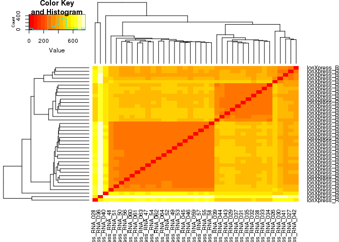
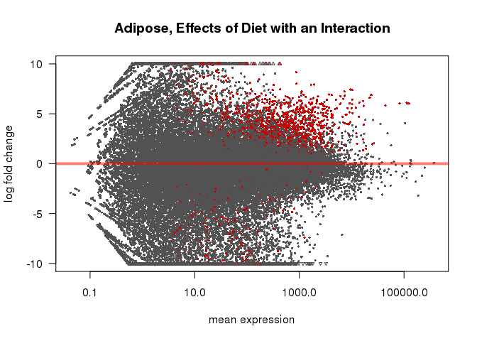

# DESeq Analysis
Dave Bridges  
August 2, 2015  


This script performs the DESeq analyses on the Juvenile HFD studies.  This script was most recently run on Mon Mar 14 12:47:23 2016.  This uses the input data from the kallisto runs.


The counts data, derived from HTSeq are located in ../kallisto/kallisto_output.  The sample mapping file is located in ../sample-mapping.csv.  The annotations are from the file ENSEMBL Annotation - Transcripts.csv.  The files are written out as TPM Table.csv and Estimated Counts.csv.


# Overall Analysis

The first model was a completely interacting model in which tissue, feeding state and diet were all able to interact.

<div class="figure">

<p class="caption">MA Plot for Overall Model</p>
</div>

<div class="figure">

<p class="caption">PCA Plot for Overall Model</p>
</div>

<div class="figure">

<p class="caption">Similarity Matrix for All Samples</p>
</div>

# Adipose Tissue

The adipose tissue samples are all eWAT samples

## Adipose Overall Model

This model used only the adipose tissue data, and tested for changes for the interaction between feeding state and diet, then for the main effects of each.


Using the combined model, we identified 2675 transcripts with a significant interaction between feeding and diet in WAT.  After removing those genes with an interaction, 204 genes had a main effect with respect to Diet and 215 transcripts had a main effect with respect to Feeding State.


Table: Top Hits for Effects of Diet

        ensembl_transcript_id    baseMean   log2FoldChange   lfcSE    stat   pvalue   padj   log2FoldChange_Diet   lfcSE_Diet   pvalue_Diet   padj_Diet   log2FoldChange_Feeding   lfcSE_Feeding   pvalue_Feeding   padj_Feeding        X  gene_biotype     external_gene_name   ensembl_gene_id    
------  ----------------------  ---------  ---------------  ------  ------  -------  -----  --------------------  -----------  ------------  ----------  -----------------------  --------------  ---------------  -------------  -------  ---------------  -------------------  -------------------
4584    ENSMUST00000028114          225.8             27.6    3.56    7.74        0      0                 -24.8         2.79             0           0                   -3.740            2.03            0.065          0.428    36045  protein_coding   Pfkfb3               ENSMUSG00000026773 
42408   ENSMUST00000162825          162.2            -23.6    3.40   -6.95        0      0                  23.3         2.62             0           0                   23.898            2.71            0.000          0.000    17132  protein_coding   Fndc3a               ENSMUSG00000033487 
39181   ENSMUST00000152377           72.3            -27.2    3.63   -7.49        0      0                  23.4         2.75             0           0                   21.738            2.85            0.000          0.000   104817  protein_coding   Ccdc67               ENSMUSG00000039977 
51368   ENSMUST00000187711           70.3             22.8    3.45    6.60        0      0                 -22.7         2.73             0           0                   -0.346            1.93            0.858          0.961    16764  protein_coding   Fam46a               ENSMUSG00000032265 
23898   ENSMUST00000108415          151.4            -23.7    4.04   -5.85        0      0                  24.3         2.99             0           0                   22.190            3.11            0.000          0.000    82376  protein_coding   Pou2f2               ENSMUSG00000008496 


Table: Top Hits for Effects of Feeding

        ensembl_transcript_id    baseMean   log2FoldChange   lfcSE    stat   pvalue   padj   log2FoldChange_Diet   lfcSE_Diet   pvalue_Diet   padj_Diet   log2FoldChange_Feeding   lfcSE_Feeding   pvalue_Feeding   padj_Feeding        X  gene_biotype     external_gene_name   ensembl_gene_id    
------  ----------------------  ---------  ---------------  ------  ------  -------  -----  --------------------  -----------  ------------  ----------  -----------------------  --------------  ---------------  -------------  -------  ---------------  -------------------  -------------------
42408   ENSMUST00000162825          162.2            -23.6    3.40   -6.95        0      0                  23.3         2.62             0           0                     23.9            2.71                0              0    17132  protein_coding   Fndc3a               ENSMUSG00000033487 
28523   ENSMUST00000116388           58.2            -21.7    3.70   -5.86        0      0                  21.1         2.79             0           0                     22.9            2.90                0              0    30384  protein_coding   Rcor1                ENSMUSG00000037896 
27723   ENSMUST00000114680           72.4            -24.1    3.86   -6.24        0      0                  22.7         2.88             0           0                     22.8            2.99                0              0    23837  protein_coding   Mllt10               ENSMUSG00000026743 
39181   ENSMUST00000152377           72.3            -27.2    3.63   -7.49        0      0                  23.4         2.75             0           0                     21.7            2.85                0              0   104817  protein_coding   Ccdc67               ENSMUSG00000039977 
26087   ENSMUST00000112098           16.2            -19.2    3.53   -5.43        0      0                  18.9         2.70             0           0                     21.1            2.79                0              0   107439  protein_coding   Pbrm1                ENSMUSG00000042323 


Table: Top Hits for Interaction between Diet and Feeding

        ensembl_transcript_id    baseMean   log2FoldChange   lfcSE    stat   pvalue   padj   log2FoldChange_Diet   lfcSE_Diet   pvalue_Diet   padj_Diet   log2FoldChange_Feeding   lfcSE_Feeding   pvalue_Feeding   padj_Feeding        X  gene_biotype     external_gene_name   ensembl_gene_id    
------  ----------------------  ---------  ---------------  ------  ------  -------  -----  --------------------  -----------  ------------  ----------  -----------------------  --------------  ---------------  -------------  -------  ---------------  -------------------  -------------------
3766    ENSMUST00000025705          268.5            -24.5    3.02   -8.12        0      0                 0.616         1.29         0.633        0.91                    -1.19            1.38            0.388          0.782    35050  protein_coding   Jak2                 ENSMUSG00000024789 
4584    ENSMUST00000028114          225.8             27.6    3.56    7.74        0      0               -24.787         2.79         0.000        0.00                    -3.74            2.03            0.065          0.428    36045  protein_coding   Pfkfb3               ENSMUSG00000026773 
39181   ENSMUST00000152377           72.3            -27.2    3.63   -7.49        0      0                23.448         2.75         0.000        0.00                    21.74            2.85            0.000          0.000   104817  protein_coding   Ccdc67               ENSMUSG00000039977 
45840   ENSMUST00000171091           23.8            -28.6    3.89   -7.35        0      0                21.849         2.74         0.000        0.00                    20.40            2.84            0.000          0.000    47405  protein_coding   Iqcf6                ENSMUSG00000091129 
42408   ENSMUST00000162825          162.2            -23.6    3.40   -6.95        0      0                23.293         2.62         0.000        0.00                    23.90            2.71            0.000          0.000    17132  protein_coding   Fndc3a               ENSMUSG00000033487 

## Effects of Feeding State

This model used only the adipose tissue data, and tested for changes related to the feeding state.


Table: Top Hits for Effects of Feeding

        ensembl_transcript_id    baseMean   log2FoldChange   lfcSE    stat   pvalue   padj       X  gene_biotype     external_gene_name   ensembl_gene_id    
------  ----------------------  ---------  ---------------  ------  ------  -------  -----  ------  ---------------  -------------------  -------------------
2503    ENSMUST00000021653           23.4            -23.3    2.66   -8.75        0      0     736  protein_coding   Acot3                ENSMUSG00000021228 
43366   ENSMUST00000165113           81.7            -25.0    3.08   -8.13        0      0   52340  protein_coding   Tardbp               ENSMUSG00000041459 
6456    ENSMUST00000033437           28.0            -23.5    2.93   -8.03        0      0   51099  protein_coding   Enox2                ENSMUSG00000031109 
8212    ENSMUST00000040222           49.2            -24.2    3.05   -7.95        0      0   58647  protein_coding   Crocc                ENSMUSG00000040860 
46808   ENSMUST00000173372           20.5            -23.1    2.91   -7.93        0      0   90960  protein_coding   Myo1f                ENSMUSG00000024300 

<div class="figure">

<p class="caption">MA Plot for Effects of Feeding Status on Adipose Tissue</p>
</div>

We identified 158 differentially expressed transcripts in adipose tissue, out of a total of 55241 transcripts tested.  Of these significantly differentially expressed transcripts, 71 were upregulated and 87 were downregulated.

## Effects of Diet Overall


Table: Top Hits for Effects of Diet, Ignoring Feeding

        ensembl_transcript_id    baseMean   log2FoldChange   lfcSE   stat   pvalue    padj        X  gene_biotype     external_gene_name   ensembl_gene_id    
------  ----------------------  ---------  ---------------  ------  -----  -------  ------  -------  ---------------  -------------------  -------------------
29414   ENSMUST00000119685          28.24           10.771   1.780   37.1        0   0.000   103448  protein_coding   Uspl1                ENSMUSG00000041264 
13711   ENSMUST00000067664        4900.36            0.241   0.045   28.5        0   0.002     4107  protein_coding   Ywhae                ENSMUSG00000020849 
43506   ENSMUST00000165456           6.92           -8.338   1.920   18.5        0   0.241    34124  protein_coding   Slc6a12              ENSMUSG00000030109 
14928   ENSMUST00000073833           2.18           -6.641   1.782   16.6        0   0.452    43154  protein_coding   Zfp111               ENSMUSG00000087598 
38664   ENSMUST00000150685           1.95           -6.433   1.759   16.4        0   0.452   107855  protein_coding   Appl2                ENSMUSG00000020263 
18307   ENSMUST00000092802          56.15           11.738   2.374   15.4        0   0.540    82209  protein_coding   Mtmr4                ENSMUSG00000018401 
41890   ENSMUST00000161738           1.14           -5.735   1.685   15.3        0   0.540    25820  protein_coding   Igf2r                ENSMUSG00000023830 
53035   ENSMUST00000194663          13.81            9.776   2.193   15.2        0   0.540     8359  protein_coding   Ptch1                ENSMUSG00000021466 
13840   ENSMUST00000068333         569.51            0.514   0.137   14.0        0   0.569    47026  protein_coding   Farsb                ENSMUSG00000026245 
19386   ENSMUST00000097921         438.07            2.395   0.616   14.0        0   0.569    33569  protein_coding   Cdkn2c               ENSMUSG00000028551 

<div class="figure">

<p class="caption">MA Plot for Main Effects of Diet Status on Adipose Tissue</p>
</div>

We identified 2 differentially expressed transcripts, out of a total of 55241 transcripts tested.  

## Effects of Diet with an Interaction


Table: Top Hits for Effects of Diet

        ensembl_transcript_id    baseMean   log2FoldChange   lfcSE   stat   pvalue    padj   log2FC_HFDvsControl   lfcSE_HFDvsControl        X  gene_biotype     external_gene_name   ensembl_gene_id    
------  ----------------------  ---------  ---------------  ------  -----  -------  ------  --------------------  -------------------  -------  ---------------  -------------------  -------------------
29414   ENSMUST00000119685           28.2           -1.040   3.646   36.1        0   0.001                11.192                2.329   103448  protein_coding   Uspl1                ENSMUSG00000041264 
20497   ENSMUST00000100832           16.1           -9.218   2.334   34.2        0   0.001                 9.649                2.073   104597  protein_coding   Recql                ENSMUSG00000030243 
1070    ENSMUST00000009102          787.2           -0.422   0.112   32.9        0   0.001                 0.418                0.073    80648  protein_coding   Vps72                ENSMUSG00000008958 
15682   ENSMUST00000077472           64.0           13.401   2.688   31.1        0   0.002               -11.730                2.333   108372  protein_coding   Chst15               ENSMUSG00000030930 
11110   ENSMUST00000054083          425.2           18.461   3.105   27.7        0   0.006               -13.448                2.545    65681  protein_coding   Ermp1                ENSMUSG00000046324 
13711   ENSMUST00000067664         4900.4           -0.039   0.094   26.9        0   0.006                 0.257                0.061     4107  protein_coding   Ywhae                ENSMUSG00000020849 
17131   ENSMUST00000086112         1197.9           -0.771   0.279   26.9        0   0.006                 0.931                0.182    50609  protein_coding   Ap2s1                ENSMUSG00000008036 
24650   ENSMUST00000109646           22.1           -8.793   1.602   27.6        0   0.006                 4.643                1.018    61660  protein_coding   Fam227a              ENSMUSG00000042564 
26203   ENSMUST00000112266          144.0          -13.996   2.878   27.3        0   0.006                 1.535                1.142   103482  protein_coding   Phospho2             ENSMUSG00000027088 
58      ENSMUST00000000342          221.9            6.484   1.168   26.6        0   0.006                -3.563                0.761    97241  protein_coding   Ccl11                ENSMUSG00000020676 

<div class="figure">

<p class="caption">MA Plot for Effects of Diet Status on Adipose Tissue</p>
</div>

We identified 914 differentially expressed transcripts, out of a total of 55241 transcripts tested.  Of these significantly differentially expressed transcripts, 718 were upregulated and 196 were downregulated.

# Muscle Tissue

The muscle tissue samples are all quadriceps samples

## Muscle Overall Model

This model used only the quadricep tissue data, and tested for changes for the interaction between feeding state and diet, then for the main effects of each.


Using the combined model, we identified 115 transcripts with a significant interaction between feeding and diet in quad.  After removing those genes with an interaction, 63 genes had a main effect with respect to Diet and 3632 transcripts had a main effect with respect to Feeding State.


Table: Top Hits for Effects of Diet

        ensembl_gene_id       baseMean   log2FoldChange   lfcSE     stat   pvalue   padj   log2FoldChange_Diet   lfcSE_Diet   pvalue_Diet   padj_Diet   log2FoldChange_Feeding   lfcSE_Feeding   pvalue_Feeding   padj_Feeding    X  gene_biotype   external_gene_name   ensembl_transcript_id 
------  -------------------  ---------  ---------------  ------  -------  -------  -----  --------------------  -----------  ------------  ----------  -----------------------  --------------  ---------------  -------------  ---  -------------  -------------------  ----------------------
46123   ENSMUST00000171751        38.5            21.94    3.11    7.057    0.000      0                 -21.9         2.44             0           0                    0.695            1.76            0.693          0.915   NA  NA             NA                   NA                    
43952   ENSMUST00000166592        51.2            20.08    3.44    5.838    0.000      0                 -22.9         2.61             0           0                    0.636            2.04            0.755          0.938   NA  NA             NA                   NA                    
46214   ENSMUST00000171999        12.2            20.51    3.69    5.559    0.000      0                 -20.6         2.74             0           0                    0.404            2.25            0.858          0.966   NA  NA             NA                   NA                    
43      ENSMUST00000000284        14.9            -4.31    4.98   -0.865    0.387      1                 -22.6         3.15             0           0                   -0.514            2.84            0.856          0.966   NA  NA             NA                   NA                    
41174   ENSMUST00000160132        13.7           -21.76    3.64   -5.980    0.000      0                  19.0         2.71             0           0                   21.270            2.88            0.000          0.000   NA  NA             NA                   NA                    


Table: Top Hits for Effects of Feeding

        ensembl_gene_id       baseMean   log2FoldChange   lfcSE     stat   pvalue   padj   log2FoldChange_Diet   lfcSE_Diet   pvalue_Diet   padj_Diet   log2FoldChange_Feeding   lfcSE_Feeding   pvalue_Feeding   padj_Feeding    X  gene_biotype   external_gene_name   ensembl_transcript_id 
------  -------------------  ---------  ---------------  ------  -------  -------  -----  --------------------  -----------  ------------  ----------  -----------------------  --------------  ---------------  -------------  ---  -------------  -------------------  ----------------------
13650   ENSMUST00000067354        2846            0.553   0.425    1.299    0.194      1                 0.156        0.251         0.535        1.00                    -6.99           0.306                0              0   NA  NA             NA                   NA                    
3616    ENSMUST00000025279        3766           -0.213   0.131   -1.625    0.104      1                 0.181        0.081         0.026        0.72                    -1.87           0.093                0              0   NA  NA             NA                   NA                    
22257   ENSMUST00000105875       27633           -0.043   0.251   -0.171    0.864      1                -0.004        0.159         0.981        1.00                    -3.51           0.178                0              0   NA  NA             NA                   NA                    
29184   ENSMUST00000118936        2787           -0.106   0.149   -0.710    0.477      1                 0.013        0.093         0.891        1.00                    -1.79           0.105                0              0   NA  NA             NA                   NA                    
20988   ENSMUST00000102745         931           -0.192   0.269   -0.715    0.474      1                 0.204        0.174         0.239        1.00                     2.96           0.190                0              0   NA  NA             NA                   NA                    


Table: Top Hits for Interaction between Diet and Feeding

        ensembl_gene_id       baseMean   log2FoldChange   lfcSE    stat   pvalue   padj   log2FoldChange_Diet   lfcSE_Diet   pvalue_Diet   padj_Diet   log2FoldChange_Feeding   lfcSE_Feeding   pvalue_Feeding   padj_Feeding    X  gene_biotype   external_gene_name   ensembl_transcript_id 
------  -------------------  ---------  ---------------  ------  ------  -------  -----  --------------------  -----------  ------------  ----------  -----------------------  --------------  ---------------  -------------  ---  -------------  -------------------  ----------------------
24491   ENSMUST00000109394       98.45            -23.6    3.30   -7.15        0      0                -0.807         1.51         0.593       1.000                    0.487            1.69            0.773          0.944   NA  NA             NA                   NA                    
46123   ENSMUST00000171751       38.46             21.9    3.11    7.06        0      0               -21.907         2.44         0.000       0.000                    0.695            1.76            0.693          0.915   NA  NA             NA                   NA                    
53016   ENSMUST00000194592        2.95            -30.0    4.27   -7.02        0      0                14.058         2.71         0.000       0.000                   16.365            2.86            0.000          0.000   NA  NA             NA                   NA                    
42991   ENSMUST00000164235       58.90            -24.5    3.60   -6.80        0      0                 1.346         1.76         0.445       1.000                    0.919            1.97            0.641          0.894   NA  NA             NA                   NA                    
23732   ENSMUST00000108183       15.07            -30.0    4.72   -6.35        0      0                14.336         2.99         0.000       0.001                   16.187            3.21            0.000          0.000   NA  NA             NA                   NA                    

## Effects of Feeding State

This model used only the quadriceps tissue data, and tested for changes related to the feeding state.


Table: Top Hits for Effects of Feeding

        ensembl_transcript_id    baseMean   log2FoldChange   lfcSE    stat   pvalue   padj        X  gene_biotype     external_gene_name   ensembl_gene_id    
------  ----------------------  ---------  ---------------  ------  ------  -------  -----  -------  ---------------  -------------------  -------------------
13650   ENSMUST00000067354           2846            -6.67   0.223   -29.9        0      0      142  protein_coding   8430408G22Rik        ENSMUSG00000048489 
22257   ENSMUST00000105875          27633            -3.54   0.119   -29.6        0      0    81577  protein_coding   Trim63               ENSMUSG00000028834 
3616    ENSMUST00000025279           3766            -1.98   0.071   -27.9        0      0    68773  protein_coding   Npc1                 ENSMUSG00000024413 
29184   ENSMUST00000118936           2787            -1.84   0.072   -25.7        0      0   107766  protein_coding   Gucd1                ENSMUSG00000033416 
2984    ENSMUST00000022986          31906            -3.19   0.138   -23.2        0      0     4159  protein_coding   Fbxo32               ENSMUSG00000022358 

<div class="figure">

<p class="caption">MA Plot for Effects of Feeding Status on Muscle Tissue</p>
</div>

We identified 5681 differentially expressed transcripts in muscle tissue, out of a total of 55241 transcripts tested.  Of these significantly differentially expressed transcripts, 2620 were upregulated and 3061 were downregulated.

## Effects of Diet 


Table: Top Hits for Effects of Diet

        ensembl_transcript_id    baseMean   log2FoldChange   lfcSE   stat   pvalue    padj   log2FC_HFDvsControl   lfcSE_HFDvsControl        X  gene_biotype     external_gene_name   ensembl_gene_id    
------  ----------------------  ---------  ---------------  ------  -----  -------  ------  --------------------  -------------------  -------  ---------------  -------------------  -------------------
28428   ENSMUST00000115785          96.68          -11.779   2.417   68.1        0   0.000                 0.738                0.507    83449  protein_coding   Synj2                ENSMUSG00000023805 
44074   ENSMUST00000166930          46.20           -6.297   1.308   55.3        0   0.000                -0.857                0.521    64038  protein_coding   Morf4l2              ENSMUSG00000031422 
23731   ENSMUST00000108182          28.15          -10.229   2.547   37.3        0   0.000                -0.373                0.725     8103  protein_coding   Dcun1d1              ENSMUSG00000027708 
52528   ENSMUST00000192305          56.91           -0.672   0.904   32.3        0   0.001                -2.318                0.548    82362  protein_coding   Uqcrc1               ENSMUSG00000025651 
44421   ENSMUST00000167764         495.77           -0.563   0.209   28.3        0   0.005                -0.254                0.130    86186  protein_coding   Fgfr1                ENSMUSG00000031565 
14366   ENSMUST00000071152          35.43           11.503   2.693   25.8        0   0.011                -1.569                0.909   102808  protein_coding   Rffl                 ENSMUSG00000020696 
19831   ENSMUST00000099131         801.93           -0.009   0.106   26.1        0   0.011                 0.266                0.066    33088  protein_coding   Smarcc2              ENSMUSG00000025369 
29868   ENSMUST00000121114         529.68            0.036   0.163   25.8        0   0.011                -0.411                0.099    92692  protein_coding   Slc43a1              ENSMUSG00000027075 
5468    ENSMUST00000030508          53.77           -0.627   0.286   25.0        0   0.011                 0.890                0.184    54259  protein_coding   Pax7                 ENSMUSG00000028736 
33009   ENSMUST00000131679           1.68            0.480   3.227   25.3        0   0.011                -6.738                2.036    43499  protein_coding   Tchp                 ENSMUSG00000002486 

<div class="figure">

<p class="caption">MA Plot for Effects of Diet Status on Adipose Tissue</p>
</div>

We identified 45 differentially expressed transcripts in quadriceps, out of a total of 55241 transcripts tested.  Of these significantly differentially expressed transcripts, 16 were upregulated and 29 were downregulated.

## Effects of Diet with an Interaction


Table: Top Hits for Effects of Diet with An Interaction

        ensembl_transcript_id    baseMean   log2FoldChange   lfcSE   stat   pvalue    padj   log2FC_HFDvsControl   lfcSE_HFDvsControl        X  gene_biotype     external_gene_name   ensembl_gene_id    
------  ----------------------  ---------  ---------------  ------  -----  -------  ------  --------------------  -------------------  -------  ---------------  -------------------  -------------------
28428   ENSMUST00000115785          96.68          -11.779   2.417   68.1        0   0.000                 0.738                0.507    83449  protein_coding   Synj2                ENSMUSG00000023805 
44074   ENSMUST00000166930          46.20           -6.297   1.308   55.3        0   0.000                -0.857                0.521    64038  protein_coding   Morf4l2              ENSMUSG00000031422 
23731   ENSMUST00000108182          28.15          -10.229   2.547   37.3        0   0.000                -0.373                0.725     8103  protein_coding   Dcun1d1              ENSMUSG00000027708 
52528   ENSMUST00000192305          56.91           -0.672   0.904   32.3        0   0.001                -2.318                0.548    82362  protein_coding   Uqcrc1               ENSMUSG00000025651 
44421   ENSMUST00000167764         495.77           -0.563   0.209   28.3        0   0.005                -0.254                0.130    86186  protein_coding   Fgfr1                ENSMUSG00000031565 
14366   ENSMUST00000071152          35.43           11.503   2.693   25.8        0   0.011                -1.569                0.909   102808  protein_coding   Rffl                 ENSMUSG00000020696 
19831   ENSMUST00000099131         801.93           -0.009   0.106   26.1        0   0.011                 0.266                0.066    33088  protein_coding   Smarcc2              ENSMUSG00000025369 
29868   ENSMUST00000121114         529.68            0.036   0.163   25.8        0   0.011                -0.411                0.099    92692  protein_coding   Slc43a1              ENSMUSG00000027075 
5468    ENSMUST00000030508          53.77           -0.627   0.286   25.0        0   0.011                 0.890                0.184    54259  protein_coding   Pax7                 ENSMUSG00000028736 
33009   ENSMUST00000131679           1.68            0.480   3.227   25.3        0   0.011                -6.738                2.036    43499  protein_coding   Tchp                 ENSMUSG00000002486 

<div class="figure">

<p class="caption">MA Plot for Effects of Diet Status on Quadriceps Tissue</p>
</div>

We identified 45 differentially expressed transcripts, out of a total of 55241 transcripts tested.  Of these significantly differentially expressed transcripts, 16 were upregulated and 29 were downregulated.

# Session Information


```
## R version 3.2.2 (2015-08-14)
## Platform: x86_64-redhat-linux-gnu (64-bit)
## Running under: Red Hat Enterprise Linux Server release 6.7 (Santiago)
## 
## locale:
##  [1] LC_CTYPE=en_US.UTF-8       LC_NUMERIC=C              
##  [3] LC_TIME=en_US.UTF-8        LC_COLLATE=en_US.UTF-8    
##  [5] LC_MONETARY=en_US.UTF-8    LC_MESSAGES=en_US.UTF-8   
##  [7] LC_PAPER=en_US.UTF-8       LC_NAME=C                 
##  [9] LC_ADDRESS=C               LC_TELEPHONE=C            
## [11] LC_MEASUREMENT=en_US.UTF-8 LC_IDENTIFICATION=C       
## 
## attached base packages:
## [1] parallel  stats4    stats     graphics  grDevices utils     datasets 
## [8] methods   base     
## 
## other attached packages:
##  [1] gplots_2.17.0              BiocParallel_1.4.3        
##  [3] DESeq2_1.10.1              RcppArmadillo_0.6.500.4.0 
##  [5] Rcpp_0.12.3                SummarizedExperiment_1.0.2
##  [7] Biobase_2.30.0             GenomicRanges_1.22.4      
##  [9] GenomeInfoDb_1.6.3         IRanges_2.4.8             
## [11] S4Vectors_0.8.11           BiocGenerics_0.16.1       
## [13] knitr_1.12.3              
## 
## loaded via a namespace (and not attached):
##  [1] genefilter_1.52.1    gtools_3.5.0         locfit_1.5-9.1      
##  [4] splines_3.2.2        lattice_0.20-33      colorspace_1.2-6    
##  [7] htmltools_0.3        yaml_2.1.13          survival_2.38-3     
## [10] XML_3.98-1.4         foreign_0.8-66       DBI_0.3.1           
## [13] RColorBrewer_1.1-2   lambda.r_1.1.7       plyr_1.8.3          
## [16] stringr_1.0.0        zlibbioc_1.16.0      munsell_0.4.3       
## [19] gtable_0.2.0         futile.logger_1.4.1  caTools_1.17.1      
## [22] evaluate_0.8.3       labeling_0.3         latticeExtra_0.6-28 
## [25] geneplotter_1.48.0   AnnotationDbi_1.32.3 highr_0.5.1         
## [28] KernSmooth_2.23-15   acepack_1.3-3.3      xtable_1.8-2        
## [31] scales_0.4.0         formatR_1.3          gdata_2.17.0        
## [34] Hmisc_3.17-2         annotate_1.48.0      XVector_0.10.0      
## [37] gridExtra_2.2.1      ggplot2_2.1.0        digest_0.6.9        
## [40] stringi_1.0-1        grid_3.2.2           bitops_1.0-6        
## [43] tools_3.2.2          magrittr_1.5         RSQLite_1.0.0       
## [46] Formula_1.2-1        cluster_2.0.3        futile.options_1.0.0
## [49] rmarkdown_0.9.5      rpart_4.1-10         nnet_7.3-12
```
