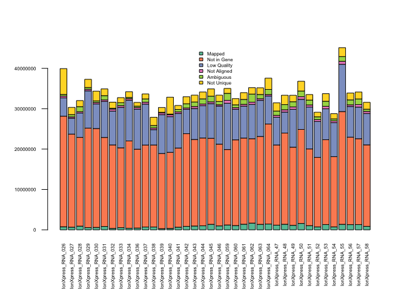

# HTSeq Counts Analysis
Dave Bridges  
August 2, 2015  


This script analyses the HTSeq resutls for the Juvenile HFD studies.  This script was most recently run on Fri Aug  7 16:36:31 2015


This script merges all the files in the directory ../server-scripts/htseq-output and analyses the counts.

 

# Summary

On average 29% of reads were aligned to a known feature, with 40% of reads not mapped to known features.  A remaining 24% of reads were too low quality to be mapped.  The range of mapped reads was 6199586 to 14993394 with an average of 9760435.

# Annotation


# Session Information


```
## R version 3.2.0 (2015-04-16)
## Platform: x86_64-apple-darwin13.4.0 (64-bit)
## Running under: OS X 10.10.4 (Yosemite)
## 
## locale:
## [1] en_US.UTF-8/en_US.UTF-8/en_US.UTF-8/C/en_US.UTF-8/en_US.UTF-8
## 
## attached base packages:
## [1] stats     graphics  grDevices utils     datasets  methods   base     
## 
## other attached packages:
## [1] biomaRt_2.24.0     RColorBrewer_1.1-2 knitr_1.10.5      
## 
## loaded via a namespace (and not attached):
##  [1] IRanges_2.2.5        XML_3.98-1.3         digest_0.6.8        
##  [4] bitops_1.0-6         GenomeInfoDb_1.4.1   DBI_0.3.1           
##  [7] stats4_3.2.0         formatR_1.2          magrittr_1.5        
## [10] RSQLite_1.0.0        evaluate_0.7         stringi_0.5-5       
## [13] S4Vectors_0.6.3      rmarkdown_0.7        tools_3.2.0         
## [16] stringr_1.0.0        Biobase_2.28.0       RCurl_1.95-4.7      
## [19] parallel_3.2.0       yaml_2.1.13          BiocGenerics_0.14.0 
## [22] AnnotationDbi_1.30.1 htmltools_0.2.6
```
