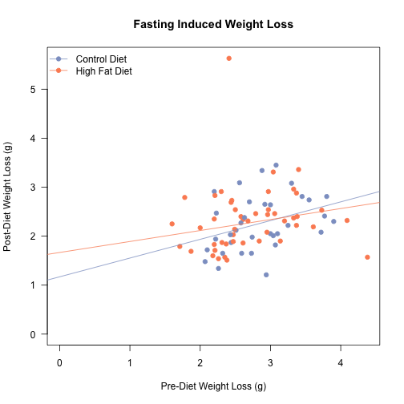

Effects of Fasting Induced Weight Loss
==========================================

Data
-----


This analysis uses the fed and fasted data from C57BL6/J mice at three time points.  There was a total of 71 mice analysed from these cohorts.  The first is the pre-diet fasting data (experiments 83/84 and 100/101, from cohorts 5 and 6), the second is the post-12 weeks high fat diet (experiments 61/62 and 69/70 from cohorts 3,4 and 5) and the third is at the end of the rapamycin treatment experiment (experiments 56 and 57).  The input file for this is ../data/raw/body_weights_file.csv and this script was most recently run on Sun Apr 20 09:34:31 2014

Analysis
----------


### Weight Loss on Normal Chow Diet


We tested whether there was a trend towards weight loss or percentage weight loss with age in the Normal Chow Diet Fed Animals.  First we tested whether there is a correlation between Age and Weight loss (r=**-0.093**, R2=**0.0087** p=**0.44**) or percentage weight loss (r=**0.043**, R2=**0.0018** p=**0.724**).  

We next generated simple linar models to test the size of this effect.  The results of these linear models are shown in the tables below.  The adjusted r-squared for these models are **-0.0057** for weight loss and **-0.0126** for percentage weight loss.  These data are presented graphically below.

<!-- html table generated in R 3.1.0 by xtable 1.7-3 package -->
<!-- Sun Apr 20 09:34:31 2014 -->
<TABLE border=1>
<CAPTION ALIGN="bottom"> Linear Models for Fasting Induced Weight Loss for Mice on a Normal Chow Diet </CAPTION>
<TR> <TH>  </TH> <TH> Estimate </TH> <TH> Std. Error </TH> <TH> t value </TH> <TH> Pr(&gt;|t|) </TH>  </TR>
  <TR> <TD align="right"> (Intercept) </TD> <TD align="right"> 2.6518 </TD> <TD align="right"> 0.1746 </TD> <TD align="right"> 15.19 </TD> <TD align="right"> 0.0000 </TD> </TR>
  <TR> <TD align="right"> Age </TD> <TD align="right"> -0.0010 </TD> <TD align="right"> 0.0013 </TD> <TD align="right"> -0.78 </TD> <TD align="right"> 0.4403 </TD> </TR>
   <A NAME=tab:lm-loss></A>
</TABLE>
<!-- html table generated in R 3.1.0 by xtable 1.7-3 package -->
<!-- Sun Apr 20 09:34:31 2014 -->
<TABLE border=1>
<CAPTION ALIGN="bottom"> Linear Models for Fasting Induced Percentage Weight Loss for Mice on a Normal Chow Diet </CAPTION>
<TR> <TH>  </TH> <TH> Estimate </TH> <TH> Std. Error </TH> <TH> t value </TH> <TH> Pr(&gt;|t|) </TH>  </TR>
  <TR> <TD align="right"> (Intercept) </TD> <TD align="right"> 8.1743 </TD> <TD align="right"> 0.5859 </TD> <TD align="right"> 13.95 </TD> <TD align="right"> 0.0000 </TD> </TR>
  <TR> <TD align="right"> Age </TD> <TD align="right"> 0.0016 </TD> <TD align="right"> 0.0044 </TD> <TD align="right"> 0.36 </TD> <TD align="right"> 0.7236 </TD> </TR>
   <A NAME=tab:lm-loss-pct></A>
</TABLE>


Longitudinal Analysis of Fasting Induced Weight Loss
-----------------------------------------------------


We next tested whether weight loss pre-diet has any effect on weight loss later on.  In other words, is weight loss consistent within animals. There was a strong correlation between percentage weight loss pre-diet and weight loss post-diet (r=0.406, R2=0.165, p=1.0428 &times; 10<sup>-4</sup>) but not absolute weight loss (r=0.249, R2=0.062, p=0.021).  These data are graphed below.

<!-- html table generated in R 3.1.0 by xtable 1.7-3 package -->
<!-- Sun Apr 20 09:34:31 2014 -->
<TABLE border=1>
<CAPTION ALIGN="bottom"> Linear Model for The Role of Early Fasting Induced Weight Loss Compared to Late Fasting Induced Weight Loss </CAPTION>
<TR> <TH>  </TH> <TH> Estimate </TH> <TH> Std. Error </TH> <TH> t value </TH> <TH> Pr(&gt;|t|) </TH>  </TR>
  <TR> <TD align="right"> (Intercept) </TD> <TD align="right"> 1.4660 </TD> <TD align="right"> 0.2800 </TD> <TD align="right"> 5.24 </TD> <TD align="right"> 0.0000 </TD> </TR>
  <TR> <TD align="right"> TreatmentHigh Fat Diet </TD> <TD align="right"> 0.1618 </TD> <TD align="right"> 0.0920 </TD> <TD align="right"> 1.76 </TD> <TD align="right"> 0.0825 </TD> </TR>
  <TR> <TD align="right"> Early </TD> <TD align="right"> 0.2278 </TD> <TD align="right"> 0.0862 </TD> <TD align="right"> 2.64 </TD> <TD align="right"> 0.0098 </TD> </TR>
   <A NAME=tab:lm-fasting-loss></A>
</TABLE>
<!-- html table generated in R 3.1.0 by xtable 1.7-3 package -->
<!-- Sun Apr 20 09:34:31 2014 -->
<TABLE border=1>
<CAPTION ALIGN="bottom"> Linear Model for The Role of Early Fasting Induced Percent Weight Loss Compared to Late Fasting Induced Percent Weight Loss </CAPTION>
<TR> <TH>  </TH> <TH> Estimate </TH> <TH> Std. Error </TH> <TH> t value </TH> <TH> Pr(&gt;|t|) </TH>  </TR>
  <TR> <TD align="right"> (Intercept) </TD> <TD align="right"> 2.8166 </TD> <TD align="right"> 0.8029 </TD> <TD align="right"> 3.51 </TD> <TD align="right"> 0.0007 </TD> </TR>
  <TR> <TD align="right"> TreatmentHigh Fat Diet </TD> <TD align="right"> -0.4819 </TD> <TD align="right"> 0.2071 </TD> <TD align="right"> -2.33 </TD> <TD align="right"> 0.0224 </TD> </TR>
  <TR> <TD align="right"> Early.pct </TD> <TD align="right"> 0.2435 </TD> <TD align="right"> 0.0676 </TD> <TD align="right"> 3.61 </TD> <TD align="right"> 0.0005 </TD> </TR>
   <A NAME=tab:lm-fasting-loss-pct></A>
</TABLE>
<!-- html table generated in R 3.1.0 by xtable 1.7-3 package -->
<!-- Sun Apr 20 09:34:31 2014 -->
<TABLE border=1>
<CAPTION ALIGN="bottom"> Linear Model for The Role of Early Fasting Induced Percent Weight Loss Compared to Late Fasting Induced Percent Weight Loss Including Interaction Term </CAPTION>
<TR> <TH>  </TH> <TH> Estimate </TH> <TH> Std. Error </TH> <TH> t value </TH> <TH> Pr(&gt;|t|) </TH>  </TR>
  <TR> <TD align="right"> (Intercept) </TD> <TD align="right"> -0.3529 </TD> <TD align="right"> 1.3257 </TD> <TD align="right"> -0.27 </TD> <TD align="right"> 0.7907 </TD> </TR>
  <TR> <TD align="right"> TreatmentHigh Fat Diet </TD> <TD align="right"> 4.1498 </TD> <TD align="right"> 1.5911 </TD> <TD align="right"> 2.61 </TD> <TD align="right"> 0.0108 </TD> </TR>
  <TR> <TD align="right"> Early.pct </TD> <TD align="right"> 0.5151 </TD> <TD align="right"> 0.1129 </TD> <TD align="right"> 4.56 </TD> <TD align="right"> 0.0000 </TD> </TR>
  <TR> <TD align="right"> TreatmentHigh Fat Diet:Early.pct </TD> <TD align="right"> -0.4041 </TD> <TD align="right"> 0.1377 </TD> <TD align="right"> -2.93 </TD> <TD align="right"> 0.0043 </TD> </TR>
   <A NAME=tab:lm-fasting-loss-pct-int></A>
</TABLE>


To account for the potential confounding effect of dietary treatment, we generated linear models comparing early weight loss to late weight loss in absolute  or relative terms  .   These models had an R2 of 0.096 for absolute weight loss and 0.216 for percentage weight loss.  

The only model that had a significant term was for percent weight loss.  For percent weight loss, was a significant interaction between the treatment and the early fasting induced weight loss (p=0.0043) on the late fasting induced weight loss.  In addition to this interaction term, both the dietary treatment (p=0.0108) and the pre-diet fasting response (p=1.7551 &times; 10<sup>-5</sup>) were highly significant.

 


 


 


 


### Comparason of Fasting Induced Weight Loss to Eventual Weight Gain

Due to the stability in percent weight loss even without dietary manipulation, we wanted to test for associations between fasting induced-weight loss and their eventual weight gain during dietary manipulation.


```
## Warning: using the 86/88 rows from a combined fit
```


We next tested whether weight loss pre-diet has any effect on weight loss later on.  In other words, is weight loss consistent within animals. There was a strong correlation between percentage weight loss pre-diet and weight gained during the diet (r=-0.516, R2=0.266, p=0) but not absolute weight loss (r=-0.452, R2=0.205, p=10<sup>-5</sup>).  These data are graphed below.

<!-- html table generated in R 3.1.0 by xtable 1.7-3 package -->
<!-- Sun Apr 20 09:34:31 2014 -->
<TABLE border=1>
<CAPTION ALIGN="bottom"> Linear model for the role of early fasting induced weight loss compared to weight gain during diet </CAPTION>
<TR> <TH>  </TH> <TH> Estimate </TH> <TH> Std. Error </TH> <TH> t value </TH> <TH> Pr(&gt;|t|) </TH>  </TR>
  <TR> <TD align="right"> (Intercept) </TD> <TD align="right"> 21.5104 </TD> <TD align="right"> 1.9203 </TD> <TD align="right"> 11.20 </TD> <TD align="right"> 0.0000 </TD> </TR>
  <TR> <TD align="right"> TreatmentHigh Fat Diet </TD> <TD align="right"> 6.6204 </TD> <TD align="right"> 0.6313 </TD> <TD align="right"> 10.49 </TD> <TD align="right"> 0.0000 </TD> </TR>
  <TR> <TD align="right"> Early </TD> <TD align="right"> -3.0834 </TD> <TD align="right"> 0.5910 </TD> <TD align="right"> -5.22 </TD> <TD align="right"> 0.0000 </TD> </TR>
   <A NAME=tab:lm-gain></A>
</TABLE>
<!-- html table generated in R 3.1.0 by xtable 1.7-3 package -->
<!-- Sun Apr 20 09:34:31 2014 -->
<TABLE border=1>
<CAPTION ALIGN="bottom"> Linear model for rhe role of early fasting induced percent weight loss compared to percent weight gain during dietary manipulation </CAPTION>
<TR> <TH>  </TH> <TH> Estimate </TH> <TH> Std. Error </TH> <TH> t value </TH> <TH> Pr(&gt;|t|) </TH>  </TR>
  <TR> <TD align="right"> (Intercept) </TD> <TD align="right"> 101.1039 </TD> <TD align="right"> 10.1594 </TD> <TD align="right"> 9.95 </TD> <TD align="right"> 0.0000 </TD> </TR>
  <TR> <TD align="right"> TreatmentHigh Fat Diet </TD> <TD align="right"> 24.2973 </TD> <TD align="right"> 2.6209 </TD> <TD align="right"> 9.27 </TD> <TD align="right"> 0.0000 </TD> </TR>
  <TR> <TD align="right"> Early.pct </TD> <TD align="right"> -4.8923 </TD> <TD align="right"> 0.8548 </TD> <TD align="right"> -5.72 </TD> <TD align="right"> 0.0000 </TD> </TR>
   <A NAME=tab:lm-gain-pct></A>
</TABLE>


To account for the potential confounding effect of dietary treatment, we generated linear models comparing early weight loss to weight gain in absolute or relative terms.   These models had an adjusted R2 of 0.658 for absolute weight gain and 0.639 for percentage weight gain. There was no interaction between the treatment and the early fasting induced weight loss in either absolute (p=0.4) but there was an interaction in percent terms (p=0.352).

Because of this, we separated out the diets and looked at correlations between weight gain on high fat diet on percent weight loss (r=-0.582, R2=0.338, p=1.4 &times; 10<sup>-5</sup>) and for control diet  (r=-0.34, R2=0.116, p=0.0367).  In terms of percentage weight gain (relative to percent pre-diet weight loss) we observed for high fat diet (r-0.591, R2=0.349, p=9.8929 &times; 10<sup>-6</sup>) and for control diet  (r=-0.41, R2=0.168, p=0.0105).

Alternatively we generated a model where percent weight gain is dependent only on the treatment.  We then performed a F-test to see if inclusion of the pre-diet improved the model.  In this case it does, with a p-value of **1.14 &times; 10<sup>-7</sup>**.

 


 


Session Information

```
## R version 3.1.0 (2014-04-10)
## Platform: x86_64-apple-darwin13.1.0 (64-bit)
## 
## locale:
## [1] en_US.UTF-8/en_US.UTF-8/en_US.UTF-8/C/en_US.UTF-8/en_US.UTF-8
## 
## attached base packages:
## [1] stats     graphics  grDevices utils     datasets  methods   base     
## 
## other attached packages:
## [1] xtable_1.7-3       reshape_0.8.4      plyr_1.8.1        
## [4] RColorBrewer_1.0-5 knitr_1.5         
## 
## loaded via a namespace (and not attached):
## [1] evaluate_0.5.3 formatR_0.10   Rcpp_0.11.1    stringr_0.6.2 
## [5] tools_3.1.0
```


