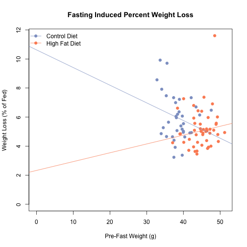

Effects of Fasting Induced Weight Loss
==========================================

Data
-----


This analysis uses the fed and fasted data from C57BL6/J mice at three time points.  There was a total of 71 mice analysed from these cohorts.  The first is the pre-diet fasting data (experiments 83/84 and 100/101, from cohorts 5 and 6), the second is the post-12 weeks high fat diet (experiments 61/62 and 69/70 from cohorts 3,4 and 5) and the third is at the end of the rapamycin treatment experiment (experiments 56 and 57).  The input file for this is ../data/raw/body_weights_file.csv and this script was most recently run on Sun Jun  1 08:28:53 2014

Analysis
----------


### Weight Loss on Normal Chow Diet


We tested whether there was a trend towards weight loss or percentage weight loss with age in the Normal Chow Diet Fed Animals.  First we tested whether there is a correlation between Age and Weight loss (r=**-0.093**, R2=**0.0087** p=**0.44**) or percentage weight loss (r=**0.043**, R2=**0.0018** p=**0.724**).  

We next generated simple linar models to test the size of this effect.  The results of these linear models are shown in the tables below.  The adjusted r-squared for these models are **-0.0057** for weight loss and **-0.0126** for percentage weight loss.  These data are presented graphically below.

<!-- html table generated in R 3.1.0 by xtable 1.7-3 package -->
<!-- Sun Jun  1 08:28:53 2014 -->
<TABLE border=1>
<CAPTION ALIGN="bottom"> Linear Models for Fasting Induced Weight Loss for Mice on a Normal Chow Diet </CAPTION>
<TR> <TH>  </TH> <TH> Estimate </TH> <TH> Std. Error </TH> <TH> t value </TH> <TH> Pr(&gt;|t|) </TH>  </TR>
  <TR> <TD align="right"> (Intercept) </TD> <TD align="right"> 2.6518 </TD> <TD align="right"> 0.1746 </TD> <TD align="right"> 15.19 </TD> <TD align="right"> 0.0000 </TD> </TR>
  <TR> <TD align="right"> Age </TD> <TD align="right"> -0.0010 </TD> <TD align="right"> 0.0013 </TD> <TD align="right"> -0.78 </TD> <TD align="right"> 0.4403 </TD> </TR>
   <A NAME=tab:lm-loss></A>
</TABLE>
<!-- html table generated in R 3.1.0 by xtable 1.7-3 package -->
<!-- Sun Jun  1 08:28:53 2014 -->
<TABLE border=1>
<CAPTION ALIGN="bottom"> Linear Models for Fasting Induced Percentage Weight Loss for Mice on a Normal Chow Diet </CAPTION>
<TR> <TH>  </TH> <TH> Estimate </TH> <TH> Std. Error </TH> <TH> t value </TH> <TH> Pr(&gt;|t|) </TH>  </TR>
  <TR> <TD align="right"> (Intercept) </TD> <TD align="right"> 8.1743 </TD> <TD align="right"> 0.5859 </TD> <TD align="right"> 13.95 </TD> <TD align="right"> 0.0000 </TD> </TR>
  <TR> <TD align="right"> Age </TD> <TD align="right"> 0.0016 </TD> <TD align="right"> 0.0044 </TD> <TD align="right"> 0.36 </TD> <TD align="right"> 0.7236 </TD> </TR>
   <A NAME=tab:lm-loss-pct></A>
</TABLE>


 


 


### Effect of outliers on interpretation of longitudinal fasting weight loss

There were two outliers noted by one of the reviewers that may affect our interpretation.  These outliers were C57BL/6J-EarTag #192, C57BL/6J-EarTag #35, C57BL/6J-EarTag #922 which lost less than 2% of their body weight, and C57BL/6J-EarTag #187, C57BL/6J-EarTag #36. which lost more than 15% of their body weight at some stage.  If we remove these outliers the adjusted R<sup>2</sup> goes from 0.0018 to 0.0258.

We also calculated correlation coeffecients for both the entire dataset.  Because the residuals for the percent loss linear model were normally distributed (Shapiro-Wilk test p=9.3102 &times; 10<sup>-4</sup> for percent weight loss and 0.0181 for absolute weight loss).  Therefore correlations coefficients will be from Spearman's Rank Order test

For percent weight loss upon fasting the Spearman's rank ordered test showed no significant correlation.
(r=0.0427 r<sup>2</sup>= 0.0177 and p=0.2685) and with outliers removed (r=0.1772 r<sup>2</sup>= 0.0314 and p=0.1484).  For total weight loss there was also no correlation (r=-0.093 r<sup>2</sup>= 0.0071 and p=0.4834) and with outliers removed (r=-0.0618 r<sup>2</sup>= 0.0038 and p=0.6167).

Longitudinal Analysis of Fasting Induced Weight Loss
-----------------------------------------------------


```
## Warning: Cannot compute exact p-value with ties
## Warning: Cannot compute exact p-value with ties
## Warning: Cannot compute exact p-value with ties
## Warning: Cannot compute exact p-value with ties
```


Both pre- and post-diet fasting responses were not normally distributed.  For pre-diet the Shapiro-Wilk test had a p-value of 0.0366 for absolute weight loss and 0.0744 for relative weight loss.  For post-diet fasting responses, the results were 5.0793 &times; 10<sup>-7</sup> for absolute weight loss and 3.2307 &times; 10<sup>-6</sup> for percent weight loss.  Therefore to test correlations between these factors we used Spearman's Rank Order Test.

We next tested whether weight loss pre-diet has any effect on weight loss later on.  This used the data file ../data/processed/fasting_weights_file.csv.  In other words, is weight loss consistent within animals. There was a correlation between percentage weight loss pre-diet and weight loss post-diet (r=0.368, R2=0.135, p=6.7038 &times; 10<sup>-4</sup>) and absolute weight loss (r=0.35, R2=0.123, p=0.001) when the diets are combined.  To account for the potential confounding effect of dietary treatment, we tested each diet separately.  


#### High Fat Diet Within-Mouse Correlations

For High Fat Diet pre-diet values, the Shapiro-Wilk test had a p-value of 0.156 for absolute weight loss and 0.3309 for relative weight loss. For post-diet the Shapiro-Wilk test had a p-value of 2.1031 &times; 10<sup>-6</sup> for absolute weight loss and 1.8091 &times; 10<sup>-6</sup> for relative weight loss.  Based on this we did a Spearman Rank-Order test and found that there was a modest correlation between percentage weight loss pre-diet and weight loss post-diet (r=0.338, R2=0.114, p=0.0191) and absolute weight loss (r=0.35, R2=0.122, p=0.015).

#### Control Diet Within-Mouse Correlations

For Control Diet pre-diet values, the Shapiro-Wilk test had a p-value of 0.0303 for absolute weight loss and 0.0383 for relative weight loss. For post-diet the Shapiro-Wilk test had a p-value of 0.8117 for absolute weight loss and 0.1357 for relative weight loss.  Based on this we did a Spearman Rank-Order test and found that there was a modest correlation between percentage weight loss pre-diet and weight loss post-diet (r=0.372, R2=0.138, p=0.0311) and absolute weight loss (r=0.391, R2=0.153, p=0.022).

 


 


Effects Relative to Body Weight
--------------------------------

 


 


### Comparason of Fasting Induced Weight Loss to Eventual Weight Gain

Due to the stability in percent weight loss even without dietary manipulation, we wanted to test for associations between fasting induced-weight loss and their eventual weight gain during dietary manipulation.


We next tested whether weight loss pre-diet has any effect on weight loss later on.  For Control Diet pre-diet fasting values, the Shapiro-Wilk test had a p-value of 0.0303 for absolute weight loss and 0.0383 for relative weight loss. For High Fat Diet pre-diet values, the Shapiro-Wilk test had a p-value of 0.156 for absolute weight loss and 0.3309 for relative weight loss.  

At the end of the diet, the percent weight gain and absolute weight gain was also not normally distributed (p=0.0143 and 0.0038) for High Fat Diet.  For Control Diet, the data was normally distributed for percent weight gain (p=0.7665) but not absolute weight gain (p=0.5949).

In other words, is weight loss consistent within animals. There was a strong correlation between percentage weight loss pre-diet and weight gained during the diet (r=-0.441, R2=0.194, p=3.4 &times; 10<sup>-5</sup>) but not absolute weight loss (r=-0.377, R2=0.142, p=4.9 &times; 10<sup>-4</sup>).  These data are graphed below.

<!-- html table generated in R 3.1.0 by xtable 1.7-3 package -->
<!-- Sun Jun  1 08:28:54 2014 -->
<TABLE border=1>
<CAPTION ALIGN="bottom"> Linear model for the role of early fasting induced weight loss compared to weight gain during diet </CAPTION>
<TR> <TH>  </TH> <TH> Estimate </TH> <TH> Std. Error </TH> <TH> t value </TH> <TH> Pr(&gt;|t|) </TH>  </TR>
  <TR> <TD align="right"> (Intercept) </TD> <TD align="right"> 18.3436 </TD> <TD align="right"> 1.5851 </TD> <TD align="right"> 11.57 </TD> <TD align="right"> 0.0000 </TD> </TR>
  <TR> <TD align="right"> TreatmentHigh Fat Diet </TD> <TD align="right"> 6.7416 </TD> <TD align="right"> 0.6141 </TD> <TD align="right"> 10.98 </TD> <TD align="right"> 0.0000 </TD> </TR>
  <TR> <TD align="right"> Early </TD> <TD align="right"> -2.2488 </TD> <TD align="right"> 0.5306 </TD> <TD align="right"> -4.24 </TD> <TD align="right"> 0.0001 </TD> </TR>
   <A NAME=tab:lm-gain></A>
</TABLE>
<!-- html table generated in R 3.1.0 by xtable 1.7-3 package -->
<!-- Sun Jun  1 08:28:54 2014 -->
<TABLE border=1>
<CAPTION ALIGN="bottom"> Linear model for rhe role of early fasting induced percent weight loss compared to percent weight gain during dietary manipulation </CAPTION>
<TR> <TH>  </TH> <TH> Estimate </TH> <TH> Std. Error </TH> <TH> t value </TH> <TH> Pr(&gt;|t|) </TH>  </TR>
  <TR> <TD align="right"> (Intercept) </TD> <TD align="right"> 87.9340 </TD> <TD align="right"> 7.8276 </TD> <TD align="right"> 11.23 </TD> <TD align="right"> 0.0000 </TD> </TR>
  <TR> <TD align="right"> TreatmentHigh Fat Diet </TD> <TD align="right"> 27.0912 </TD> <TD align="right"> 2.4854 </TD> <TD align="right"> 10.90 </TD> <TD align="right"> 0.0000 </TD> </TR>
  <TR> <TD align="right"> Early.pct </TD> <TD align="right"> -3.9356 </TD> <TD align="right"> 0.7037 </TD> <TD align="right"> -5.59 </TD> <TD align="right"> 0.0000 </TD> </TR>
   <A NAME=tab:lm-gain-pct></A>
</TABLE>


To account for the potential confounding effect of dietary treatment, we generated linear models comparing early weight loss to weight gain in absolute or relative terms.   These models had an adjusted R2 of 0.66 for absolute weight gain and 0.678 for percentage weight gain. There was no interaction between the treatment and the early fasting induced weight loss in either absolute (p=0.542) but there was an interaction in percent terms (p=0.163).

Because of this, we separated out the diets and looked at correlations between weight gain on high fat diet on percent weight loss (r=-0.479, R2=0.23, p=5.71 &times; 10<sup>-4</sup>) and for control diet  (r=-0.338, R2=0.114, p=0.0509).  In terms of percentage weight gain (relative to percent pre-diet weight loss) we observed for high fat diet (r-0.602, R2=0.362, p=6.0681 &times; 10<sup>-6</sup>) and for control diet  (r=-0.397, R2=0.158, p=0.02).

Alternatively we generated a model where percent weight gain is dependent only on the treatment.  We then performed a F-test to see if inclusion of the pre-diet improved the model.  In this case it does, with a p-value of **2.599 &times; 10<sup>-7</sup>**.

 


 


Session Information
--------------------


```
## R version 3.1.0 (2014-04-10)
## Platform: x86_64-apple-darwin13.1.0 (64-bit)
## 
## locale:
## [1] en_US.UTF-8/en_US.UTF-8/en_US.UTF-8/C/en_US.UTF-8/en_US.UTF-8
## 
## attached base packages:
## [1] stats     graphics  grDevices utils     datasets  methods   base     
## 
## other attached packages:
## [1] xtable_1.7-3       MASS_7.3-33        reshape_0.8.5     
## [4] RColorBrewer_1.0-5 knitr_1.5         
## 
## loaded via a namespace (and not attached):
## [1] evaluate_0.5.5 formatR_0.10   plyr_1.8.1     Rcpp_0.11.1   
## [5] stringr_0.6.2  tools_3.1.0
```


