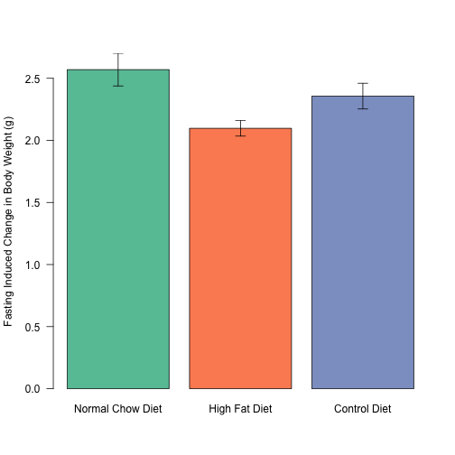
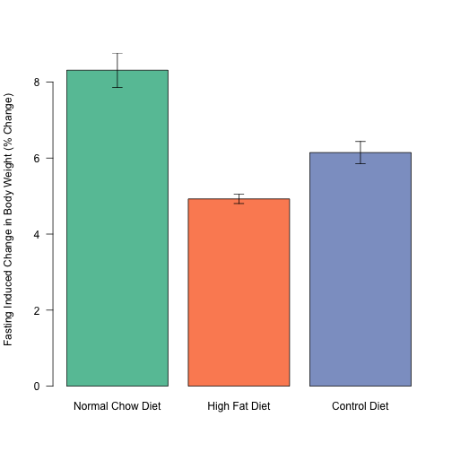
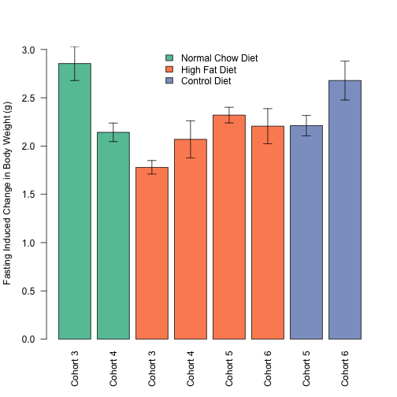
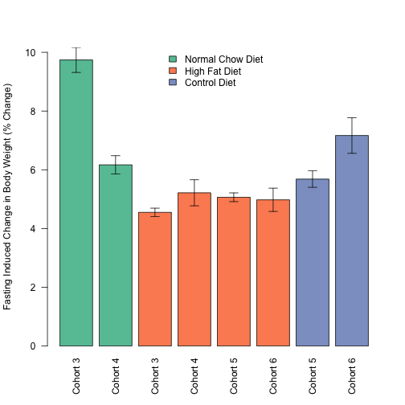
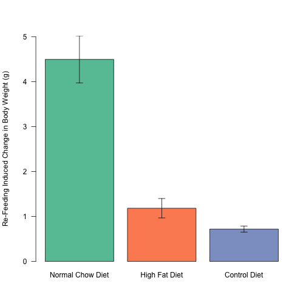
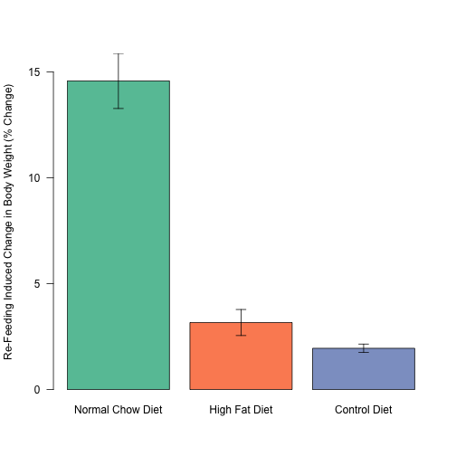
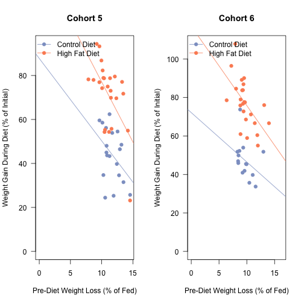
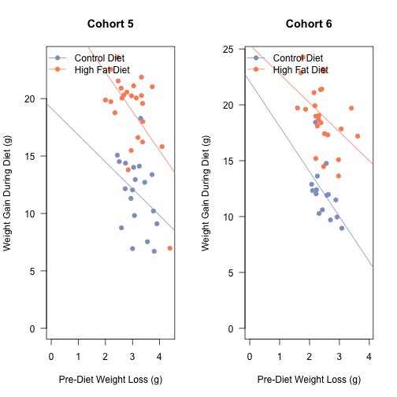

Effects of Fasting Induced Weight Loss
==========================================

Data
-----


This analysis uses the fed and fasted data from C57BL6/J mice at three time points.  There was a total of 71 mice analysed from these cohorts.  The first is the pre-diet fasting data (experiments 83/84 and 100/101, from cohorts 5 and 6), the second is the post-12 weeks high fat diet (experiments 61/62 and 69/70 from cohorts 3,4 and 5) and the third is at the end of the rapamycin treatment experiment (experiments 56 and 57).  The input file for this is ../data/raw/body_weights_file.csv and this script was most recently run on Tue Jun 17 09:21:57 2014

Analysis
----------


### Weight Loss on Normal Chow Diet


We tested whether there was a trend towards weight loss or percentage weight loss with age in the Normal Chow Diet Fed Animals.  First we tested whether there is a correlation between Age and Weight loss (r=**-0.093**, R2=**0.0087** p=**0.44**) or percentage weight loss (r=**0.043**, R2=**0.0018** p=**0.724**).  

We next generated simple linar models to test the size of this effect.  The results of these linear models are shown in the tables below.  The adjusted r-squared for these models are **-0.0057** for weight loss and **-0.0126** for percentage weight loss.  These data are presented graphically below.

<!-- html table generated in R 3.1.0 by xtable 1.7-3 package -->
<!-- Tue Jun 17 09:21:57 2014 -->
<TABLE border=1>
<CAPTION ALIGN="bottom"> Linear Models for Fasting Induced Weight Loss for Mice on a Normal Chow Diet </CAPTION>
<TR> <TH>  </TH> <TH> Estimate </TH> <TH> Std. Error </TH> <TH> t value </TH> <TH> Pr(&gt;|t|) </TH>  </TR>
  <TR> <TD align="right"> (Intercept) </TD> <TD align="right"> 2.6518 </TD> <TD align="right"> 0.1746 </TD> <TD align="right"> 15.19 </TD> <TD align="right"> 0.0000 </TD> </TR>
  <TR> <TD align="right"> Age </TD> <TD align="right"> -0.0010 </TD> <TD align="right"> 0.0013 </TD> <TD align="right"> -0.78 </TD> <TD align="right"> 0.4403 </TD> </TR>
   <A NAME=tab:lm-loss></A>
</TABLE>
<!-- html table generated in R 3.1.0 by xtable 1.7-3 package -->
<!-- Tue Jun 17 09:21:57 2014 -->
<TABLE border=1>
<CAPTION ALIGN="bottom"> Linear Models for Fasting Induced Percentage Weight Loss for Mice on a Normal Chow Diet </CAPTION>
<TR> <TH>  </TH> <TH> Estimate </TH> <TH> Std. Error </TH> <TH> t value </TH> <TH> Pr(&gt;|t|) </TH>  </TR>
  <TR> <TD align="right"> (Intercept) </TD> <TD align="right"> 8.1743 </TD> <TD align="right"> 0.5859 </TD> <TD align="right"> 13.95 </TD> <TD align="right"> 0.0000 </TD> </TR>
  <TR> <TD align="right"> Age </TD> <TD align="right"> 0.0016 </TD> <TD align="right"> 0.0044 </TD> <TD align="right"> 0.36 </TD> <TD align="right"> 0.7236 </TD> </TR>
   <A NAME=tab:lm-loss-pct></A>
</TABLE>

 

 

### Effect of outliers on interpretation of longitudinal fasting weight loss

There were two outliers noted by one of the reviewers that may affect our interpretation.  These outliers were C57BL/6J-EarTag #192, C57BL/6J-EarTag #35, C57BL/6J-EarTag #922 which lost less than 2% of their body weight, and C57BL/6J-EarTag #187, C57BL/6J-EarTag #36. which lost more than 15% of their body weight at some stage.  If we remove these outliers the adjusted R<sup>2</sup> goes from 0.0018 to 0.0258.

We also calculated correlation coeffecients for both the entire dataset.  Because the residuals for the percent loss linear model were normally distributed (Shapiro-Wilk test p=9.3102 &times; 10<sup>-4</sup> for percent weight loss and 0.0181 for absolute weight loss).  Therefore correlations coefficients will be from Spearman's Rank Order test

For percent weight loss upon fasting the Spearman's rank ordered test showed no significant correlation.
(r=0.0427 r<sup>2</sup>= 0.0177 and p=0.2685) and with outliers removed (r=0.1772 r<sup>2</sup>= 0.0314 and p=0.1484).  For total weight loss there was also no correlation (r=-0.093 r<sup>2</sup>= 0.0071 and p=0.4834) and with outliers removed (r=-0.0618 r<sup>2</sup>= 0.0038 and p=0.6167).

Longitudinal Analysis of Fasting Induced Weight Loss
-----------------------------------------------------


```
## Warning: Cannot compute exact p-value with ties
## Warning: Cannot compute exact p-value with ties
## Warning: Cannot compute exact p-value with ties
## Warning: Cannot compute exact p-value with ties
```

Both pre- and post-diet fasting responses were not normally distributed.  For pre-diet the Shapiro-Wilk test had a p-value of 0.0366 for absolute weight loss and 0.0744 for relative weight loss.  For post-diet fasting responses, the results were 5.0793 &times; 10<sup>-7</sup> for absolute weight loss and 3.2307 &times; 10<sup>-6</sup> for percent weight loss.  Therefore to test correlations between these factors we used Spearman's Rank Order Test.

We next tested whether weight loss pre-diet has any effect on weight loss later on.  This used the data file ../data/processed/fasting_weights_file.csv.  In other words, is weight loss consistent within animals. There was a correlation between percentage weight loss pre-diet and weight loss post-diet (r=0.368, R2=0.135, p=6.7038 &times; 10<sup>-4</sup>) and absolute weight loss (r=0.35, R2=0.123, p=0.001) when the diets are combined.  To account for the potential confounding effect of dietary treatment, we tested each diet separately.  


#### High Fat Diet Within-Mouse Correlations

For High Fat Diet pre-diet values, the Shapiro-Wilk test had a p-value of 0.156 for absolute weight loss and 0.3309 for relative weight loss. For post-diet the Shapiro-Wilk test had a p-value of 2.1031 &times; 10<sup>-6</sup> for absolute weight loss and 1.8091 &times; 10<sup>-6</sup> for relative weight loss.  Based on this we did a Spearman Rank-Order test and found that there was a modest correlation between percentage weight loss pre-diet and weight loss post-diet (r=0.338, R2=0.114, p=0.0191) and absolute weight loss (r=0.35, R2=0.122, p=0.015).

#### Control Diet Within-Mouse Correlations

For Control Diet pre-diet values, the Shapiro-Wilk test had a p-value of 0.0303 for absolute weight loss and 0.0383 for relative weight loss. For post-diet the Shapiro-Wilk test had a p-value of 0.8117 for absolute weight loss and 0.1357 for relative weight loss.  Based on this we did a Spearman Rank-Order test and found that there was a modest correlation between percentage weight loss pre-diet and weight loss post-diet (r=0.372, R2=0.138, p=0.0311) and absolute weight loss (r=0.391, R2=0.153, p=0.022).

 

 

### Effects of cohort on the lack of correlation between pre-diet and post-diet fasting resposnes.

Since this analysis used both cohorts, and as described above did not observe a trend when combined, we separated these analyses by cohort.

The correlations betwen pre-diet fasting percent response and post-diet percent fasting response by cohort are:


```
##                     pval-cd Rho-cd Rho^2-cd pval-hfd Rho-hfd Rho^2-hfd
## Cohort 5 Absolute 1.027e-02 0.5734   0.3288   0.6912 0.08551  0.007312
## Cohort 5 Relative 1.967e-02 0.5297   0.2806   0.2303 0.25441  0.064723
## Cohort 6 Absolute 1.550e-03 0.7417   0.5501   0.2549 0.24183  0.058483
## Cohort 6 Relative 4.756e-05 0.8556   0.7320   0.3084 0.21702  0.047098
```

 

 

Effects Relative to Body Weight
--------------------------------

 

 


Effects of Diet on the Fasting Response
-----------------------------------------


We checked at the end point of the experiments what the effects of fasting were.  This tests whether the diet and/or weight affects the fasting response.  These data come from the file ../data/raw/Raw Weights Data - Fasting.csv.


### Absolute Weight Loss

We checked based on the ANOVA analysis whether the residuals were equally distributed.  For absolute weight loss, the p-value from the Shapiro-Wilk test was 0.1304 so therefore an ANOVA was appropriate.  The results of this ANOVA showed Treatment having an effect with a p-value of 0.0011.  We therefore did a post-hoc Tukey's test on this:


```r
TukeyHSD(loss.anova)$Treatment
```

```
##                                   diff      lwr     upr    p adj
## High Fat Diet-Normal Chow Diet -0.4725 -0.78005 -0.1650 0.001146
## Control Diet-Normal Chow Diet  -0.2130 -0.57118  0.1451 0.337990
## Control Diet-High Fat Diet      0.2595 -0.03223  0.5511 0.091854
```

 

### Relative Weight Loss

We checked based on the ANOVA analysis whether the residuals were equally distributed.  For percentage weight loss, the p-value from the Shapiro-Wilk test was 0.0283 so therefore an ANOVA was **not** appropriate.  The results of the Kruskal-Wallis are shown below, with the Treatment having an effect with a p-value of 4.5283 &times; 10<sup>-11</sup>.  We therefore did post-hoc Wilcoxon Rank Sum Tests:


```r
pairwise.wilcox.test(weight.data$Loss.pct, weight.data$Treatment, p.adjust.method="BH")
```

```
## 
## 	Pairwise comparisons using Wilcoxon rank sum test 
## 
## data:  weight.data$Loss.pct and weight.data$Treatment 
## 
##               Normal Chow Diet High Fat Diet
## High Fat Diet 7e-10            -            
## Control Diet  0.00031          0.00018      
## 
## P value adjustment method: BH
```

 

#### Relative Weight Loss Accross Cohorts

To test whether the enhanced relative weight loss was not consistent accross cohorts we separated these analyses by cohort.


 

 

### Weight Gain During Refeeding Phase

#### Absolute Weight Gain 

We checked based on the ANOVA analysis whether the residuals were equally distributed.  For absolute weight loss, the p-value from the Shapiro-Wilk test was 1.3731 &times; 10<sup>-6</sup> so therefore an ANOVA was **not** appropriate.  The p-value for the Kruskal-Wallis test was 2.367 &times; 10<sup>-7</sup>.  Pairwise Wilcoxon tests are shown below:


```
## 
## 	Pairwise comparisons using Wilcoxon rank sum test 
## 
## data:  weight.data$Gain and weight.data$Treatment 
## 
##               Normal Chow Diet High Fat Diet
## High Fat Diet 2.2e-06          -            
## Control Diet  2.9e-05          0.53         
## 
## P value adjustment method: holm
```

 

#### Relative Weight Gain 

We checked based on the ANOVA analysis whether the residuals were equally distributed.  For absolute weight loss, the p-value from the Shapiro-Wilk test was 8.5757 &times; 10<sup>-7</sup> so therefore an ANOVA was **not** appropriate.  The p-value for the Kruskal-Wallis test was 1.6588 &times; 10<sup>-7</sup>.  Pairwise Wilcoxon tests are shown below:


```
## 
## 	Pairwise comparisons using Wilcoxon rank sum test 
## 
## data:  weight.data$Gain.pct and weight.data$Treatment 
## 
##               Normal Chow Diet High Fat Diet
## High Fat Diet 3.7e-08          -            
## Control Diet  2.9e-05          0.7          
## 
## P value adjustment method: holm
```

 

Comparason of Fasting Induced Weight Loss to Eventual Weight Gain
--------------------------------------------------------------------

Due to the stability in percent weight loss even without dietary manipulation, we wanted to test for associations between fasting induced-weight loss and their eventual weight gain during dietary manipulation.


We next tested whether weight loss pre-diet has any effect on weight loss later on.  When combined, since there should be no difference in the groups pre-diet the data were normall distributed (p=0.0366 for absolute weight loss and p=0.0744 for percent weight loss).  Log-transforming these data yielded normal distributions (p=0.5658 for absolute weight loss and p=0.8993 for percent weight loss).

For log transformed Control Diet pre-diet fasting values, the Shapiro-Wilk test had a p-value of 0.1563 for absolute weight loss and 0.2955 for relative weight loss. For log transformed High Fat Diet pre-diet values, the Shapiro-Wilk test had a p-value of 0.7994 for absolute weight loss and 0.6812 for relative weight loss.

At the end of the diet, the percent weight gain and absolute weight gain was also not normally distributed (p=0.0143 and 0.0038) for High Fat Diet.  For Control Diet, the data was normally distributed for percent weight gain (p=0.7665) but not absolute weight gain (p=0.5949).  The log transformed Shapiro-tests were (p=8.6558 &times; 10<sup>-7</sup> and 6.6461 &times; 10<sup>-7</sup>) for High Fat Diet and (p=0.1147 and 0.3422) for Control Diet.  This was due to a bimodal distribution for the gain in high fat diet and cannot be accounted for by a transformation, as shown below:

 

The question, we asked is whether is weight loss consistent within animals, based on a Spearman's Rank Order Test. There was a strong correlation between percentage weight loss pre-diet and weight gained during the diet (r=-0.423, R2=0.179, p=7.7 &times; 10<sup>-5</sup>) and also absolute weight loss relative to absolute weight gain (r=-0.332, R2=0.11, p=0.0023).  These data are graphed below.

To account for the potential confounding effect of dietary treatment, we generated linear models comparing early weight loss to weight gain in absolute or relative terms.   These models had an adjusted R2 of 0.66 for absolute weight gain and 0.678 for percentage weight gain. There was no interaction between the treatment and the early fasting induced weight loss in either absolute (p=0.542) but there was an interaction in percent terms (p=0.163).

Because of this, we separated out the diets and looked at correlations between absolute weight gain on high fat diet and pre-diet absolute weight loss (Rho=-0.332, Rho<sup>2</sup>=0.11, p=0.0211) and for control diet  (r=-0.319, R2=0.102, p=0.066).

In terms of percentage weight gain (relative to percent pre-diet fasting response) we observed for high fat diet (r-0.61, R2=0.373, p=6.6002 &times; 10<sup>-6</sup>) and for control diet  (r=-0.334, R2=0.112, p=0.0538).

  These correlation coefficients are summarized below:

<!-- html table generated in R 3.1.0 by xtable 1.7-3 package -->
<!-- Tue Jun 17 09:21:59 2014 -->
<TABLE border=1>
<CAPTION ALIGN="bottom"> Spearman's Rho and p-values for each comparason between weight gain and fasting responses </CAPTION>
<TR> <TH>  </TH> <TH> Pre Diet Relative Fasting Response </TH> <TH> Pre Diet Absolute Fasting Response </TH>  </TR>
  <TR> <TD align="right"> HFD - Absolute Weight Gain (Rho) </TD> <TD align="right"> -0.3979 </TD> <TD align="right"> -0.3321 </TD> </TR>
  <TR> <TD align="right"> HFD - Absolute Weight Gain (p.value) </TD> <TD align="right"> 0.0054 </TD> <TD align="right"> 0.0211 </TD> </TR>
  <TR> <TD align="right"> HFD - Relative Weight Gain (Rho) </TD> <TD align="right"> -0.6104 </TD> <TD align="right"> -0.6180 </TD> </TR>
  <TR> <TD align="right"> HFD - Relative Weight Gain (p.value) </TD> <TD align="right"> 0.0000 </TD> <TD align="right"> 0.0000 </TD> </TR>
  <TR> <TD align="right"> CD - Absolute Weight Gain (Rho) </TD> <TD align="right"> -0.3235 </TD> <TD align="right"> -0.3189 </TD> </TR>
  <TR> <TD align="right"> CD - Absolute Weight Gain (p.value) </TD> <TD align="right"> 0.0625 </TD> <TD align="right"> 0.0660 </TD> </TR>
  <TR> <TD align="right"> CD - Relative Weight Gain (Rho) </TD> <TD align="right"> -0.3345 </TD> <TD align="right"> -0.4184 </TD> </TR>
  <TR> <TD align="right"> CD - Relative Weight Gain (p.value) </TD> <TD align="right"> 0.0538 </TD> <TD align="right"> 0.0138 </TD> </TR>
   <A NAME=tab:gain-correlations></A>
</TABLE>

Alternatively we generated a model where percent weight gain is dependent only on the treatment.  We then performed a F-test to see if inclusion of the pre-diet improved the model.  In this case it does, with a p-value of **2.599 &times; 10<sup>-7</sup>**.

 

 

 

### Checking for Cohort Effects on Relationship Between Pre-Diet Fasting Response and Weight Gain

We tested whether each cohort was independently significant.  We did Spearman Rank Order tests on each cohort independently.

<!-- html table generated in R 3.1.0 by xtable 1.7-3 package -->
<!-- Tue Jun 17 09:21:59 2014 -->
<TABLE border=1>
<CAPTION ALIGN="bottom"> Correlations between pre-diet fasting response and weight gain per cohort </CAPTION>
<TR> <TH>  </TH> <TH> pval-cd </TH> <TH> Rho-cd </TH> <TH> Rho^2-cd </TH> <TH> pval-hfd </TH> <TH> Rho-hfd </TH> <TH> Rho^2-hfd </TH>  </TR>
  <TR> <TD align="right"> Cohort 5 Absolute </TD> <TD align="right"> 0.1542 </TD> <TD align="right"> -0.3401 </TD> <TD align="right"> 0.1157 </TD> <TD align="right"> 0.0029 </TD> <TD align="right"> -0.5818 </TD> <TD align="right"> 0.3384 </TD> </TR>
  <TR> <TD align="right"> Cohort 5 Relative </TD> <TD align="right"> 0.0810 </TD> <TD align="right"> -0.4103 </TD> <TD align="right"> 0.1684 </TD> <TD align="right"> 0.0024 </TD> <TD align="right"> -0.5907 </TD> <TD align="right"> 0.3489 </TD> </TR>
  <TR> <TD align="right"> Cohort 6 Absolute </TD> <TD align="right"> 0.0357 </TD> <TD align="right"> -0.5450 </TD> <TD align="right"> 0.2970 </TD> <TD align="right"> 0.0266 </TD> <TD align="right"> -0.4520 </TD> <TD align="right"> 0.2043 </TD> </TR>
  <TR> <TD align="right"> Cohort 6 Relative </TD> <TD align="right"> 0.1823 </TD> <TD align="right"> -0.3640 </TD> <TD align="right"> 0.1325 </TD> <TD align="right"> 0.0030 </TD> <TD align="right"> -0.5798 </TD> <TD align="right"> 0.3362 </TD> </TR>
   </TABLE>

 

 

Session Information
--------------------


```
## R version 3.1.0 (2014-04-10)
## Platform: x86_64-apple-darwin13.1.0 (64-bit)
## 
## locale:
## [1] en_US.UTF-8/en_US.UTF-8/en_US.UTF-8/C/en_US.UTF-8/en_US.UTF-8
## 
## attached base packages:
## [1] stats     graphics  grDevices utils     datasets  methods   base     
## 
## other attached packages:
## [1] plyr_1.8.1         xtable_1.7-3       MASS_7.3-33       
## [4] reshape_0.8.5      RColorBrewer_1.0-5 knitr_1.6         
## 
## loaded via a namespace (and not attached):
## [1] evaluate_0.5.5 formatR_0.10   Rcpp_0.11.2    stringr_0.6.2 
## [5] tools_3.1.0
```

