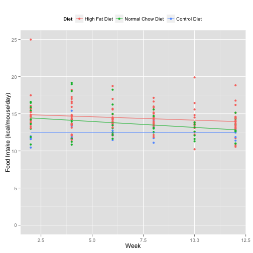
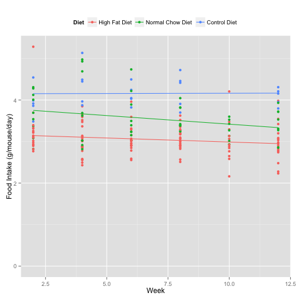

Food Intake for High Fat Diet Mice
========================================================


This script examines the combined food intake for the high fat diet cohorts.  It analyses the data present in the ../data/raw/hfd_food_intake.csv file.  This script was most recently run on Fri Apr 11 09:29:13 2014.  


Food Intake
-------------

Food was monitored biweekly at the cage level. The raw data is as food per week per mouse. 

Food Intake Statistics
-----------------------

We used mixed effects linear models to examine food intake.  The first question we asked was whether food intake changed over time.


After accounting for the Diet, there was a significant effect of the week on the food intake both in terms of calories (p=0.0038) and in terms of grams (p=0.0033).  The effect was that mice ate -0.095kcal/week or -0.022g/week, or less per week. 

There was no significant interaction between diet and the week (p=0.288 calorically and p=0.175 in terms of grams). This means that the mice on average eat less, no matter what the diet is.  We therefore corrected for that effect first, prior to comparing dietary manipulations.  The model coefficients for these are below

To test for the effect of diet, we compared a model with a diet term to a model without a diet term, in both cases were statistically significant (p=2.65 &times; 10<sup>-9</sup> for absolute food intake and p=8.8 &times; 10<sup>-5</sup> for caloric intake).  

To test between groups, we did a Dunnet's test comparing diets in the linear mixed effects model.  There were significant differences between both Control Diet and Normal Chow Diet when compared to the High Fat Diet, in all cases with High Fat Diet eating less calorically and in absolute terms.  The results of the mixed effects model are shown below.  The root mean square error of these model are **0.361g** or **NA\%** for absolute food intake or **1.574g** or **NA** for caloric intake.

<!-- html table generated in R 3.0.2 by xtable 1.7-3 package -->
<!-- Fri Apr 11 09:29:17 2014 -->
<TABLE border=1>
<CAPTION ALIGN="bottom"> Coefficients for Selected Mixed Effects Model for Food Intake </CAPTION>
<TR> <TH>  </TH> <TH> Absolute </TH> <TH> Caloric </TH>  </TR>
  <TR> <TD align="right"> (Intercept) </TD> <TD align="right"> 3.2053 </TD> <TD align="right"> 15.0952 </TD> </TR>
  <TR> <TD align="right"> Week </TD> <TD align="right"> -0.0221 </TD> <TD align="right"> -0.0949 </TD> </TR>
  <TR> <TD align="right"> DietControl Diet </TD> <TD align="right"> 0.4890 </TD> <TD align="right"> -0.8052 </TD> </TR>
  <TR> <TD align="right"> DietNormal Chow Diet </TD> <TD align="right"> 1.0948 </TD> <TD align="right"> 2.4373 </TD> </TR>
   <A NAME=tab:food-nlme-coefficients></A>
</TABLE>
<!-- html table generated in R 3.0.2 by xtable 1.7-3 package -->
<!-- Fri Apr 11 09:29:17 2014 -->
<TABLE border=1>
<CAPTION ALIGN="bottom"> Results of Mixed Effects Linear Models of Food Intake </CAPTION>
<TR> <TH> Comparason </TH> <TH> Diet </TH> <TH> Coefficients </TH> <TH> P.Values </TH>  </TR>
  <TR> <TD> Normal Chow Diet - High Fat Diet </TD> <TD> Absolute </TD> <TD align="right"> 0.489 </TD> <TD align="right"> 0.000028 </TD> </TR>
  <TR> <TD> Control Diet - High Fat Diet </TD> <TD> Absolute </TD> <TD align="right"> 1.095 </TD> <TD align="right"> 0.000000 </TD> </TR>
  <TR> <TD> Normal Chow Diet - High Fat Diet </TD> <TD> Caloric </TD> <TD align="right"> -0.805 </TD> <TD align="right"> 0.184971 </TD> </TR>
  <TR> <TD> Control Diet - High Fat Diet </TD> <TD> Caloric </TD> <TD align="right"> 2.437 </TD> <TD align="right"> 0.000174 </TD> </TR>
   <A NAME=tab:food-intake-statistics></A>
</TABLE>


Food Intake Graphs
---------------------

See below for the food intake by calories and and by mass.


```
## Warning: pseudoinverse used at 8
## Warning: neighborhood radius 4
## Warning: reciprocal condition number  1.125e-16
```

 


```
## Warning: pseudoinverse used at 8
## Warning: neighborhood radius 4
## Warning: reciprocal condition number  1.125e-16
```

 


<!-- html table generated in R 3.0.2 by xtable 1.7-3 package -->
<!-- Fri Apr 11 09:29:18 2014 -->
<TABLE border=1>
<CAPTION ALIGN="bottom"> Average Food Intake Per Week by Diet </CAPTION>
<TR> <TH>  </TH> <TH> value </TH> <TH> High Fat Diet </TH> <TH> Normal Chow Diet </TH> <TH> Control Diet </TH>  </TR>
  <TR> <TD align="right"> Caloric Intake </TD> <TD> (all) </TD> <TD align="right"> 14.41 </TD> <TD align="right"> 13.62 </TD> <TD align="right"> 16.93 </TD> </TR>
  <TR> <TD align="right"> Absolute Intake </TD> <TD> (all) </TD> <TD align="right"> 3.05 </TD> <TD align="right"> 3.54 </TD> <TD align="right"> 4.16 </TD> </TR>
   <A NAME=tab:food-intake-summary></A>
</TABLE>


Session Information
---------------------


```
## R version 3.0.2 (2013-09-25)
## Platform: x86_64-apple-darwin10.8.0 (64-bit)
## 
## locale:
## [1] en_US.UTF-8/en_US.UTF-8/en_US.UTF-8/C/en_US.UTF-8/en_US.UTF-8
## 
## attached base packages:
## [1] splines   stats     graphics  grDevices utils     datasets  methods  
## [8] base     
## 
## other attached packages:
##  [1] reshape_0.8.4    ggplot2_0.9.3.1  plyr_1.8.1       xtable_1.7-3    
##  [5] multcomp_1.3-2   TH.data_1.0-3    survival_2.37-7  mvtnorm_0.9-9997
##  [9] lme4_1.1-5       Rcpp_0.11.1      Matrix_1.1-2-2   knitr_1.5       
## 
## loaded via a namespace (and not attached):
##  [1] colorspace_1.2-4    dichromat_2.0-0     digest_0.6.4       
##  [4] evaluate_0.5.1      formatR_0.10        grid_3.0.2         
##  [7] gtable_0.1.2        labeling_0.2        lattice_0.20-27    
## [10] MASS_7.3-30         minqa_1.2.3         munsell_0.4.2      
## [13] nlme_3.1-115        proto_0.3-10        RColorBrewer_1.0-5 
## [16] RcppEigen_0.3.2.1.1 reshape2_1.2.2      sandwich_2.3-0     
## [19] scales_0.2.3        stringr_0.6.2       tools_3.0.2        
## [22] zoo_1.7-11
```


