Body Weight Weight Analysis of Ob/Ob Mice
===========================================


Data Entry
-----------

This was from combined weights over several measurements of Ob/Ob Mice on a C57BL6/J background.  Some animals may appear multiple times in this analysis.  Data is downloaded in csv format from the mousedb website.  This includes only fed weights.


This data is taken from the file ``../data/raw/Ob_Ob Raw Weight Data.csv``.  This script was most recently run on ``Sat Mar 29 12:34:14 2014``.  This includes ``375`` fed body weight measurements from ``157`` different mice.


```
## geom_smooth: method="auto" and size of largest group is <1000, so using loess. Use 'method = x' to change the smoothing method.
## geom_smooth: method="auto" and size of largest group is <1000, so using loess. Use 'method = x' to change the smoothing method.
## geom_smooth: method="auto" and size of largest group is <1000, so using loess. Use 'method = x' to change the smoothing method.
## geom_smooth: method="auto" and size of largest group is <1000, so using loess. Use 'method = x' to change the smoothing method.
```

 


```
## geom_smooth: method="auto" and size of largest group is <1000, so using loess. Use 'method = x' to change the smoothing method.
## geom_smooth: method="auto" and size of largest group is <1000, so using loess. Use 'method = x' to change the smoothing method.
## geom_smooth: method="auto" and size of largest group is <1000, so using loess. Use 'method = x' to change the smoothing method.
## geom_smooth: method="auto" and size of largest group is <1000, so using loess. Use 'method = x' to change the smoothing method.
## geom_smooth: method="auto" and size of largest group is <1000, so using loess. Use 'method = x' to change the smoothing method.
## geom_smooth: method="auto" and size of largest group is <1000, so using loess. Use 'method = x' to change the smoothing method.
## geom_smooth: method="auto" and size of largest group is <1000, so using loess. Use 'method = x' to change the smoothing method.
## geom_smooth: Only one unique x value each group.Maybe you want aes(group = 1)?
```

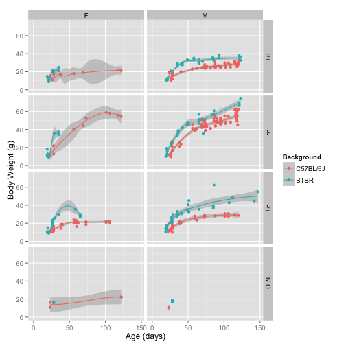 


Analysis by Age
------------------

We segregated mice into groups of of adult mice (100-400 days) and calculated some basic statistics.

<!-- html table generated in R 3.0.2 by xtable 1.7-1 package -->
<!-- Sat Mar 29 12:34:19 2014 -->
<TABLE border=1>
<CAPTION ALIGN="bottom"> Summarized Data for Adult Mice </CAPTION>
<TR> <TH> Background </TH> <TH> Genotype </TH> <TH> mean </TH> <TH> se </TH> <TH> sd </TH> <TH> rel.sd </TH> <TH> number </TH> <TH> age </TH>  </TR>
  <TR> <TD> C57BL/6J </TD> <TD> +/+ </TD> <TD align="right"> 27.44 </TD> <TD align="right"> 0.59 </TD> <TD align="right"> 2.72 </TD> <TD align="right"> 9.93 </TD> <TD align="right">  21 </TD> <TD align="right"> 114.33 </TD> </TR>
  <TR> <TD> C57BL/6J </TD> <TD> -/- </TD> <TD align="right"> 54.40 </TD> <TD align="right"> 0.97 </TD> <TD align="right"> 4.85 </TD> <TD align="right"> 8.91 </TD> <TD align="right">  25 </TD> <TD align="right"> 113.48 </TD> </TR>
  <TR> <TD> C57BL/6J </TD> <TD> -/+ </TD> <TD align="right"> 25.80 </TD> <TD align="right"> 1.22 </TD> <TD align="right"> 4.06 </TD> <TD align="right"> 15.74 </TD> <TD align="right">  11 </TD> <TD align="right"> 106.27 </TD> </TR>
  <TR> <TD> C57BL/6J </TD> <TD> N.D. </TD> <TD align="right"> 22.37 </TD> <TD align="right"> 0.01 </TD> <TD align="right"> 0.01 </TD> <TD align="right"> 0.06 </TD> <TD align="right">   2 </TD> <TD align="right"> 122.00 </TD> </TR>
  <TR> <TD> BTBR </TD> <TD> +/+ </TD> <TD align="right"> 34.82 </TD> <TD align="right"> 0.91 </TD> <TD align="right"> 2.23 </TD> <TD align="right"> 6.40 </TD> <TD align="right">   6 </TD> <TD align="right"> 121.83 </TD> </TR>
  <TR> <TD> BTBR </TD> <TD> -/- </TD> <TD align="right"> 69.44 </TD> <TD align="right"> 1.64 </TD> <TD align="right"> 3.29 </TD> <TD align="right"> 4.73 </TD> <TD align="right">   4 </TD> <TD align="right"> 121.50 </TD> </TR>
  <TR> <TD> BTBR </TD> <TD> -/+ </TD> <TD align="right"> 47.80 </TD> <TD align="right"> 2.65 </TD> <TD align="right"> 5.31 </TD> <TD align="right"> 11.10 </TD> <TD align="right">   4 </TD> <TD align="right"> 127.00 </TD> </TR>
   <A NAME=tab:adult-summary></A>
</TABLE>


```
## Warning: covariate interactions found -- default contrast might be inappropriate
## Warning: covariate interactions found -- default contrast might be inappropriate
```


To summarise these data we generated a mixed linear model comparing the logarithm of the body weight to the genotype, background and age.  The logaritm fit the data much better than a linear effect (p=0).  Each of the other terms were also significant contributors to the model with removal of age (p=1.07 &times; 10<sup>-82</sup>``), genotype (p=2.87 &times; 10<sup>-28</sup>) or background strain (p=6.916 &times; 10<sup>-16</sup>) all having significantly worse models.  There was a significant interaction between genotype and age (p=9.38 &times; 10<sup>-11</sup>) and background and age (p=0.0131), so those terms are included as interactors.  Therefore the final model is:


```r
formula(nlme.fit)
```

```
## log(Weight) ~ Age + Background + Genotype + Age:Background + 
##     Age:Genotype + (1 | Animal)
```


The residuals for this model are:

 


Variation in Weight Gain
--------------------------

To examine the variation in weight gain between wild-type and knockout mice we generated a density plot and graphed both the Standard Deviation and Relative Standard Deviation.  This is all done for mice >100 days old. 


 To test whether these differences are statistically significant we did a F-test comparing the standard deviations of these groups.  Neither difference was statistically significant (p=0.119 for C57BL/6J and p=0.419 for BTBR).

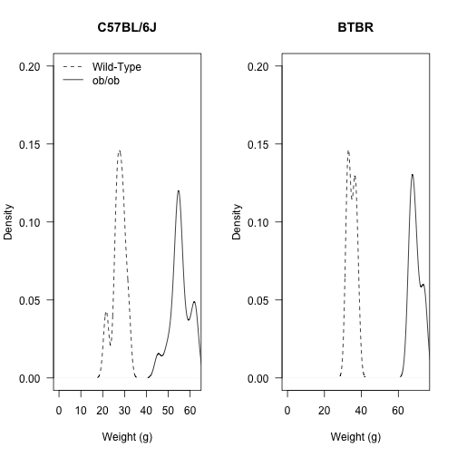 


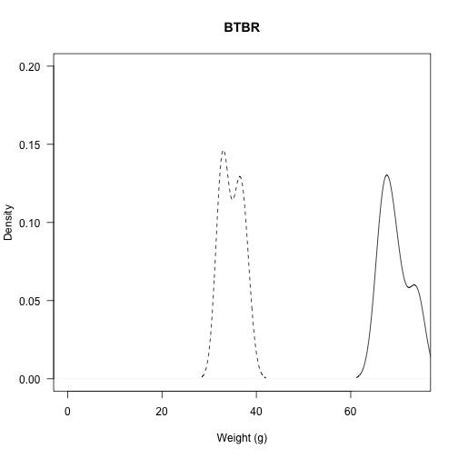 


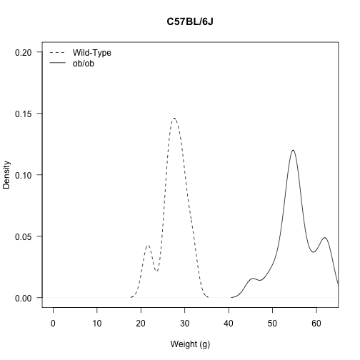 


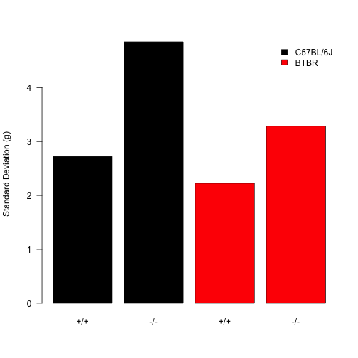 


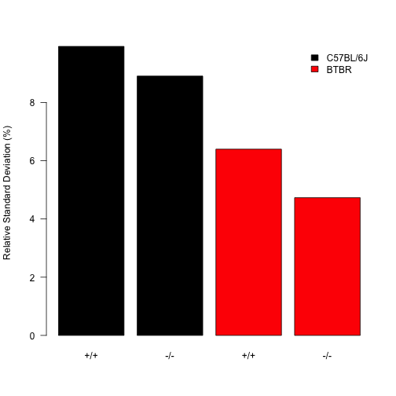 


Fasting Response in ob/ob Mice
-------------------------------

Fasting data is taken from ../data/raw/Ob_Ob Raw Weight Data Fasting.csv.


To determine whether the fasting data has a normal distribution we did Shapiro-Wilk tests on each of the groups:

<!-- html table generated in R 3.0.2 by xtable 1.7-1 package -->
<!-- Sat Mar 29 12:34:28 2014 -->
<TABLE border=1>
<TR> <TH>  </TH> <TH> Day70 </TH> <TH> Day120 </TH>  </TR>
  <TR> <TD align="right"> BTBR +/+ </TD> <TD align="right">  </TD> <TD align="right"> 0.22 </TD> </TR>
  <TR> <TD align="right"> BTBR -/- </TD> <TD align="right">  </TD> <TD align="right"> 0.81 </TD> </TR>
  <TR> <TD align="right"> C57BL/6J +/+ </TD> <TD align="right"> 0.55 </TD> <TD align="right"> 0.01 </TD> </TR>
  <TR> <TD align="right"> C57BL/6J -/- </TD> <TD align="right"> 0.38 </TD> <TD align="right"> 0.89 </TD> </TR>
   </TABLE>


First we tested whether there was an effect of genotype on the fasting response at approximately 10 weeks of age.  The t-test between wild-type and knockouts having different absolute fasting induced weight loss is 0.0661 and for percent weight loss is 0.0075.  These data are graphed below

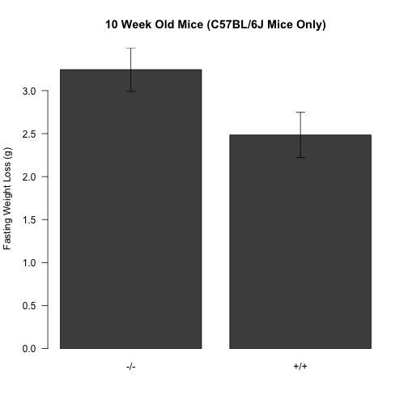 


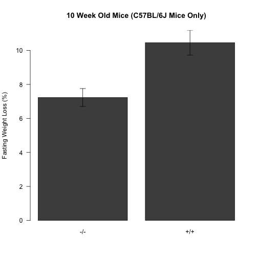 


At approximately 120 days of age for C57BL/6J, the t-test between wild-type and knockouts having different absolute fasting induced weight loss is 0.0422 and for percent weight loss is 0.074.  For BTBR, the t-test between wild-type and knockouts having different absolute fasting induced weight loss is 0.0038 and for percent weight loss is 0.0449.  These data are graphed below.

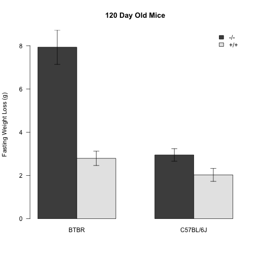 


 


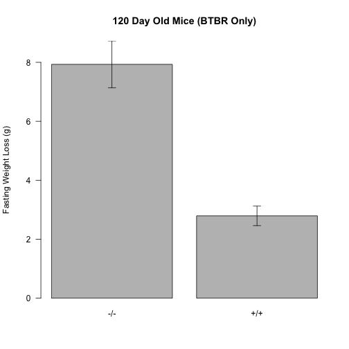 


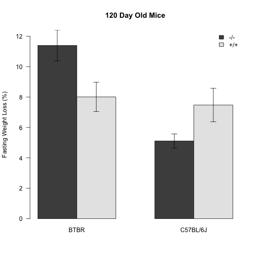 


 


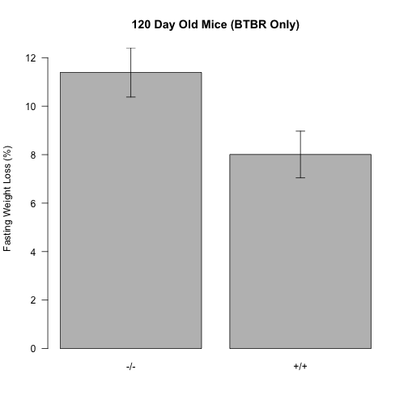 


Session Information
---------------------
  

```r
sessionInfo()
```

```
## R version 3.0.2 (2013-09-25)
## Platform: x86_64-apple-darwin10.8.0 (64-bit)
## 
## locale:
## [1] en_US.UTF-8/en_US.UTF-8/en_US.UTF-8/C/en_US.UTF-8/en_US.UTF-8
## 
## attached base packages:
## [1] splines   stats     graphics  grDevices utils     datasets  methods  
## [8] base     
## 
## other attached packages:
##  [1] reshape2_1.2.2   multcomp_1.3-2   TH.data_1.0-3    survival_2.37-7 
##  [5] mvtnorm_0.9-9997 lme4_1.0-6       Matrix_1.1-2     lattice_0.20-24 
##  [9] xtable_1.7-1     plyr_1.8         ggplot2_0.9.3.1  knitr_1.5       
## 
## loaded via a namespace (and not attached):
##  [1] colorspace_1.2-4   dichromat_2.0-0    digest_0.6.4      
##  [4] evaluate_0.5.1     formatR_0.10       grid_3.0.2        
##  [7] gtable_0.1.2       labeling_0.2       MASS_7.3-29       
## [10] minqa_1.2.3        munsell_0.4.2      nlme_3.1-113      
## [13] proto_0.3-10       RColorBrewer_1.0-5 Rcpp_0.11.0       
## [16] sandwich_2.3-0     scales_0.2.3       stringr_0.6.2     
## [19] tools_3.0.2        zoo_1.7-10
```


