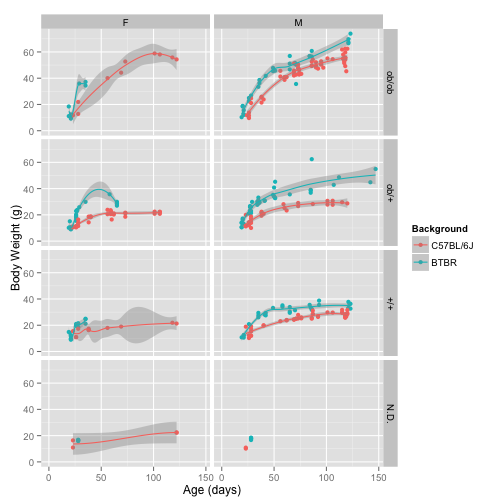
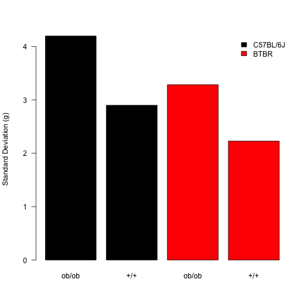
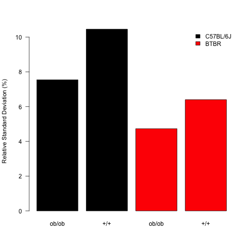

Body Weight Weight Analysis of Ob/Ob Mice
===========================================


Data Entry
-----------

This was from combined weights over several measurements of Ob/Ob Mice on a C57BL6/J background.  Some animals may appear multiple times in this analysis.  Data is downloaded in csv format from the mousedb website.  This includes only fed weights.


This data is taken from the file ``../data/raw/Ob_Ob Raw Weight Data.csv``.  This script was most recently run on ``Thu Apr 10 20:28:36 2014``.  This includes ``347`` fed body weight measurements from ``153`` different mice.


```
## geom_smooth: method="auto" and size of largest group is <1000, so using loess. Use 'method = x' to change the smoothing method.
## geom_smooth: method="auto" and size of largest group is <1000, so using loess. Use 'method = x' to change the smoothing method.
## geom_smooth: method="auto" and size of largest group is <1000, so using loess. Use 'method = x' to change the smoothing method.
## geom_smooth: method="auto" and size of largest group is <1000, so using loess. Use 'method = x' to change the smoothing method.
```

 


 


```
## geom_smooth: method="auto" and size of largest group is <1000, so using loess. Use 'method = x' to change the smoothing method.
## geom_smooth: method="auto" and size of largest group is <1000, so using loess. Use 'method = x' to change the smoothing method.
## geom_smooth: method="auto" and size of largest group is <1000, so using loess. Use 'method = x' to change the smoothing method.
## geom_smooth: method="auto" and size of largest group is <1000, so using loess. Use 'method = x' to change the smoothing method.
## geom_smooth: method="auto" and size of largest group is <1000, so using loess. Use 'method = x' to change the smoothing method.
## geom_smooth: method="auto" and size of largest group is <1000, so using loess. Use 'method = x' to change the smoothing method.
## geom_smooth: method="auto" and size of largest group is <1000, so using loess. Use 'method = x' to change the smoothing method.
## geom_smooth: Only one unique x value each group.Maybe you want aes(group = 1)?
```

 


Analysis by Age
------------------

We segregated mice into groups of of adult mice (100-400 days) and calculated some basic statistics.

<!-- html table generated in R 3.0.2 by xtable 1.7-3 package -->
<!-- Thu Apr 10 20:28:43 2014 -->
<TABLE border=1>
<CAPTION ALIGN="bottom"> Summarized Data for Adult Mice </CAPTION>
<TR> <TH> Background </TH> <TH> Genotype </TH> <TH> mean </TH> <TH> se </TH> <TH> sd </TH> <TH> rel.sd </TH> <TH> number </TH> <TH> age </TH>  </TR>
  <TR> <TD> C57BL/6J </TD> <TD> ob/ob </TD> <TD align="right"> 55.66 </TD> <TD align="right"> 0.92 </TD> <TD align="right"> 4.20 </TD> <TD align="right"> 7.54 </TD> <TD align="right">  21 </TD> <TD align="right"> 115.00 </TD> </TR>
  <TR> <TD> C57BL/6J </TD> <TD> ob/+ </TD> <TD align="right"> 25.80 </TD> <TD align="right"> 1.22 </TD> <TD align="right"> 4.06 </TD> <TD align="right"> 15.74 </TD> <TD align="right">  11 </TD> <TD align="right"> 106.27 </TD> </TR>
  <TR> <TD> C57BL/6J </TD> <TD> +/+ </TD> <TD align="right"> 27.73 </TD> <TD align="right"> 0.70 </TD> <TD align="right"> 2.90 </TD> <TD align="right"> 10.46 </TD> <TD align="right">  17 </TD> <TD align="right"> 116.41 </TD> </TR>
  <TR> <TD> C57BL/6J </TD> <TD> N.D. </TD> <TD align="right"> 22.37 </TD> <TD align="right"> 0.01 </TD> <TD align="right"> 0.01 </TD> <TD align="right"> 0.06 </TD> <TD align="right">   2 </TD> <TD align="right"> 122.00 </TD> </TR>
  <TR> <TD> BTBR </TD> <TD> ob/ob </TD> <TD align="right"> 69.44 </TD> <TD align="right"> 1.64 </TD> <TD align="right"> 3.29 </TD> <TD align="right"> 4.73 </TD> <TD align="right">   4 </TD> <TD align="right"> 121.50 </TD> </TR>
  <TR> <TD> BTBR </TD> <TD> ob/+ </TD> <TD align="right"> 47.80 </TD> <TD align="right"> 2.65 </TD> <TD align="right"> 5.31 </TD> <TD align="right"> 11.10 </TD> <TD align="right">   4 </TD> <TD align="right"> 127.00 </TD> </TR>
  <TR> <TD> BTBR </TD> <TD> +/+ </TD> <TD align="right"> 34.82 </TD> <TD align="right"> 0.91 </TD> <TD align="right"> 2.23 </TD> <TD align="right"> 6.40 </TD> <TD align="right">   6 </TD> <TD align="right"> 121.83 </TD> </TR>
   <A NAME=tab:adult-summary></A>
</TABLE>


```
## Warning: covariate interactions found -- default contrast might be inappropriate
## Warning: covariate interactions found -- default contrast might be inappropriate
```


To summarise these data we generated a mixed linear model comparing the logarithm of the body weight to the genotype, background and age.  The logaritm fit the data much better than a linear effect (p=0).  Each of the other terms were also significant contributors to the model with removal of age (p=1.4534 &times; 10<sup>-74</sup>``), genotype (p=2.112 &times; 10<sup>-25</sup>) or background strain (p=9.5335 &times; 10<sup>-15</sup>) all having significantly worse models.  There was a significant interaction between genotype and age (p=9.071 &times; 10<sup>-10</sup>) and background and age (p=0.0184), so those terms are included as interactors.  Therefore the final model is:


```r
formula(nlme.fit)
```

```
## log(Weight) ~ Age + Background + Genotype + Age:Background + 
##     Age:Genotype + (1 | Animal)
```


The residuals for this model are:

 


Variation in Weight Gain
--------------------------

To examine the variation in weight gain between wild-type and knockout mice we generated a density plot and graphed both the Standard Deviation and Relative Standard Deviation.  This is all done for mice >100 days old. 


```
## Loading required package: VGAM
## Loading required package: stats4
## 
## Attaching package: 'VGAM'
## 
## The following object is masked from 'package:stats4':
## 
##     coef
## 
## The following objects are masked from 'package:splines':
## 
##     bs, ns
## 
## The following objects are masked from 'package:stats':
## 
##     case.names, coef, coefficients, df.residual, dfbeta, fitted,
##     fitted.values, formula, hatvalues, poly, residuals,
##     variable.names, weights
## 
## The following objects are masked from 'package:base':
## 
##     identity, scale.default
```


 To test whether these differences are statistically significant we did a Browne-Forsythe test comparing the standard deviations of these groups.  Neither difference was statistically significant (p=0.214 for C57BL/6J and p=0.318 for BTBR).

 


 


 


 


 


Fasting Response in ob/ob Mice
-------------------------------

Fasting data is taken from ../data/raw/Ob_Ob Raw Weight Data Fasting.csv.


To determine whether the fasting data has a normal distribution we did Shapiro-Wilk tests on each of the groups.  Based on this we did wilcoxon-rank sum tests on these groups.

<!-- html table generated in R 3.0.2 by xtable 1.7-3 package -->
<!-- Thu Apr 10 20:28:54 2014 -->
<TABLE border=1>
<TR> <TH>  </TH> <TH> Day70 </TH> <TH> Day120 </TH>  </TR>
  <TR> <TD align="right"> BTBR +/+ </TD> <TD align="right">  </TD> <TD align="right"> 0.22 </TD> </TR>
  <TR> <TD align="right"> BTBR ob/ob </TD> <TD align="right">  </TD> <TD align="right"> 0.81 </TD> </TR>
  <TR> <TD align="right"> C57BL/6J +/+ </TD> <TD align="right"> 0.55 </TD> <TD align="right"> 0.01 </TD> </TR>
  <TR> <TD align="right"> C57BL/6J ob/ob </TD> <TD align="right"> 0.38 </TD> <TD align="right"> 0.89 </TD> </TR>
   </TABLE>


First we tested whether there was an effect of genotype on the fasting response at approximately 10 weeks of age.  The t-test between wild-type and knockouts having different absolute fasting induced weight loss is 0.0732 and for percent weight loss is 0.0101.  These data are graphed below

 


 


 


At approximately 120 days of age for C57BL/6J, the Wilcoxon between wild-type and knockouts having different absolute fasting induced weight loss is 0.0604 and for percent weight loss is 0.0055.  For BTBR, the t-test between wild-type and knockouts having different absolute fasting induced weight loss is 0.0095 and for percent weight loss is 0.0381.  These data are graphed below.

 


 


 


 


 


 


Session Information
---------------------
  

```r
sessionInfo()
```

```
## R version 3.0.2 (2013-09-25)
## Platform: x86_64-apple-darwin10.8.0 (64-bit)
## 
## locale:
## [1] en_US.UTF-8/en_US.UTF-8/en_US.UTF-8/C/en_US.UTF-8/en_US.UTF-8
## 
## attached base packages:
## [1] stats4    splines   stats     graphics  grDevices utils     datasets 
## [8] methods   base     
## 
## other attached packages:
##  [1] reshape2_1.2.2   lawstat_2.4.1    VGAM_0.9-3       multcomp_1.3-2  
##  [5] TH.data_1.0-3    survival_2.37-7  mvtnorm_0.9-9997 lme4_1.1-5      
##  [9] Rcpp_0.11.1      Matrix_1.1-2-2   xtable_1.7-3     plyr_1.8.1      
## [13] ggplot2_0.9.3.1  knitr_1.5       
## 
## loaded via a namespace (and not attached):
##  [1] colorspace_1.2-4    dichromat_2.0-0     digest_0.6.4       
##  [4] evaluate_0.5.1      formatR_0.10        grid_3.0.2         
##  [7] gtable_0.1.2        labeling_0.2        lattice_0.20-27    
## [10] MASS_7.3-30         minqa_1.2.3         munsell_0.4.2      
## [13] nlme_3.1-115        proto_0.3-10        RColorBrewer_1.0-5 
## [16] RcppEigen_0.3.2.1.1 sandwich_2.3-0      scales_0.2.3       
## [19] stringr_0.6.2       tools_3.0.2         zoo_1.7-11
```


