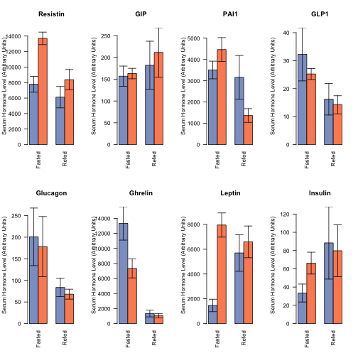

Analysis of Serum Hormones from High Fat Diet Cohort 5
=======================================================

Summary
---------

Serum samples were taken from mice which were fasted for 16h, and in which some of them were refed for 6h.  These mice were 22 weeks old, after 12 weeks on HFD or CD.  


The raw data is in a file named ../data/raw/Post-Diet-Multiplex.csv and are mapped against the file in ../data/raw/mapping.csv.  The mouse level data is in Table below, along with Shapiro-Wilk and Levene's tests:


<!-- html table generated in R 3.1.0 by xtable 1.7-3 package -->
<!-- Wed May 28 17:19:23 2014 -->
<TABLE border=1>
<CAPTION ALIGN="bottom"> Mouse Level Data </CAPTION>
<TR> <TH> Row.names </TH> <TH> Resistin </TH> <TH> GIP </TH> <TH> PAI1 </TH> <TH> GLP1 </TH> <TH> Glucagon </TH> <TH> Ghrelin </TH> <TH> Leptin </TH> <TH> Insulin </TH> <TH> Treatment </TH> <TH> Feeding </TH>  </TR>
  <TR> <TD> 26 </TD> <TD align="right"> 7366.00 </TD> <TD align="right"> 254.00 </TD> <TD align="right"> 5955.00 </TD> <TD align="right"> 42.50 </TD> <TD align="right"> 267.50 </TD> <TD align="right"> 452.00 </TD> <TD align="right"> 567.50 </TD> <TD align="right"> 20.00 </TD> <TD> Control Diet </TD> <TD> Fasted </TD> </TR>
  <TR> <TD> 27 </TD> <TD align="right"> 5272.50 </TD> <TD align="right"> 122.00 </TD> <TD align="right"> 1934.00 </TD> <TD align="right"> 15.50 </TD> <TD align="right"> 72.00 </TD> <TD align="right"> 7815.50 </TD> <TD align="right"> 870.00 </TD> <TD align="right"> 10.00 </TD> <TD> Control Diet </TD> <TD> Fasted </TD> </TR>
  <TR> <TD> 28 </TD> <TD align="right"> 5545.00 </TD> <TD align="right"> 118.00 </TD> <TD align="right"> 3074.50 </TD> <TD align="right"> 11.50 </TD> <TD align="right"> 111.00 </TD> <TD align="right"> 17597.00 </TD> <TD align="right"> 863.00 </TD> <TD align="right"> 17.00 </TD> <TD> Control Diet </TD> <TD> Fasted </TD> </TR>
  <TR> <TD> 29 </TD> <TD align="right"> 6263.00 </TD> <TD align="right"> 113.00 </TD> <TD align="right"> 2781.50 </TD> <TD align="right"> 23.50 </TD> <TD align="right"> 202.00 </TD> <TD align="right"> 21302.50 </TD> <TD align="right"> 523.00 </TD> <TD align="right"> 13.00 </TD> <TD> Control Diet </TD> <TD> Fasted </TD> </TR>
  <TR> <TD> 30 </TD> <TD align="right"> 4733.50 </TD> <TD align="right"> 98.00 </TD> <TD align="right"> 2522.00 </TD> <TD align="right"> 17.50 </TD> <TD align="right"> 65.00 </TD> <TD align="right"> 17542.00 </TD> <TD align="right"> 535.50 </TD> <TD align="right"> 14.00 </TD> <TD> Control Diet </TD> <TD> Fasted </TD> </TR>
  <TR> <TD> 44 </TD> <TD align="right"> 10726.00 </TD> <TD align="right"> 169.00 </TD> <TD align="right"> 2957.00 </TD> <TD align="right"> 16.50 </TD> <TD align="right"> 134.00 </TD> <TD align="right"> 12611.50 </TD> <TD align="right"> 2533.00 </TD> <TD align="right"> 36.00 </TD> <TD> Control Diet </TD> <TD> Fasted </TD> </TR>
  <TR> <TD> 45 </TD> <TD align="right"> 13166.50 </TD> <TD align="right"> 122.00 </TD> <TD align="right"> 3603.00 </TD> <TD align="right"> 24.50 </TD> <TD align="right"> 108.00 </TD> <TD align="right"> 8366.00 </TD> <TD align="right"> 4923.00 </TD> <TD align="right"> 52.00 </TD> <TD> Control Diet </TD> <TD> Fasted </TD> </TR>
  <TR> <TD> 46 </TD> <TD align="right"> 11032.50 </TD> <TD align="right"> 122.00 </TD> <TD align="right"> 3912.00 </TD> <TD align="right"> 35.50 </TD> <TD align="right"> 142.50 </TD> <TD align="right"> 15337.50 </TD> <TD align="right"> 2047.00 </TD> <TD align="right"> 36.00 </TD> <TD> Control Diet </TD> <TD> Fasted </TD> </TR>
  <TR> <TD> 47 </TD> <TD align="right"> 5916.50 </TD> <TD align="right"> 294.00 </TD> <TD align="right"> 4814.00 </TD> <TD align="right"> 103.50 </TD> <TD align="right"> 706.00 </TD> <TD align="right"> 18904.50 </TD> <TD align="right"> 306.00 </TD> <TD align="right"> 103.00 </TD> <TD> Control Diet </TD> <TD> Fasted </TD> </TR>
  <TR> <TD> 31 </TD> <TD align="right"> 15288.50 </TD> <TD align="right"> 179.00 </TD> <TD align="right"> 2786.00 </TD> <TD align="right"> 28.50 </TD> <TD align="right"> 82.00 </TD> <TD align="right"> 11500.00 </TD> <TD align="right"> 10438.00 </TD> <TD align="right"> 83.00 </TD> <TD> High Fat Diet </TD> <TD> Fasted </TD> </TR>
  <TR> <TD> 32 </TD> <TD align="right"> 14964.00 </TD> <TD align="right"> 268.00 </TD> <TD align="right"> 9417.50 </TD> <TD align="right"> 39.50 </TD> <TD align="right"> 864.00 </TD> <TD align="right"> 13433.00 </TD> <TD align="right"> 5738.00 </TD> <TD align="right"> 57.00 </TD> <TD> High Fat Diet </TD> <TD> Fasted </TD> </TR>
  <TR> <TD> 33 </TD> <TD align="right"> 7454.50 </TD> <TD align="right"> 162.00 </TD> <TD align="right"> 5198.00 </TD> <TD align="right"> 19.50 </TD> <TD align="right"> 111.00 </TD> <TD align="right"> 6730.50 </TD> <TD align="right"> 1178.00 </TD> <TD align="right"> 34.00 </TD> <TD> High Fat Diet </TD> <TD> Fasted </TD> </TR>
  <TR> <TD> 34 </TD> <TD align="right"> 15375.50 </TD> <TD align="right"> 117.00 </TD> <TD align="right"> 3202.00 </TD> <TD align="right"> 18.50 </TD> <TD align="right"> 114.00 </TD> <TD align="right"> 7617.00 </TD> <TD align="right"> 9690.00 </TD> <TD align="right"> 47.00 </TD> <TD> High Fat Diet </TD> <TD> Fasted </TD> </TR>
  <TR> <TD> 35 </TD> <TD align="right"> 14663.00 </TD> <TD align="right"> 167.50 </TD> <TD align="right"> 3553.00 </TD> <TD align="right"> 24.50 </TD> <TD align="right"> 45.00 </TD> <TD align="right"> 1534.00 </TD> <TD align="right"> 11130.50 </TD> <TD align="right"> 71.50 </TD> <TD> High Fat Diet </TD> <TD> Fasted </TD> </TR>
  <TR> <TD> 36 </TD> <TD align="right"> 10683.00 </TD> <TD align="right"> 162.00 </TD> <TD align="right"> 3642.00 </TD> <TD align="right"> 18.50 </TD> <TD align="right"> 208.00 </TD> <TD align="right"> 6432.50 </TD> <TD align="right"> 4866.00 </TD> <TD align="right"> 4.00 </TD> <TD> High Fat Diet </TD> <TD> Fasted </TD> </TR>
  <TR> <TD> 38 </TD> <TD align="right"> 13868.00 </TD> <TD align="right"> 156.50 </TD> <TD align="right"> 4196.50 </TD> <TD align="right"> 28.50 </TD> <TD align="right"> 108.00 </TD> <TD align="right"> 13871.00 </TD> <TD align="right"> 5519.00 </TD> <TD align="right"> 35.00 </TD> <TD> High Fat Diet </TD> <TD> Fasted </TD> </TR>
  <TR> <TD> 40 </TD> <TD align="right"> 12798.50 </TD> <TD align="right"> 136.00 </TD> <TD align="right"> 2973.00 </TD> <TD align="right"> 20.00 </TD> <TD align="right"> 73.00 </TD> <TD align="right"> 7607.00 </TD> <TD align="right"> 7743.00 </TD> <TD align="right"> 41.00 </TD> <TD> High Fat Diet </TD> <TD> Fasted </TD> </TR>
  <TR> <TD> 41 </TD> <TD align="right"> 14841.00 </TD> <TD align="right"> 170.00 </TD> <TD align="right"> 3996.00 </TD> <TD align="right"> 22.00 </TD> <TD align="right"> 101.00 </TD> <TD align="right"> 1394.50 </TD> <TD align="right"> 10811.00 </TD> <TD align="right"> 108.00 </TD> <TD> High Fat Diet </TD> <TD> Fasted </TD> </TR>
  <TR> <TD> 42 </TD> <TD align="right"> 17291.00 </TD> <TD align="right"> 130.00 </TD> <TD align="right"> 4593.50 </TD> <TD align="right"> 30.50 </TD> <TD align="right"> 116.00 </TD> <TD align="right"> 5072.00 </TD> <TD align="right"> 9502.50 </TD> <TD align="right"> 125.00 </TD> <TD> High Fat Diet </TD> <TD> Fasted </TD> </TR>
  <TR> <TD> 43 </TD> <TD align="right"> 13506.00 </TD> <TD align="right"> 145.00 </TD> <TD align="right"> 5574.00 </TD> <TD align="right"> 27.50 </TD> <TD align="right"> 137.50 </TD> <TD align="right"> 5497.00 </TD> <TD align="right"> 10900.00 </TD> <TD align="right"> 123.00 </TD> <TD> High Fat Diet </TD> <TD> Fasted </TD> </TR>
  <TR> <TD> 17 </TD> <TD align="right"> 6439.00 </TD> <TD align="right"> 110.00 </TD> <TD align="right"> 1603.50 </TD> <TD align="right"> 5.50 </TD> <TD align="right"> 68.00 </TD> <TD align="right"> 1281.00 </TD> <TD align="right"> 5833.00 </TD> <TD align="right"> 43.00 </TD> <TD> Control Diet </TD> <TD> Refed </TD> </TR>
  <TR> <TD> 19 </TD> <TD align="right"> 10156.00 </TD> <TD align="right"> 401.00 </TD> <TD align="right"> 7129.50 </TD> <TD align="right"> 33.00 </TD> <TD align="right"> 165.00 </TD> <TD align="right"> 2975.00 </TD> <TD align="right"> 8773.00 </TD> <TD align="right"> 227.00 </TD> <TD> Control Diet </TD> <TD> Refed </TD> </TR>
  <TR> <TD> 20 </TD> <TD align="right"> 3083.00 </TD> <TD align="right"> 139.00 </TD> <TD align="right"> 1815.50 </TD> <TD align="right"> 12.50 </TD> <TD align="right"> 55.00 </TD> <TD align="right"> 615.50 </TD> <TD align="right"> 3860.00 </TD> <TD align="right"> 26.00 </TD> <TD> Control Diet </TD> <TD> Refed </TD> </TR>
  <TR> <TD> 21 </TD> <TD align="right"> 3069.50 </TD> <TD align="right"> 113.00 </TD> <TD align="right"> 2086.00 </TD> <TD align="right"> 4.50 </TD> <TD align="right"> 48.00 </TD> <TD align="right"> 1517.00 </TD> <TD align="right"> 1146.00 </TD> <TD align="right"> 19.00 </TD> <TD> Control Diet </TD> <TD> Refed </TD> </TR>
  <TR> <TD> 7 </TD> <TD align="right"> 7855.00 </TD> <TD align="right"> 147.00 </TD> <TD align="right"> 3163.00 </TD> <TD align="right"> 25.50 </TD> <TD align="right"> 82.00 </TD> <TD align="right"> 350.00 </TD> <TD align="right"> 8884.00 </TD> <TD align="right"> 127.00 </TD> <TD> Control Diet </TD> <TD> Refed </TD> </TR>
  <TR> <TD> 11 </TD> <TD align="right"> 11675.00 </TD> <TD align="right"> 320.00 </TD> <TD align="right"> 2001.00 </TD> <TD align="right"> 16.50 </TD> <TD align="right"> 91.50 </TD> <TD align="right"> 1689.00 </TD> <TD align="right"> 8072.50 </TD> <TD align="right"> 204.00 </TD> <TD> High Fat Diet </TD> <TD> Refed </TD> </TR>
  <TR> <TD> 12 </TD> <TD align="right"> 12879.00 </TD> <TD align="right"> 499.00 </TD> <TD align="right"> 2745.50 </TD> <TD align="right"> 30.50 </TD> <TD align="right"> 121.50 </TD> <TD align="right"> 2060.00 </TD> <TD align="right"> 12372.00 </TD> <TD align="right"> 169.00 </TD> <TD> High Fat Diet </TD> <TD> Refed </TD> </TR>
  <TR> <TD> 15 </TD> <TD align="right"> 2963.00 </TD> <TD align="right"> 136.00 </TD> <TD align="right"> 236.00 </TD> <TD align="right"> 5.50 </TD> <TD align="right"> 44.00 </TD> <TD align="right"> 104.00 </TD> <TD align="right"> 2173.00 </TD> <TD align="right"> 10.00 </TD> <TD> High Fat Diet </TD> <TD> Refed </TD> </TR>
  <TR> <TD> 16 </TD> <TD align="right"> 5407.00 </TD> <TD align="right"> 115.00 </TD> <TD align="right"> 481.00 </TD> <TD align="right"> 7.50 </TD> <TD align="right"> 40.00 </TD> <TD align="right"> 185.50 </TD> <TD align="right"> 4717.00 </TD> <TD align="right"> 41.00 </TD> <TD> High Fat Diet </TD> <TD> Refed </TD> </TR>
  <TR> <TD> 2 </TD> <TD align="right"> 9909.50 </TD> <TD align="right"> 108.00 </TD> <TD align="right"> 1426.00 </TD> <TD align="right"> 17.00 </TD> <TD align="right"> 75.00 </TD> <TD align="right"> 1589.50 </TD> <TD align="right"> 8103.50 </TD> <TD align="right"> 56.00 </TD> <TD> High Fat Diet </TD> <TD> Refed </TD> </TR>
  <TR> <TD> 22 </TD> <TD align="right"> 7277.00 </TD> <TD align="right"> 87.00 </TD> <TD align="right"> 1289.00 </TD> <TD align="right"> 7.50 </TD> <TD align="right"> 63.00 </TD> <TD align="right"> 945.00 </TD> <TD align="right"> 3823.00 </TD> <TD align="right"> 28.50 </TD> <TD> High Fat Diet </TD> <TD> Refed </TD> </TR>
  <TR> <TD> 25 </TD> <TD align="right"> 8476.50 </TD> <TD align="right"> 215.00 </TD> <TD align="right"> 1383.50 </TD> <TD align="right"> 15.00 </TD> <TD align="right"> 41.00 </TD> <TD align="right"> 803.00 </TD> <TD align="right"> 6912.00 </TD> <TD align="right"> 50.00 </TD> <TD> High Fat Diet </TD> <TD> Refed </TD> </TR>
   <A NAME=tab:animal-data></A>
</TABLE>


Summary
--------

These values are grouped by feeding status and diet and dhown below

<!-- html table generated in R 3.1.0 by xtable 1.7-3 package -->
<!-- Wed May 28 17:19:24 2014 -->
<TABLE border=1>
<CAPTION ALIGN="bottom"> Summary Values </CAPTION>
<TR> <TH>  </TH> <TH> Hormone </TH> <TH> Feeding </TH> <TH> Treatment </TH> <TH> Average </TH> <TH> SD </TH> <TH> SE </TH> <TH> N </TH>  </TR>
  <TR> <TD align="right"> 1 </TD> <TD> Resistin </TD> <TD> Fasted </TD> <TD> Control Diet </TD> <TD align="right"> 7780.17 </TD> <TD align="right"> 3057.40 </TD> <TD align="right"> 1019.13 </TD> <TD align="right">   9 </TD> </TR>
  <TR> <TD align="right"> 2 </TD> <TD> Resistin </TD> <TD> Fasted </TD> <TD> High Fat Diet </TD> <TD align="right"> 13703.00 </TD> <TD align="right"> 2665.33 </TD> <TD align="right"> 803.63 </TD> <TD align="right">  11 </TD> </TR>
  <TR> <TD align="right"> 3 </TD> <TD> Resistin </TD> <TD> Refed </TD> <TD> Control Diet </TD> <TD align="right"> 6120.50 </TD> <TD align="right"> 3079.37 </TD> <TD align="right"> 1377.14 </TD> <TD align="right">   5 </TD> </TR>
  <TR> <TD align="right"> 4 </TD> <TD> Resistin </TD> <TD> Refed </TD> <TD> High Fat Diet </TD> <TD align="right"> 8369.57 </TD> <TD align="right"> 3484.37 </TD> <TD align="right"> 1316.97 </TD> <TD align="right">   7 </TD> </TR>
  <TR> <TD align="right"> 5 </TD> <TD> GIP </TD> <TD> Fasted </TD> <TD> Control Diet </TD> <TD align="right"> 156.89 </TD> <TD align="right"> 69.76 </TD> <TD align="right"> 23.25 </TD> <TD align="right">   9 </TD> </TR>
  <TR> <TD align="right"> 6 </TD> <TD> GIP </TD> <TD> Fasted </TD> <TD> High Fat Diet </TD> <TD align="right"> 163.00 </TD> <TD align="right"> 39.56 </TD> <TD align="right"> 11.93 </TD> <TD align="right">  11 </TD> </TR>
  <TR> <TD align="right"> 7 </TD> <TD> GIP </TD> <TD> Refed </TD> <TD> Control Diet </TD> <TD align="right"> 182.00 </TD> <TD align="right"> 123.47 </TD> <TD align="right"> 55.22 </TD> <TD align="right">   5 </TD> </TR>
  <TR> <TD align="right"> 8 </TD> <TD> GIP </TD> <TD> Refed </TD> <TD> High Fat Diet </TD> <TD align="right"> 211.43 </TD> <TD align="right"> 150.37 </TD> <TD align="right"> 56.83 </TD> <TD align="right">   7 </TD> </TR>
  <TR> <TD align="right"> 9 </TD> <TD> PAI1 </TD> <TD> Fasted </TD> <TD> Control Diet </TD> <TD align="right"> 3505.89 </TD> <TD align="right"> 1241.70 </TD> <TD align="right"> 413.90 </TD> <TD align="right">   9 </TD> </TR>
  <TR> <TD align="right"> 10 </TD> <TD> PAI1 </TD> <TD> Fasted </TD> <TD> High Fat Diet </TD> <TD align="right"> 4466.50 </TD> <TD align="right"> 1864.20 </TD> <TD align="right"> 562.08 </TD> <TD align="right">  11 </TD> </TR>
  <TR> <TD align="right"> 11 </TD> <TD> PAI1 </TD> <TD> Refed </TD> <TD> Control Diet </TD> <TD align="right"> 3159.50 </TD> <TD align="right"> 2298.96 </TD> <TD align="right"> 1028.12 </TD> <TD align="right">   5 </TD> </TR>
  <TR> <TD align="right"> 12 </TD> <TD> PAI1 </TD> <TD> Refed </TD> <TD> High Fat Diet </TD> <TD align="right"> 1366.00 </TD> <TD align="right"> 854.03 </TD> <TD align="right"> 322.79 </TD> <TD align="right">   7 </TD> </TR>
  <TR> <TD align="right"> 13 </TD> <TD> GLP1 </TD> <TD> Fasted </TD> <TD> Control Diet </TD> <TD align="right"> 32.28 </TD> <TD align="right"> 28.52 </TD> <TD align="right"> 9.51 </TD> <TD align="right">   9 </TD> </TR>
  <TR> <TD align="right"> 14 </TD> <TD> GLP1 </TD> <TD> Fasted </TD> <TD> High Fat Diet </TD> <TD align="right"> 25.23 </TD> <TD align="right"> 6.48 </TD> <TD align="right"> 1.95 </TD> <TD align="right">  11 </TD> </TR>
  <TR> <TD align="right"> 15 </TD> <TD> GLP1 </TD> <TD> Refed </TD> <TD> Control Diet </TD> <TD align="right"> 16.20 </TD> <TD align="right"> 12.59 </TD> <TD align="right"> 5.63 </TD> <TD align="right">   5 </TD> </TR>
  <TR> <TD align="right"> 16 </TD> <TD> GLP1 </TD> <TD> Refed </TD> <TD> High Fat Diet </TD> <TD align="right"> 14.21 </TD> <TD align="right"> 8.61 </TD> <TD align="right"> 3.25 </TD> <TD align="right">   7 </TD> </TR>
  <TR> <TD align="right"> 17 </TD> <TD> Glucagon </TD> <TD> Fasted </TD> <TD> Control Diet </TD> <TD align="right"> 200.89 </TD> <TD align="right"> 199.76 </TD> <TD align="right"> 66.59 </TD> <TD align="right">   9 </TD> </TR>
  <TR> <TD align="right"> 18 </TD> <TD> Glucagon </TD> <TD> Fasted </TD> <TD> High Fat Diet </TD> <TD align="right"> 178.14 </TD> <TD align="right"> 231.15 </TD> <TD align="right"> 69.70 </TD> <TD align="right">  11 </TD> </TR>
  <TR> <TD align="right"> 19 </TD> <TD> Glucagon </TD> <TD> Refed </TD> <TD> Control Diet </TD> <TD align="right"> 83.60 </TD> <TD align="right"> 47.32 </TD> <TD align="right"> 21.16 </TD> <TD align="right">   5 </TD> </TR>
  <TR> <TD align="right"> 20 </TD> <TD> Glucagon </TD> <TD> Refed </TD> <TD> High Fat Diet </TD> <TD align="right"> 68.00 </TD> <TD align="right"> 30.49 </TD> <TD align="right"> 11.52 </TD> <TD align="right">   7 </TD> </TR>
  <TR> <TD align="right"> 21 </TD> <TD> Ghrelin </TD> <TD> Fasted </TD> <TD> Control Diet </TD> <TD align="right"> 13325.39 </TD> <TD align="right"> 6671.06 </TD> <TD align="right"> 2223.69 </TD> <TD align="right">   9 </TD> </TR>
  <TR> <TD align="right"> 22 </TD> <TD> Ghrelin </TD> <TD> Fasted </TD> <TD> High Fat Diet </TD> <TD align="right"> 7335.32 </TD> <TD align="right"> 4195.55 </TD> <TD align="right"> 1265.00 </TD> <TD align="right">  11 </TD> </TR>
  <TR> <TD align="right"> 23 </TD> <TD> Ghrelin </TD> <TD> Refed </TD> <TD> Control Diet </TD> <TD align="right"> 1347.70 </TD> <TD align="right"> 1026.25 </TD> <TD align="right"> 458.95 </TD> <TD align="right">   5 </TD> </TR>
  <TR> <TD align="right"> 24 </TD> <TD> Ghrelin </TD> <TD> Refed </TD> <TD> High Fat Diet </TD> <TD align="right"> 1053.71 </TD> <TD align="right"> 756.49 </TD> <TD align="right"> 285.93 </TD> <TD align="right">   7 </TD> </TR>
  <TR> <TD align="right"> 25 </TD> <TD> Leptin </TD> <TD> Fasted </TD> <TD> Control Diet </TD> <TD align="right"> 1463.11 </TD> <TD align="right"> 1502.23 </TD> <TD align="right"> 500.74 </TD> <TD align="right">   9 </TD> </TR>
  <TR> <TD align="right"> 26 </TD> <TD> Leptin </TD> <TD> Fasted </TD> <TD> High Fat Diet </TD> <TD align="right"> 7956.00 </TD> <TD align="right"> 3238.02 </TD> <TD align="right"> 976.30 </TD> <TD align="right">  11 </TD> </TR>
  <TR> <TD align="right"> 27 </TD> <TD> Leptin </TD> <TD> Refed </TD> <TD> Control Diet </TD> <TD align="right"> 5699.20 </TD> <TD align="right"> 3306.18 </TD> <TD align="right"> 1478.57 </TD> <TD align="right">   5 </TD> </TR>
  <TR> <TD align="right"> 28 </TD> <TD> Leptin </TD> <TD> Refed </TD> <TD> High Fat Diet </TD> <TD align="right"> 6596.14 </TD> <TD align="right"> 3383.73 </TD> <TD align="right"> 1278.93 </TD> <TD align="right">   7 </TD> </TR>
  <TR> <TD align="right"> 29 </TD> <TD> Insulin </TD> <TD> Fasted </TD> <TD> Control Diet </TD> <TD align="right"> 33.44 </TD> <TD align="right"> 29.56 </TD> <TD align="right"> 9.85 </TD> <TD align="right">   9 </TD> </TR>
  <TR> <TD align="right"> 30 </TD> <TD> Insulin </TD> <TD> Fasted </TD> <TD> High Fat Diet </TD> <TD align="right"> 66.23 </TD> <TD align="right"> 39.63 </TD> <TD align="right"> 11.95 </TD> <TD align="right">  11 </TD> </TR>
  <TR> <TD align="right"> 31 </TD> <TD> Insulin </TD> <TD> Refed </TD> <TD> Control Diet </TD> <TD align="right"> 88.40 </TD> <TD align="right"> 88.70 </TD> <TD align="right"> 39.67 </TD> <TD align="right">   5 </TD> </TR>
  <TR> <TD align="right"> 32 </TD> <TD> Insulin </TD> <TD> Refed </TD> <TD> High Fat Diet </TD> <TD align="right"> 79.79 </TD> <TD align="right"> 75.11 </TD> <TD align="right"> 28.39 </TD> <TD align="right">   7 </TD> </TR>
   <A NAME=tab:summary></A>
</TABLE>


Statistics
-------------


We did ANOVA analyses, testing first for an effect of Feeding Status, then for Treatment then for an interaction between those factors.  The results of these ANOVAs are in Table below:

<!-- html table generated in R 3.1.0 by xtable 1.7-3 package -->
<!-- Wed May 28 17:19:24 2014 -->
<TABLE border=1>
<CAPTION ALIGN="bottom"> ANOVA Analyses, uncorrected </CAPTION>
<TR> <TH>  </TH> <TH> Feeding </TH> <TH> Treatment </TH> <TH> Interaction </TH> <TH> Shapiro </TH> <TH> Levene </TH> <TH> Test </TH>  </TR>
  <TR> <TD align="right"> Resistin </TD> <TD align="right"> 0.0029 </TD> <TD align="right"> 0.0002 </TD> <TD align="right"> 0.1113 </TD> <TD align="right"> 0.7625 </TD> <TD align="right"> 0.8304 </TD> <TD> Student's T-Test </TD> </TR>
  <TR> <TD align="right"> GIP </TD> <TD align="right"> 0.2701 </TD> <TD align="right"> 0.6655 </TD> <TD align="right"> 0.7413 </TD> <TD align="right"> 0.0003 </TD> <TD align="right"> 0.2645 </TD> <TD> Wilcoxon Rank Sum </TD> </TR>
  <TR> <TD align="right"> PAI1 </TD> <TD align="right"> 0.0029 </TD> <TD align="right"> 0.9168 </TD> <TD align="right"> 0.0280 </TD> <TD align="right"> 0.0002 </TD> <TD align="right"> 0.7309 </TD> <TD> Wilcoxon Rank Sum </TD> </TR>
  <TR> <TD align="right"> GLP1 </TD> <TD align="right"> 0.0392 </TD> <TD align="right"> 0.3981 </TD> <TD align="right"> 0.6880 </TD> <TD align="right"> 0.0000 </TD> <TD align="right"> 0.3385 </TD> <TD> Wilcoxon Rank Sum </TD> </TR>
  <TR> <TD align="right"> Glucagon </TD> <TD align="right"> 0.0874 </TD> <TD align="right"> 0.7512 </TD> <TD align="right"> 0.9565 </TD> <TD align="right"> 0.0000 </TD> <TD align="right"> 0.6706 </TD> <TD> Wilcoxon Rank Sum </TD> </TR>
  <TR> <TD align="right"> Ghrelin </TD> <TD align="right"> 0.0000 </TD> <TD align="right"> 0.0195 </TD> <TD align="right"> 0.0897 </TD> <TD align="right"> 0.0407 </TD> <TD align="right"> 0.0142 </TD> <TD> Wilcoxon Rank Sum </TD> </TR>
  <TR> <TD align="right"> Leptin </TD> <TD align="right"> 0.2712 </TD> <TD align="right"> 0.0002 </TD> <TD align="right"> 0.0142 </TD> <TD align="right"> 0.8701 </TD> <TD align="right"> 0.2589 </TD> <TD> Student's T-Test </TD> </TR>
  <TR> <TD align="right"> Insulin </TD> <TD align="right"> 0.1304 </TD> <TD align="right"> 0.3905 </TD> <TD align="right"> 0.3258 </TD> <TD align="right"> 0.0119 </TD> <TD align="right"> 0.3177 </TD> <TD> Wilcoxon Rank Sum </TD> </TR>
   <A NAME=tab:anova-summary></A>
</TABLE>


There was no significant interaction term for all hormones except PAI1, Leptin, so for those hormones the interaction term was dropped and the simplified non-interacting ANOVAs are in the Table below:

<!-- html table generated in R 3.1.0 by xtable 1.7-3 package -->
<!-- Wed May 28 17:19:24 2014 -->
<TABLE border=1>
<CAPTION ALIGN="bottom"> ANOVA Analyses, uncorrected for hormones without an interaction term </CAPTION>
<TR> <TH>  </TH> <TH> Feeding </TH> <TH> Treatment </TH> <TH> Shapiro </TH> <TH> Levene </TH> <TH> Test </TH>  </TR>
  <TR> <TD align="right"> Resistin </TD> <TD align="right"> 0.0036 </TD> <TD align="right"> 0.0003 </TD> <TD align="right"> 0.5468 </TD> <TD align="right"> 0.8304 </TD> <TD> Student's T-Test </TD> </TR>
  <TR> <TD align="right"> GIP </TD> <TD align="right"> 0.2625 </TD> <TD align="right"> 0.6605 </TD> <TD align="right"> 0.0002 </TD> <TD align="right"> 0.2645 </TD> <TD> Wilcoxon Rank Sum </TD> </TR>
  <TR> <TD align="right"> GLP1 </TD> <TD align="right"> 0.0363 </TD> <TD align="right"> 0.3911 </TD> <TD align="right"> 0.0000 </TD> <TD align="right"> 0.3385 </TD> <TD> Wilcoxon Rank Sum </TD> </TR>
  <TR> <TD align="right"> Glucagon </TD> <TD align="right"> 0.0819 </TD> <TD align="right"> 0.7469 </TD> <TD align="right"> 0.0000 </TD> <TD align="right"> 0.6706 </TD> <TD> Wilcoxon Rank Sum </TD> </TR>
  <TR> <TD align="right"> Ghrelin </TD> <TD align="right"> 0.0000 </TD> <TD align="right"> 0.0234 </TD> <TD align="right"> 0.8915 </TD> <TD align="right"> 0.0142 </TD> <TD> Welch's T-Test </TD> </TR>
  <TR> <TD align="right"> Insulin </TD> <TD align="right"> 0.1300 </TD> <TD align="right"> 0.3903 </TD> <TD align="right"> 0.0096 </TD> <TD align="right"> 0.3177 </TD> <TD> Wilcoxon Rank Sum </TD> </TR>
   <A NAME=tab:anova-summary-no-interaction></A>
</TABLE>


Based on these ANOVA results, and the tests for normality and equal variance either a Wilcoxon-Rank Sum Test, Welch's T-Test or Student's T-Test was performed.  If there was no significant interaction, then the above table indicates the test.  If there was an interaction (for PAI1, Leptin), two tables above indicates the test.  The results of the appropriate tests are shown in the Table below:

<!-- html table generated in R 3.1.0 by xtable 1.7-3 package -->
<!-- Wed May 28 17:19:24 2014 -->
<TABLE border=1>
<CAPTION ALIGN="bottom"> Appropriate Tests Based on the Above, Not Corrected for Multiple Observations </CAPTION>
<TR> <TH>  </TH> <TH> HFD.Fasted.Refed </TH> <TH> CD.Fasted.Refed </TH> <TH> Fasted.CDvHFD </TH> <TH> Refed.CDvHFD </TH>  </TR>
  <TR> <TD align="right"> Resistin </TD> <TD align="right"> 0.0020 </TD> <TD align="right"> 0.3508 </TD> <TD align="right"> 0.0002 </TD> <TD align="right"> 0.2753 </TD> </TR>
  <TR> <TD align="right"> GIP </TD> <TD align="right"> 0.7510 </TD> <TD align="right"> 0.9466 </TD> <TD align="right"> 0.2233 </TD> <TD align="right"> 1.0000 </TD> </TR>
  <TR> <TD align="right"> PAI1 </TD> <TD align="right"> 0.0008 </TD> <TD align="right"> 0.7165 </TD> <TD align="right"> 0.2029 </TD> <TD align="right"> 0.0842 </TD> </TR>
  <TR> <TD align="right"> GLP1 </TD> <TD align="right"> 0.0097 </TD> <TD align="right"> 0.2398 </TD> <TD align="right"> 0.6210 </TD> <TD align="right"> 0.9351 </TD> </TR>
  <TR> <TD align="right"> Glucagon </TD> <TD align="right"> 0.0268 </TD> <TD align="right"> 0.0829 </TD> <TD align="right"> 0.5430 </TD> <TD align="right"> 0.5303 </TD> </TR>
  <TR> <TD align="right"> Ghrelin </TD> <TD align="right"> 0.0005 </TD> <TD align="right"> 0.0006 </TD> <TD align="right"> 0.0359 </TD> <TD align="right"> 0.6035 </TD> </TR>
  <TR> <TD align="right"> Leptin </TD> <TD align="right"> 0.4057 </TD> <TD align="right"> 0.0058 </TD> <TD align="right"> 0.0000 </TD> <TD align="right"> 0.6575 </TD> </TR>
  <TR> <TD align="right"> Insulin </TD> <TD align="right"> 0.9639 </TD> <TD align="right"> 0.1420 </TD> <TD align="right"> 0.0574 </TD> <TD align="right"> 1.0000 </TD> </TR>
   <A NAME=tab:t-test-summary></A>
</TABLE>
<!-- html table generated in R 3.1.0 by xtable 1.7-3 package -->
<!-- Wed May 28 17:19:24 2014 -->
<TABLE border=1>
<CAPTION ALIGN="bottom"> Appropriate Tests Based on the Above, Corrected for Multiple Observations by the Method of Benjamini and Hochberg </CAPTION>
<TR> <TH>  </TH> <TH> HFD.Fasted.Refed </TH> <TH> CD.Fasted.Refed </TH> <TH> Fasted.CDvHFD </TH> <TH> Refed.CDvHFD </TH>  </TR>
  <TR> <TD align="right"> Resistin </TD> <TD align="right"> 0.0108 </TD> <TD align="right"> 0.5908 </TD> <TD align="right"> 0.0033 </TD> <TD align="right"> 0.4894 </TD> </TR>
  <TR> <TD align="right"> GIP </TD> <TD align="right"> 0.8901 </TD> <TD align="right"> 1.0000 </TD> <TD align="right"> 0.4465 </TD> <TD align="right"> 1.0000 </TD> </TR>
  <TR> <TD align="right"> PAI1 </TD> <TD align="right"> 0.0053 </TD> <TD align="right"> 0.8819 </TD> <TD align="right"> 0.4329 </TD> <TD align="right"> 0.2072 </TD> </TR>
  <TR> <TD align="right"> GLP1 </TD> <TD align="right"> 0.0388 </TD> <TD align="right"> 0.4513 </TD> <TD align="right"> 0.8280 </TD> <TD align="right"> 1.0000 </TD> </TR>
  <TR> <TD align="right"> Glucagon </TD> <TD align="right"> 0.0952 </TD> <TD align="right"> 0.2072 </TD> <TD align="right"> 0.7899 </TD> <TD align="right"> 0.7899 </TD> </TR>
  <TR> <TD align="right"> Ghrelin </TD> <TD align="right"> 0.0046 </TD> <TD align="right"> 0.0046 </TD> <TD align="right"> 0.1148 </TD> <TD align="right"> 0.8280 </TD> </TR>
  <TR> <TD align="right"> Leptin </TD> <TD align="right"> 0.6491 </TD> <TD align="right"> 0.0266 </TD> <TD align="right"> 0.0010 </TD> <TD align="right"> 0.8416 </TD> </TR>
  <TR> <TD align="right"> Insulin </TD> <TD align="right"> 1.0000 </TD> <TD align="right"> 0.3246 </TD> <TD align="right"> 0.1671 </TD> <TD align="right"> 1.0000 </TD> </TR>
   <A NAME=tab:t-test-summary-adjusted></A>
</TABLE>


 


Session Information
---------------------

```
## R version 3.1.0 (2014-04-10)
## Platform: x86_64-apple-darwin13.1.0 (64-bit)
## 
## locale:
## [1] en_US.UTF-8/en_US.UTF-8/en_US.UTF-8/C/en_US.UTF-8/en_US.UTF-8
## 
## attached base packages:
## [1] stats     graphics  grDevices utils     datasets  methods   base     
## 
## other attached packages:
## [1] reshape2_1.4       plyr_1.8.1         car_2.0-20        
## [4] xtable_1.7-3       RColorBrewer_1.0-5 knitr_1.5         
## 
## loaded via a namespace (and not attached):
## [1] evaluate_0.5.5 formatR_0.10   MASS_7.3-33    nnet_7.3-8    
## [5] Rcpp_0.11.1    stringr_0.6.2  tools_3.1.0
```

