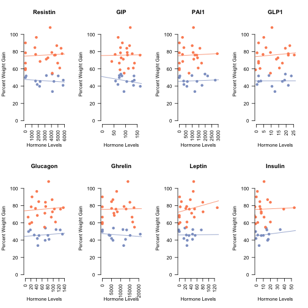

Analysis of The Predictive Value of Pre-Diet Serum Hormones from High Fat Diet Cohort 6
========================================================================================

Summary
--------

Serum samples were taken from mice which were fasted for 16h.  These mice were 10 weeks old, prior to being placed on diets.  


The raw data is in a file named ../data/raw/Pre-Diet-Multiplex.csv and are mapped against the file in ../data/raw/mapping.csv.  The mouse level data is shown below.  This analysis looked at 14 Control Diet mice and 21 High Fat Diet mice.  The pre-diet weights are shown in ../data/raw/Cohort_6_PreDiet.csv and the post-diet weights are shown in ../data/raw/Cohort_6_PostDiet.csv.


```
## Loading required package: xtable
```

<!-- html table generated in R 3.1.0 by xtable 1.7-3 package -->
<!-- Wed May 28 11:11:12 2014 -->
<TABLE border=1>
<CAPTION ALIGN="bottom"> Mouse Level Data </CAPTION>
<TR> <TH> Row.names </TH> <TH> Animal </TH> <TH> Before </TH> <TH> After </TH> <TH> Gain </TH> <TH> Gain.pct </TH> <TH> Resistin </TH> <TH> GIP </TH> <TH> PAI1 </TH> <TH> GLP1 </TH> <TH> Glucagon </TH> <TH> Ghrelin </TH> <TH> Leptin </TH> <TH> Insulin </TH> <TH> Treatment </TH>  </TR>
  <TR> <TD> 192 </TD> <TD> C57BL/6J-EarTag #192 </TD> <TD align="right"> 22800 </TD> <TD align="right"> 43440 </TD> <TD align="right"> 20640 </TD> <TD align="right"> 90.53 </TD> <TD align="right"> 10.50 </TD> <TD align="right"> 68.00 </TD> <TD align="right"> 2.00 </TD> <TD align="right"> 3.50 </TD> <TD align="right"> 14.00 </TD> <TD align="right"> -5.00 </TD> <TD align="right"> -2.50 </TD> <TD align="right"> -3.50 </TD> <TD> Control Diet </TD> </TR>
  <TR> <TD> 193 </TD> <TD> C57BL/6J-EarTag #193 </TD> <TD align="right"> 27360 </TD> <TD align="right"> 42120 </TD> <TD align="right"> 14760 </TD> <TD align="right"> 53.95 </TD> <TD align="right"> 4116.00 </TD> <TD align="right"> 79.50 </TD> <TD align="right"> 1981.00 </TD> <TD align="right"> 19.50 </TD> <TD align="right"> 72.00 </TD> <TD align="right"> 6087.00 </TD> <TD align="right"> 19.00 </TD> <TD align="right"> 14.00 </TD> <TD> Control Diet </TD> </TR>
  <TR> <TD> 205 </TD> <TD> C57BL/6J-EarTag #205 </TD> <TD align="right"> 26060 </TD> <TD align="right"> 39680 </TD> <TD align="right"> 13620 </TD> <TD align="right"> 52.26 </TD> <TD align="right"> 3229.00 </TD> <TD align="right"> 73.00 </TD> <TD align="right"> 976.00 </TD> <TD align="right"> 8.50 </TD> <TD align="right"> 110.00 </TD> <TD align="right"> 11308.00 </TD> <TD align="right"> 46.00 </TD> <TD align="right"> 34.00 </TD> <TD> Control Diet </TD> </TR>
  <TR> <TD> 202 </TD> <TD> C57BL/6J-EarTag #202 </TD> <TD align="right"> 24870 </TD> <TD align="right"> 37760 </TD> <TD align="right"> 12890 </TD> <TD align="right"> 51.83 </TD> <TD align="right"> 124.00 </TD> <TD align="right"> 84.00 </TD> <TD align="right"> 42.00 </TD> <TD align="right"> 1.50 </TD> <TD align="right"> 18.00 </TD> <TD align="right"> 68.50 </TD> <TD align="right"> -2.00 </TD> <TD align="right"> -4.00 </TD> <TD> Control Diet </TD> </TR>
  <TR> <TD> 196 </TD> <TD> C57BL/6J-EarTag #196 </TD> <TD align="right"> 22180 </TD> <TD align="right"> 33670 </TD> <TD align="right"> 11490 </TD> <TD align="right"> 51.80 </TD> <TD align="right"> 5044.00 </TD> <TD align="right"> 136.00 </TD> <TD align="right"> 2184.00 </TD> <TD align="right"> 23.50 </TD> <TD align="right"> 125.00 </TD> <TD align="right"> 13356.00 </TD> <TD align="right"> 75.00 </TD> <TD align="right"> 15.00 </TD> <TD> Control Diet </TD> </TR>
  <TR> <TD> 203 </TD> <TD> C57BL/6J-EarTag #203 </TD> <TD align="right"> 24700 </TD> <TD align="right"> 37030 </TD> <TD align="right"> 12330 </TD> <TD align="right"> 49.92 </TD> <TD align="right"> 17.00 </TD> <TD align="right"> 73.00 </TD> <TD align="right"> 0.00 </TD> <TD align="right"> -2.50 </TD> <TD align="right"> 11.50 </TD> <TD align="right"> 0.50 </TD> <TD align="right"> 0.00 </TD> <TD align="right"> -1.00 </TD> <TD> Control Diet </TD> </TR>
  <TR> <TD> 201 </TD> <TD> C57BL/6J-EarTag #201 </TD> <TD align="right"> 26430 </TD> <TD align="right"> 38830 </TD> <TD align="right"> 12400 </TD> <TD align="right"> 46.92 </TD> <TD align="right"> 5817.00 </TD> <TD align="right"> 137.00 </TD> <TD align="right"> 2773.00 </TD> <TD align="right"> 19.00 </TD> <TD align="right"> 133.00 </TD> <TD align="right"> 20829.00 </TD> <TD align="right"> 45.00 </TD> <TD align="right"> 18.00 </TD> <TD> Control Diet </TD> </TR>
  <TR> <TD> 190 </TD> <TD> C57BL/6J-EarTag #190 </TD> <TD align="right"> 26220 </TD> <TD align="right"> 38260 </TD> <TD align="right"> 12040 </TD> <TD align="right"> 45.92 </TD> <TD align="right"> 1573.00 </TD> <TD align="right"> 57.00 </TD> <TD align="right"> 333.50 </TD> <TD align="right"> 3.00 </TD> <TD align="right"> 32.00 </TD> <TD align="right"> 3674.50 </TD> <TD align="right"> 24.00 </TD> <TD align="right"> 2.00 </TD> <TD> Control Diet </TD> </TR>
  <TR> <TD> 200 </TD> <TD> C57BL/6J-EarTag #200 </TD> <TD align="right"> 26180 </TD> <TD align="right"> 38090 </TD> <TD align="right"> 11910 </TD> <TD align="right"> 45.49 </TD> <TD align="right"> 4378.50 </TD> <TD align="right"> 129.00 </TD> <TD align="right"> 1362.00 </TD> <TD align="right"> 17.50 </TD> <TD align="right"> 81.00 </TD> <TD align="right"> 15249.00 </TD> <TD align="right"> 54.00 </TD> <TD align="right"> 10.00 </TD> <TD> Control Diet </TD> </TR>
  <TR> <TD> 189 </TD> <TD> C57BL/6J-EarTag #189 </TD> <TD align="right"> 26430 </TD> <TD align="right"> 38410 </TD> <TD align="right"> 11980 </TD> <TD align="right"> 45.33 </TD> <TD align="right"> 2269.00 </TD> <TD align="right"> 105.00 </TD> <TD align="right"> 619.50 </TD> <TD align="right"> 1.50 </TD> <TD align="right"> 49.00 </TD> <TD align="right"> 4236.00 </TD> <TD align="right"> 33.00 </TD> <TD align="right"> 7.00 </TD> <TD> Control Diet </TD> </TR>
  <TR> <TD> 204 </TD> <TD> C57BL/6J-EarTag #204 </TD> <TD align="right"> 25330 </TD> <TD align="right"> 35940 </TD> <TD align="right"> 10610 </TD> <TD align="right"> 41.89 </TD> <TD align="right"> 1817.00 </TD> <TD align="right"> 67.00 </TD> <TD align="right"> 353.00 </TD> <TD align="right"> 0.50 </TD> <TD align="right"> 43.00 </TD> <TD align="right"> 5070.00 </TD> <TD align="right"> 15.50 </TD> <TD align="right"> -0.50 </TD> <TD> Control Diet </TD> </TR>
  <TR> <TD> 188 </TD> <TD> C57BL/6J-EarTag #188 </TD> <TD align="right"> 25120 </TD> <TD align="right"> 35400 </TD> <TD align="right"> 10280 </TD> <TD align="right"> 40.92 </TD> <TD align="right"> 5780.00 </TD> <TD align="right"> 134.00 </TD> <TD align="right"> 1751.00 </TD> <TD align="right"> 21.50 </TD> <TD align="right"> 85.00 </TD> <TD align="right"> 12733.00 </TD> <TD align="right"> 45.00 </TD> <TD align="right"> 17.00 </TD> <TD> Control Diet </TD> </TR>
  <TR> <TD> 194 </TD> <TD> C57BL/6J-EarTag #194 </TD> <TD align="right"> 24400 </TD> <TD align="right"> 34100 </TD> <TD align="right"> 9700 </TD> <TD align="right"> 39.75 </TD> <TD align="right"> 2184.00 </TD> <TD align="right"> 163.00 </TD> <TD align="right"> 583.00 </TD> <TD align="right"> 10.50 </TD> <TD align="right"> 71.00 </TD> <TD align="right"> 5850.00 </TD> <TD align="right"> 27.00 </TD> <TD align="right"> 16.00 </TD> <TD> Control Diet </TD> </TR>
  <TR> <TD> 191 </TD> <TD> C57BL/6J-EarTag #191 </TD> <TD align="right"> 26580 </TD> <TD align="right"> 35540 </TD> <TD align="right"> 8960 </TD> <TD align="right"> 33.71 </TD> <TD align="right"> 4155.50 </TD> <TD align="right"> 93.00 </TD> <TD align="right"> 1198.00 </TD> <TD align="right"> 12.50 </TD> <TD align="right"> 45.00 </TD> <TD align="right"> 11730.00 </TD> <TD align="right"> 26.00 </TD> <TD align="right"> 4.00 </TD> <TD> Control Diet </TD> </TR>
  <TR> <TD> 217 </TD> <TD> C57BL/6J-EarTag #217 </TD> <TD align="right"> 22480 </TD> <TD align="right"> 46730 </TD> <TD align="right"> 24250 </TD> <TD align="right"> 107.87 </TD> <TD align="right"> 3808.00 </TD> <TD align="right"> 120.00 </TD> <TD align="right"> 1093.00 </TD> <TD align="right"> 10.50 </TD> <TD align="right"> 83.50 </TD> <TD align="right"> 14049.00 </TD> <TD align="right"> 49.00 </TD> <TD align="right"> 11.00 </TD> <TD> High Fat Diet </TD> </TR>
  <TR> <TD> 215 </TD> <TD> C57BL/6J-EarTag #215 </TD> <TD align="right"> 23710 </TD> <TD align="right"> 46580 </TD> <TD align="right"> 22870 </TD> <TD align="right"> 96.46 </TD> <TD align="right"> 1686.00 </TD> <TD align="right"> 68.00 </TD> <TD align="right"> 243.50 </TD> <TD align="right"> 5.00 </TD> <TD align="right"> 41.00 </TD> <TD align="right"> 7863.00 </TD> <TD align="right"> 47.50 </TD> <TD align="right"> 1.50 </TD> <TD> High Fat Diet </TD> </TR>
  <TR> <TD> 208 </TD> <TD> C57BL/6J-EarTag #208 </TD> <TD align="right"> 25750 </TD> <TD align="right"> 48950 </TD> <TD align="right"> 23200 </TD> <TD align="right"> 90.10 </TD> <TD align="right"> 13.50 </TD> <TD align="right"> 86.00 </TD> <TD align="right"> 4.00 </TD> <TD align="right"> 1.50 </TD> <TD align="right"> 24.00 </TD> <TD align="right"> -2.00 </TD> <TD align="right"> 1.00 </TD> <TD align="right"> 0.00 </TD> <TD> High Fat Diet </TD> </TR>
  <TR> <TD> 230 </TD> <TD> C57BL/6J-EarTag #230 </TD> <TD align="right"> 26490 </TD> <TD align="right"> 49510 </TD> <TD align="right"> 23020 </TD> <TD align="right"> 86.90 </TD> <TD align="right"> 4819.00 </TD> <TD align="right"> 117.00 </TD> <TD align="right"> 994.00 </TD> <TD align="right"> 22.50 </TD> <TD align="right"> 96.00 </TD> <TD align="right"> 5812.00 </TD> <TD align="right"> 37.50 </TD> <TD align="right"> 16.00 </TD> <TD> High Fat Diet </TD> </TR>
  <TR> <TD> 233 </TD> <TD> C57BL/6J-EarTag #233 </TD> <TD align="right"> 23170 </TD> <TD align="right"> 42770 </TD> <TD align="right"> 19600 </TD> <TD align="right"> 84.59 </TD> <TD align="right"> 1465.50 </TD> <TD align="right"> 78.00 </TD> <TD align="right"> 351.50 </TD> <TD align="right"> 6.50 </TD> <TD align="right"> 48.00 </TD> <TD align="right"> 5056.00 </TD> <TD align="right"> 7.00 </TD> <TD align="right"> 5.00 </TD> <TD> High Fat Diet </TD> </TR>
  <TR> <TD> 228 </TD> <TD> C57BL/6J-EarTag #228 </TD> <TD align="right"> 25470 </TD> <TD align="right"> 46830 </TD> <TD align="right"> 21360 </TD> <TD align="right"> 83.86 </TD> <TD align="right"> 5478.00 </TD> <TD align="right"> 105.00 </TD> <TD align="right"> 1589.00 </TD> <TD align="right"> 19.50 </TD> <TD align="right"> 72.00 </TD> <TD align="right"> 15138.00 </TD> <TD align="right"> 80.00 </TD> <TD align="right"> 20.00 </TD> <TD> High Fat Diet </TD> </TR>
  <TR> <TD> 219 </TD> <TD> C57BL/6J-EarTag #219 </TD> <TD align="right"> 27110 </TD> <TD align="right"> 48520 </TD> <TD align="right"> 21410 </TD> <TD align="right"> 78.97 </TD> <TD align="right"> 4064.00 </TD> <TD align="right"> 107.00 </TD> <TD align="right"> 1067.00 </TD> <TD align="right"> 9.50 </TD> <TD align="right"> 73.00 </TD> <TD align="right"> 11919.50 </TD> <TD align="right"> 25.00 </TD> <TD align="right"> 5.00 </TD> <TD> High Fat Diet </TD> </TR>
  <TR> <TD> 227 </TD> <TD> C57BL/6J-EarTag #227 </TD> <TD align="right"> 25100 </TD> <TD align="right"> 44820 </TD> <TD align="right"> 19720 </TD> <TD align="right"> 78.57 </TD> <TD align="right"> 24.00 </TD> <TD align="right"> 78.00 </TD> <TD align="right"> 3.00 </TD> <TD align="right"> 0.50 </TD> <TD align="right"> 21.00 </TD> <TD align="right"> 4.00 </TD> <TD align="right"> 3.00 </TD> <TD align="right"> -2.00 </TD> <TD> High Fat Diet </TD> </TR>
  <TR> <TD> 220 </TD> <TD> C57BL/6J-EarTag #220 </TD> <TD align="right"> 24100 </TD> <TD align="right"> 42800 </TD> <TD align="right"> 18700 </TD> <TD align="right"> 77.59 </TD> <TD align="right"> 5640.00 </TD> <TD align="right"> 128.50 </TD> <TD align="right"> 2930.00 </TD> <TD align="right"> 21.50 </TD> <TD align="right"> 136.00 </TD> <TD align="right"> 17386.00 </TD> <TD align="right"> 129.50 </TD> <TD align="right"> 54.00 </TD> <TD> High Fat Diet </TD> </TR>
  <TR> <TD> 211 </TD> <TD> C57BL/6J-EarTag #211 </TD> <TD align="right"> 24810 </TD> <TD align="right"> 43850 </TD> <TD align="right"> 19040 </TD> <TD align="right"> 76.74 </TD> <TD align="right"> 1580.00 </TD> <TD align="right"> 55.00 </TD> <TD align="right"> 244.50 </TD> <TD align="right"> 4.50 </TD> <TD align="right"> 36.50 </TD> <TD align="right"> 5093.00 </TD> <TD align="right"> 22.00 </TD> <TD align="right"> -4.00 </TD> <TD> High Fat Diet </TD> </TR>
  <TR> <TD> 222 </TD> <TD> C57BL/6J-EarTag #222 </TD> <TD align="right"> 25900 </TD> <TD align="right"> 45600 </TD> <TD align="right"> 19700 </TD> <TD align="right"> 76.06 </TD> <TD align="right"> 4600.00 </TD> <TD align="right"> 108.00 </TD> <TD align="right"> 1203.00 </TD> <TD align="right"> 25.50 </TD> <TD align="right"> 104.00 </TD> <TD align="right"> 13037.50 </TD> <TD align="right"> 52.00 </TD> <TD align="right"> 6.00 </TD> <TD> High Fat Diet </TD> </TR>
  <TR> <TD> 223 </TD> <TD> C57BL/6J-EarTag #223 </TD> <TD align="right"> 25010 </TD> <TD align="right"> 43990 </TD> <TD align="right"> 18980 </TD> <TD align="right"> 75.89 </TD> <TD align="right"> 4464.00 </TD> <TD align="right"> 162.00 </TD> <TD align="right"> 1347.00 </TD> <TD align="right"> 21.50 </TD> <TD align="right"> 126.00 </TD> <TD align="right"> 7482.00 </TD> <TD align="right"> 34.00 </TD> <TD align="right"> 39.00 </TD> <TD> High Fat Diet </TD> </TR>
  <TR> <TD> 232 </TD> <TD> C57BL/6J-EarTag #232 </TD> <TD align="right"> 25280 </TD> <TD align="right"> 43680 </TD> <TD align="right"> 18400 </TD> <TD align="right"> 72.78 </TD> <TD align="right"> 3461.00 </TD> <TD align="right"> 81.00 </TD> <TD align="right"> 1408.00 </TD> <TD align="right"> 14.50 </TD> <TD align="right"> 97.00 </TD> <TD align="right"> 8230.00 </TD> <TD align="right"> 81.00 </TD> <TD align="right"> 7.00 </TD> <TD> High Fat Diet </TD> </TR>
  <TR> <TD> 210 </TD> <TD> C57BL/6J-EarTag #210 </TD> <TD align="right"> 24310 </TD> <TD align="right"> 41620 </TD> <TD align="right"> 17310 </TD> <TD align="right"> 71.21 </TD> <TD align="right"> 3210.00 </TD> <TD align="right"> 90.00 </TD> <TD align="right"> 1116.00 </TD> <TD align="right"> 13.50 </TD> <TD align="right"> 70.00 </TD> <TD align="right"> 6337.00 </TD> <TD align="right"> 42.00 </TD> <TD align="right"> 7.00 </TD> <TD> High Fat Diet </TD> </TR>
  <TR> <TD> 229 </TD> <TD> C57BL/6J-EarTag #229 </TD> <TD align="right"> 25400 </TD> <TD align="right"> 42820 </TD> <TD align="right"> 17420 </TD> <TD align="right"> 68.58 </TD> <TD align="right"> 2257.50 </TD> <TD align="right"> 40.50 </TD> <TD align="right"> 261.00 </TD> <TD align="right"> 1.50 </TD> <TD align="right"> 43.00 </TD> <TD align="right"> 6573.00 </TD> <TD align="right"> 0.00 </TD> <TD align="right"> -3.00 </TD> <TD> High Fat Diet </TD> </TR>
  <TR> <TD> 221 </TD> <TD> C57BL/6J-EarTag #221 </TD> <TD align="right"> 26760 </TD> <TD align="right"> 44600 </TD> <TD align="right"> 17840 </TD> <TD align="right"> 66.67 </TD> <TD align="right"> 17.00 </TD> <TD align="right"> 73.00 </TD> <TD align="right"> 2.00 </TD> <TD align="right"> 1.50 </TD> <TD align="right"> 10.00 </TD> <TD align="right"> -2.00 </TD> <TD align="right"> 0.00 </TD> <TD align="right"> -1.00 </TD> <TD> High Fat Diet </TD> </TR>
  <TR> <TD> 226 </TD> <TD> C57BL/6J-EarTag #226 </TD> <TD align="right"> 25810 </TD> <TD align="right"> 43010 </TD> <TD align="right"> 17200 </TD> <TD align="right"> 66.64 </TD> <TD align="right"> 4959.00 </TD> <TD align="right"> 138.00 </TD> <TD align="right"> 1717.00 </TD> <TD align="right"> 17.50 </TD> <TD align="right"> 93.00 </TD> <TD align="right"> 16322.00 </TD> <TD align="right"> 51.00 </TD> <TD align="right"> 11.00 </TD> <TD> High Fat Diet </TD> </TR>
  <TR> <TD> 224 </TD> <TD> C57BL/6J-EarTag #224 </TD> <TD align="right"> 24910 </TD> <TD align="right"> 40100 </TD> <TD align="right"> 15190 </TD> <TD align="right"> 60.98 </TD> <TD align="right"> 5272.00 </TD> <TD align="right"> 133.00 </TD> <TD align="right"> 1456.00 </TD> <TD align="right"> 15.50 </TD> <TD align="right"> 108.00 </TD> <TD align="right"> 16668.00 </TD> <TD align="right"> 26.00 </TD> <TD align="right"> 20.00 </TD> <TD> High Fat Diet </TD> </TR>
  <TR> <TD> 216 </TD> <TD> C57BL/6J-EarTag #216 </TD> <TD align="right"> 24970 </TD> <TD align="right"> 40060 </TD> <TD align="right"> 15090 </TD> <TD align="right"> 60.43 </TD> <TD align="right"> 27.00 </TD> <TD align="right"> 112.00 </TD> <TD align="right"> 1.00 </TD> <TD align="right"> 2.50 </TD> <TD align="right"> 23.00 </TD> <TD align="right"> 6.00 </TD> <TD align="right"> 2.50 </TD> <TD align="right"> 2.00 </TD> <TD> High Fat Diet </TD> </TR>
  <TR> <TD> 206 </TD> <TD> C57BL/6J-EarTag #206 </TD> <TD align="right"> 24570 </TD> <TD align="right"> 39050 </TD> <TD align="right"> 14480 </TD> <TD align="right"> 58.93 </TD> <TD align="right"> 8.00 </TD> <TD align="right"> 76.00 </TD> <TD align="right"> 0.00 </TD> <TD align="right"> -0.50 </TD> <TD align="right"> 15.50 </TD> <TD align="right"> -5.00 </TD> <TD align="right"> -2.00 </TD> <TD align="right"> -1.00 </TD> <TD> High Fat Diet </TD> </TR>
  <TR> <TD> 212 </TD> <TD> C57BL/6J-EarTag #212 </TD> <TD align="right"> 24770 </TD> <TD align="right"> 38400 </TD> <TD align="right"> 13630 </TD> <TD align="right"> 55.03 </TD> <TD align="right"> 4130.00 </TD> <TD align="right"> 94.00 </TD> <TD align="right"> 749.50 </TD> <TD align="right"> 9.50 </TD> <TD align="right"> 69.00 </TD> <TD align="right"> 17645.00 </TD> <TD align="right"> 24.50 </TD> <TD align="right"> 13.00 </TD> <TD> High Fat Diet </TD> </TR>
   <A NAME=tab:animal-data></A>
</TABLE>


Statistics
-----------


We tested for correlations between each hormone and the percent body weight gained on a high fat diet.  The null model with just the treatment term predicting the weight gain is described below.  This null model had an adjusted R<sup>2</sup> of 0.6425.

<!-- html table generated in R 3.1.0 by xtable 1.7-3 package -->
<!-- Wed May 28 11:11:12 2014 -->
<TABLE border=1>
<CAPTION ALIGN="bottom"> Model and Correlation Summary.  Linear Model Results for Effects Pre-Diet Hormones on Percent Weight Gain (Corrected for Diet) is shown in p.value, correlation coefficients for treatment separations are also shown </CAPTION>
<TR> <TH>  </TH> <TH> p.value </TH> <TH> R.HFD </TH> <TH> R.CD </TH> <TH> R2.HFD </TH> <TH> R2.CD </TH> <TH> p.HFD </TH> <TH> p.CD </TH>  </TR>
  <TR> <TD align="right"> Leptin </TD> <TD align="right"> 0.241 </TD> <TD align="right"> 0.247 </TD> <TD align="right"> 0.012 </TD> <TD align="right"> 0.061 </TD> <TD align="right"> 0.000 </TD> <TD align="right"> 0.281 </TD> <TD align="right"> 0.968 </TD> </TR>
  <TR> <TD align="right"> Glucagon </TD> <TD align="right"> 0.592 </TD> <TD align="right"> 0.084 </TD> <TD align="right"> 0.167 </TD> <TD align="right"> 0.007 </TD> <TD align="right"> 0.028 </TD> <TD align="right"> 0.717 </TD> <TD align="right"> 0.584 </TD> </TR>
  <TR> <TD align="right"> GLP1 </TD> <TD align="right"> 0.671 </TD> <TD align="right"> 0.105 </TD> <TD align="right"> 0.004 </TD> <TD align="right"> 0.011 </TD> <TD align="right"> 0.000 </TD> <TD align="right"> 0.650 </TD> <TD align="right"> 0.989 </TD> </TR>
  <TR> <TD align="right"> Insulin </TD> <TD align="right"> 0.731 </TD> <TD align="right"> 0.038 </TD> <TD align="right"> 0.190 </TD> <TD align="right"> 0.001 </TD> <TD align="right"> 0.036 </TD> <TD align="right"> 0.870 </TD> <TD align="right"> 0.535 </TD> </TR>
  <TR> <TD align="right"> PAI1 </TD> <TD align="right"> 0.765 </TD> <TD align="right"> 0.048 </TD> <TD align="right"> 0.090 </TD> <TD align="right"> 0.002 </TD> <TD align="right"> 0.008 </TD> <TD align="right"> 0.835 </TD> <TD align="right"> 0.769 </TD> </TR>
  <TR> <TD align="right"> GIP </TD> <TD align="right"> 0.775 </TD> <TD align="right"> 0.011 </TD> <TD align="right"> -0.272 </TD> <TD align="right"> 0.000 </TD> <TD align="right"> 0.074 </TD> <TD align="right"> 0.961 </TD> <TD align="right"> 0.369 </TD> </TR>
  <TR> <TD align="right"> Ghrelin </TD> <TD align="right"> 0.913 </TD> <TD align="right"> 0.020 </TD> <TD align="right"> -0.170 </TD> <TD align="right"> 0.000 </TD> <TD align="right"> 0.029 </TD> <TD align="right"> 0.933 </TD> <TD align="right"> 0.579 </TD> </TR>
  <TR> <TD align="right"> Resistin </TD> <TD align="right"> 0.930 </TD> <TD align="right"> 0.063 </TD> <TD align="right"> -0.161 </TD> <TD align="right"> 0.004 </TD> <TD align="right"> 0.026 </TD> <TD align="right"> 0.787 </TD> <TD align="right"> 0.600 </TD> </TR>
   <A NAME=tab:hormone-summary></A>
</TABLE>


We tested whether including the pre-diet hormone levels will improve the model in Table \ref{tab:hormone-summary}, allowing for an interaction between the diet and the hormone levels.  The p-value is the results of a F-test against whether the model is improved by including that hormone data.  No hormones significantly improved the prediction of this model.

<!-- html table generated in R 3.1.0 by xtable 1.7-3 package -->
<!-- Wed May 28 11:11:12 2014 -->
<TABLE border=1>
<CAPTION ALIGN="bottom"> ANOVA Determining the Effects of Diet on Eventual Weight Gain </CAPTION>
<TR> <TH>  </TH> <TH> Estimate </TH> <TH> Std. Error </TH> <TH> t value </TH> <TH> Pr(&gt;|t|) </TH>  </TR>
  <TR> <TD align="right"> (Intercept) </TD> <TD align="right"> 46.130 </TD> <TD align="right"> 3.017 </TD> <TD align="right"> 15.288 </TD> <TD align="right"> 0.000 </TD> </TR>
  <TR> <TD align="right"> TreatmentHigh Fat Diet </TD> <TD align="right"> 29.816 </TD> <TD align="right"> 3.840 </TD> <TD align="right"> 7.765 </TD> <TD align="right"> 0.000 </TD> </TR>
   <A NAME=tab:model-null></A>
</TABLE>


 


Session Information
--------------------

```
## R version 3.1.0 (2014-04-10)
## Platform: x86_64-apple-darwin13.1.0 (64-bit)
## 
## locale:
## [1] en_US.UTF-8/en_US.UTF-8/en_US.UTF-8/C/en_US.UTF-8/en_US.UTF-8
## 
## attached base packages:
## [1] stats     graphics  grDevices utils     datasets  methods   base     
## 
## other attached packages:
## [1] bibtex_0.3-6       xtable_1.7-3       RColorBrewer_1.0-5
## [4] knitr_1.5         
## 
## loaded via a namespace (and not attached):
## [1] evaluate_0.5.5 formatR_0.10   stringr_0.6.2  tools_3.1.0
```

